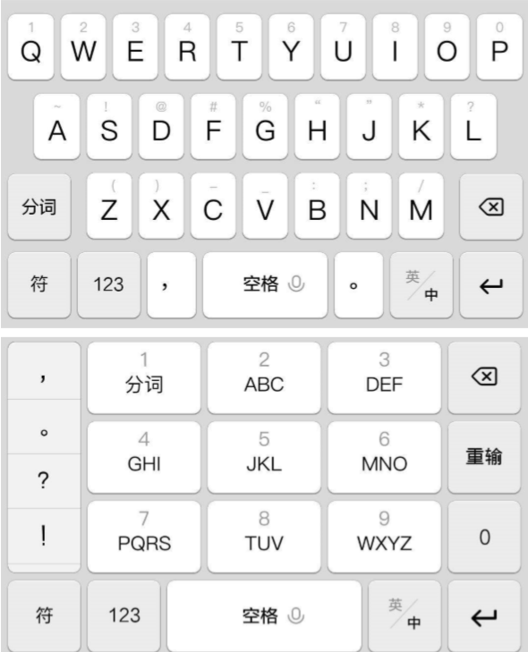

# [NCTF2019]Keyboard

[题目地址](https://buuoj.cn/challenges#[NCTF2019]Keyboard)

我以为我已经明白了键盘密码的真谛，可是我错了。

看到题目，我的笑容已经起来了。keyboard？我见过啊。结果打开附件，？？？ooo是啥？yyy又是啥？直接放弃看[wp](https://shawroot.hatenablog.com/entry/2019/12/24/NCTF2019/BUUCTF-Keyboard)。原来这回看的不是电脑键盘而是手机键盘了吗？



对照26键的o键，上面的数字是9。9对应到九宫格的WXYZ，出现了3次就是第三个字母y。知道了脑洞就不难了，写个脚本完事。

```python
strr = "ooo yyy ii w uuu ee uuuu yyy uuuu y w uuu i i rr w i i rr rrr uuuu rrr uuuu t ii uuuu i w u rrr ee www ee yyy eee www w tt ee".split()
all = {'none1':'','none2':'','w':'abc','e':'def','r':'ghi','t':'jkl','y':'mno','u':'pors','i':'tuv','o':'wxyz'}
for i in strr:
    print(all[i[0]][len(i)-1],end="")
```

## Flag
> flag{youaresosmartthatthisisjustapieceofcake}