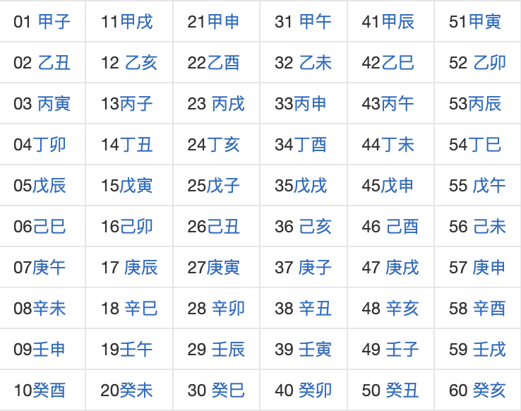

# 传统知识+古典密码

[题目地址](https://buuoj.cn/challenges#%E4%BC%A0%E7%BB%9F%E7%9F%A5%E8%AF%86+%E5%8F%A4%E5%85%B8%E5%AF%86%E7%A0%81)

语文传统知识部分考完就忘，现在完球了。

经典主角小明收到了一封信，里面是不同的年份。这个东西很眼熟，但是我不知道是什么。查百度百科的[六十甲子](https://baike.baidu.com/item/%E5%85%AD%E5%8D%81%E7%94%B2%E5%AD%90/2615886?fr=aladdin)，搜到了对照表。



对照得到28  30  23 08  17  10  16  30。背面写的“+甲子”是把这些值+60，因为“六十甲子”。最开始还以为是+1。

```python
data='28  30  23  08  17  10  16  30'.split("  ")
for i in data:
    print(chr(int(i)+60),end='')
```

得到XZSDMFLZ。接着是古典密码。古典密码的套路比较简单，替换是其灵魂之一。只是这题有点猜的成分，需要先栅栏然后凯撒。[栅栏](https://www.qqxiuzi.cn/bianma/zhalanmima.php)两栏，凯撒key为5。大佬们是怎么看出来的啊？

### Flag
- flag{SHUANGYU}