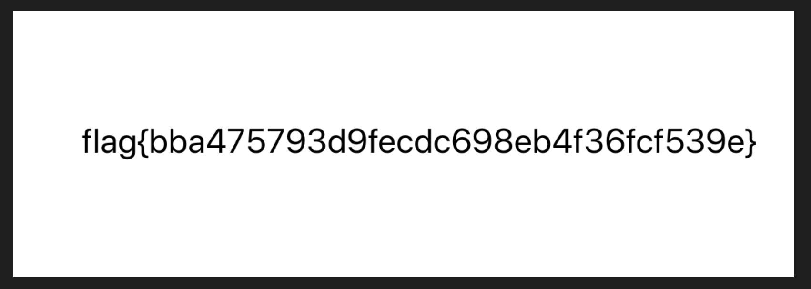

# Simple_Crypto

https://www.t00ls.com/articles-49265.html

```python
from bintools import *

class LFSR:
    def __init__(self,keyt,feedpath):
        self.trigger  = []
        self.feedback = []
        self.degree   = len(keyt)
        self.feed     = len(feedpath)
        if len(feedpath) != self.degree:
            return None
        for i in keyt:
            self.trigger.append(i)
        for i in feedpath:
            self.feedback.append(i)

    def binxor(self,bin1,bin2):
        if bin1 == bin2:
            return '0'
        else:
            return '1'

    def getfeed(self):
        self.realdback = []
        for i in range(self.feed):
            if self.feedback<i> == '1':
                self.realdback.append(self.trigger<i>)
        for i in range(1,len(self.realdback)):
            self.realdback[0] = self.binxor(self.realdback[0],self.realdback<i>)
        return self.realdback[0]

    def tick(self):
        outpin = self.trigger[-1]
        feedpin = self.getfeed()
        for i in range(self.degree-1,0,-1):
            self.trigger<i> = self.trigger[i-1]
        self.trigger[0] = feedpin
        return outpin

def getenbin(thisobj):
    tenbin = ''
    for i in range(8):
        tenbin += thisobj.tick()
    print('\t%s'%tenbin,end='')
    return ord(BinToStr(tenbin))

if '__main__' == __name__:
    newobj = LFSR('10110111101100111111101010011','00001000000000000111111100010')
    fr = open('challenge.png.encrypt','rb+')
    string =  fr.read()
    fr.close()
    newstring = ''

    for i in range(len(string)):
        newstring += chr(string<i>^getenbin(newobj))

    fw = open('lfsr.png.encrypt','wb+')
    fw.write(newstring.encode(encoding="latin1"))
    fw.close()
    print ("\nOk......")
```

