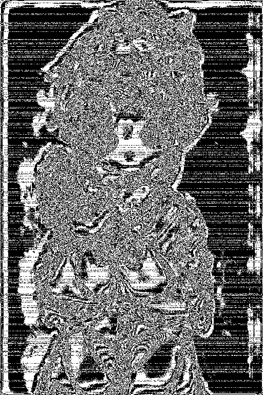

# You and me

[题目地址](https://ctf.show/challenges#You%20and%20me-3854)

拿到两张图，都放进stegsolve里看看。在you_and_me.png中发现了奇怪条纹。

这就是盲水印的特征。看you.png是找不到这样的条纹的。说明you.png是原图，you_and_me.png是叫了盲水印的图。使用[脚本](https://github.com/chishaxie/BlindWaterMark)直接解密。

- python3 bwm.py decode you.png you_and_me.png result.png

遵循 原图 加了盲水印的图 输出 的顺序输入参数。flag就是result.png，虽然有点糊。

## Flag
> ctfshow{CDEASEFFR8846}