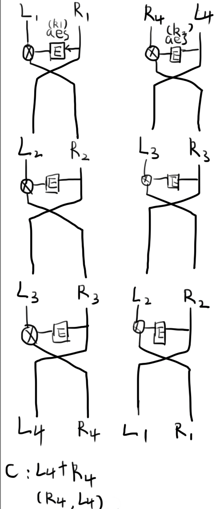

# baby NET

ctf经常有这种什么ez，baby的题目名，信它你就被暴打一顿。

这题看了一下附件，要过3关才能拿到flag。第一关挺简单的，剩下两关一边写笔记一边分析。

```python
from Crypto.Util.number import *
from Crypto.Cipher import AES
from hashlib import sha256
import socketserver
import signal
import string
import random
from secret import data,key1,key2,flag
from Feistel import M,cipher
from aes import encdata

table = string.ascii_letters+string.digits

class Task(socketserver.BaseRequestHandler):
    def _recvall(self):
        BUFF_SIZE = 2048
        data = b''
        while True:
            part = self.request.recv(BUFF_SIZE)
            data += part
            if len(part) < BUFF_SIZE:
                break
        return data.strip()

    def send(self, msg, newline=True):
        try:
            if newline:
                msg += b'\n'
            self.request.sendall(msg)
        except:
            pass

    def recv(self, prompt=b'[-] '):
        self.send(prompt, newline=False)
        return self._recvall()

    def proof_of_work(self):
        proof = (''.join([random.choice(table)for _ in range(12)])).encode()
        sha = sha256( proof ).hexdigest().encode()
        self.send(b"[+] sha256(XXX+" + proof[3:] + b") == " + sha )
        XXX = self.recv(prompt = b'[+] Plz Tell Me XXX :')
        if len(XXX) != 3 or sha256(XXX + proof[3:]).hexdigest().encode() != sha:
            return False
        return True
    
    def handle(self):
        signal.alarm(200)
        Hash = self.proof_of_work()
        if not Hash:
            self.request.close()
        self.send(b"[+] I'll send you my encrypted K,IV .Can you decrypt it ?")
        self.send(b'[+] key1 = ' + key1)
        self.send(b'[+] key2 = ' + key2)
        self.send(b'[+] cipher = ' + hex(bytes_to_long(cipher)).encode())
        self.send(b'[+] plz give me the K||IV (K+IV):')
        sec_m = self.recv()
        if sec_m == M:
            self.send(b'[+] You win! Give you my encdata: ' + hex(bytes_to_long(encdata)).encode())
            self.send(b'[+] plz give me data:')
            sec_m = self.recv()
            if sec_m == data:
                self.send(b'[+] flag is:' + flag.encode())
        self.send(b"[+] Sorry,Connection has been closed ")
        self.request.close()

class ThreadedServer(socketserver.ThreadingMixIn, socketserver.TCPServer):
    pass

class ForkedServer(socketserver.ForkingMixIn, socketserver.TCPServer):
    pass

if __name__ == "__main__":
    HOST, PORT = '0.0.0.0', 10001
    print("HOST:POST " + HOST+":" + str(PORT))
    server = ForkedServer((HOST, PORT), Task)
    server.allow_reuse_address = True
    server.serve_forever()
```

第一关在proof_of_work函数中。我们得到了sha256密文和明文的一大部分，要求找到前面的3个明文。直接暴力破解就完事了，大力出奇迹，也没别的办法。

```python
import itertools
import string
import hashlib
code = ''
key='qDXGaCpph'
sha256enc=b'f761979f41432cdc8986c6d0f69888833fecd1ce4dd88eedd7889e6dbf534d6d'
strlist = itertools.product(string.ascii_letters + string.digits, repeat=3)
for i in strlist:
    code = i[0] + i[1] + i[2]
    temp=code+key
    encinfo = hashlib.sha256(temp.encode()).hexdigest().encode()
    if encinfo == sha256enc:
        print(code)
        break
```

得到答案为1Wv。看看nc接下来的提示。

- [+] sha256(XXX+qDXGaCpph) == f761979f41432cdc8986c6d0f69888833fecd1ce4dd88eedd7889e6dbf534d6d
<br>[+] Plz Tell Me XXX :1Wv
<br>[+] I'll send you my encrypted K,IV .Can you decrypt it ?
<br>[+] key1 = this_is_the_key~
<br>[+] key2 = to_enlength_key!
<br>[+] cipher = 0x8b6d863f3e89fd2698ff90e8409502ebf485e17449cdaceb6f5cb2e781524ce4
<br>[+] plz give me the K||IV (K+IV):

来到了第二关。第二关的脚本是那个Feistel，里面导入了aes这个脚本可是好像没用，那就先不理了。

```python
from Crypto.Util.number import*
from Crypto.Cipher import AES
from aes import AES_CBC
from secret import key1,key2,IV,K

def encrypt(plaintext,key):
    assert len(plaintext) == 32
    assert len(key) == 16

    left = plaintext[:16]
    right = plaintext[16:]

    for i in range(3):
        aes = AES.new(key,AES.MODE_ECB)
        new_right = long_to_bytes(bytes_to_long(aes.encrypt(right)) ^ bytes_to_long(left))
        new_left = right
        left = new_left
        right = new_right
    return left + right

def decrypt(ciphertext,key):
    assert len(ciphertext) == 32
    assert len(key) == 16

    left = ciphertext[:16]
    right = ciphertext[16:]

    for i in range(3):
        aes = AES.new(key,AES.MODE_ECB)
        last_right = left
        last_left = long_to_bytes(bytes_to_long(right) ^ bytes_to_long(aes.encrypt(left)))
        left = last_left
        right = last_right  
    return left + right
    
M = K+IV
cipher = encrypt(M,key1)
cipher = decrypt(cipher,key2)
cipher = encrypt(cipher,key1)
```

K+IV是我们的目标，也就是M。看看encrypt函数。

```python
def encrypt(plaintext,key):
    assert len(plaintext) == 32
    assert len(key) == 16

    left = plaintext[:16]
    right = plaintext[16:]

    for i in range(3):
        aes = AES.new(key,AES.MODE_ECB)
        new_right = long_to_bytes(bytes_to_long(aes.encrypt(right)) ^ bytes_to_long(left))
        new_left = right
        left = new_left
        right = new_right
    return left + right
```

要求plaintext为32位长，key16位。left是plaintext的左半边，right是plaintext的右半边。aes是Crypto库模块里传入key的AES实例，模式是ECB。目前都没啥问题，接下来的操作虽然迷惑，但我没有像另外一道题一样一样就看出来问题。

将right适用aes加密后转为long，再与转为long的left进行异或后转为bytes。left到最后变成了right，right到最后变成new_right，也就是加密后的内容。怎么说呢，不知道它在干啥。可能跟decrypt配合起来有妙用。

```python
def decrypt(ciphertext,key):
    assert len(ciphertext) == 32
    assert len(key) == 16

    left = ciphertext[:16]
    right = ciphertext[16:]

    for i in range(3):
        aes = AES.new(key,AES.MODE_ECB)
        last_right = left
        last_left = long_to_bytes(bytes_to_long(right) ^ bytes_to_long(aes.encrypt(left)))
        left = last_left
        right = last_right  
    return left + right
```

前面还是一样的操作，只是last_right变成了left，联系上面的密文对应的是明文的right。last_left为left的aes加密内容异或right。开始看不懂了，怎么又加密一次left，left对应的是原文的right。encrypt里面加密的也是原文的right，这能解密？让我自己试试。

我去真的是可以的。必须先把普通的加解密搞清楚了才能破解第二关。拿这个例子研究。

```python
key1=b'this_is_the_key~'
M=b"i_dont_know_it_is_just_a_test_hh"
```

首先encrypt。目前left=b'i_dont_know_it_i',right=b's_just_a_test_hh'。加密后new_right=x^left，x等于aes加密后的right。left=new_left=b's_just_a_test_hh',right=x^left。最终加密结果为b's_just_a_test_hh'+x^left。接下来是解密。

last_right=left=b's_just_a_test_hh',right=x^left。last_left=right^x，x等于被aes加密后的left。因为密文的left等同于明文的right，所以两个x是等价的，即last_left=x^left^x=明文left=b'i_dont_know_it_i'。绕了一大圈成功解密。

推广到题目的第一个步骤：如果解密用的key不一样会发生什么？

```python
key1=b'this_is_the_key~'
key2=b'to_enlength_key!'
M=b"i_dont_know_it_is_just_a_test_hh"
cipher = encrypt(M,key1)
cipher = decrypt(cipher,key2)
```

按照已知条件，cipher=b's_just_a_test_hh'+x^left。decrypt中，last_right=left=b's_just_a_test_hh'，right=x^left。last_left=x^left^y,y为left的aes加密。虽然加密的left明文内容还是等于x的明文内容，但这次使用的key不一样了，所以加密后的结果也不一样，故无法抵消异或。最终结果为x^left^y+b's_just_a_test_hh'。

最后一步。

```python
key1=b'this_is_the_key~'
key2=b'to_enlength_key!'
M=b"i_dont_know_it_is_just_a_test_hh"
cipher = encrypt(M,key1)
cipher = decrypt(cipher,key2)
cipher = encrypt(cipher,key1)
```

又加密一次，使用key1。left=x^left^y，right=b's_just_a_test_hh'。new_right=x^left=x^x^left^y=left^y。x是因为这个密文和第一次encrypt是一样的，同样加密的都是右半部分。key也一样。left=new_left=right=b's_just_a_test_hh'，right=new_right=left^y。最终结果为b's_just_a_test_hh'+left^y。

如果我没算错的话，整个过程右半部分好像没变过。而且这个结构跟之前第一次实验时很像，第一次实验结果是b's_just_a_test_hh'+x^left，x是右半部分使用key1进行加密的结果。当时用key1解密成功了，试一下用key2进行解密？

好的不对。不可能这么简单。我的计算一直以来都不好，所以要重新推一次。不过这次可以先把要用的比较难表示的内容放在前面先设。


第一次encrypt:(把代码再放一遍，一边往上划拉一边推太难受了)

```python
#aes(right,key1)=x,aes(x^left,key1)=y,aes(y,key1)=z
def encrypt(plaintext,key):
    assert len(plaintext) == 32
    assert len(key) == 16

    left = plaintext[:16]   #left=b'i_dont_know_it_i'
    right = plaintext[16:]  #right=b's_just_a_test_hh'

    for i in range(3):
        aes = AES.new(key,AES.MODE_ECB)
        new_right = long_to_bytes(bytes_to_long(aes.encrypt(right)) ^ bytes_to_long(left))  #new_right=x^left   new_right=aes(x^b's_just_a_test_hh')   new_right=z^x^left
        new_left = right    #new_left=right=b's_just_a_test_hh'     new_left=right=x^left             new_left=right=y        
        left = new_left     #left=new_left=b's_just_a_test_hh'      left=new_left=x^left              left=new_left=y
        right = new_right   #right=x^left             right=new_right=y       right=new_right=z^x^left
    return left + right     #result:left+right=y+z^x^left
```

使用key2进行解密。

```python
#aes(y,key2)=m,aes(y^n,key2)=j
def decrypt(ciphertext,key):
    assert len(ciphertext) == 32
    assert len(key) == 16

    left = ciphertext[:16]  #left=y
    right = ciphertext[16:] #right=z^x^left

    for i in range(3):
        aes = AES.new(key,AES.MODE_ECB)
        last_right = left   #last_right=left=y  last_right=left=z^x^left^m    last_right=left=y^n
        last_left = long_to_bytes(bytes_to_long(right) ^ bytes_to_long(aes.encrypt(left)))  #last_left=z^x^left^m     last_left=y^n   last_left=z^x^left^m^j
        left = last_left    #left=last_left=z^x^left^m    left=last_left=y^n      left=last_left=z^x^left^m^j
        right = last_right  #right=last_right=y     right=last_right=z^x^left^m      right=last_right=y^n
    return left + right     #result:z^x^left^m^j+y^n
```

推完吧。

```python
#aes(y^n,key1)=k
def encrypt(plaintext,key):
    assert len(plaintext) == 32
    assert len(key) == 16

    left = plaintext[:16]      #left=:z^x^left^m^j   
    right = plaintext[16:]     #right=y^n

    for i in range(3):
        aes = AES.new(key,AES.MODE_ECB)
        new_right = long_to_bytes(bytes_to_long(aes.encrypt(right)) ^ bytes_to_long(left))  #new_right=k^(z^x^left^m^j)     new_right=aes(k^(z^x^left^m^j),key1)    new_right=aes(aes(k^(z^x^left^m^j),key1),key1)
        new_left = right    #new_left=right=y^n                             new_left=right=k^(z^x^left^m^j)                 new_left=right=aes(k^(z^x^left^m^j),key1)
        left = new_left     #left=new_left=y^n                              left=new_left=k^(z^x^left^m^j)                  left=new_left=aes(k^(z^x^left^m^j),key1)
        right = new_right   #right=new_right=k^(z^x^left^m^j)   right=new_right=aes(k^(z^x^left^m^j),key1)                  right=new_right=aes(aes(k^(z^x^left^m^j),key1),key1)
    return left + right     #result:aes(k^(z^x^left^m^j),key1)+aes(aes(k^(z^x^left^m^j),key1),key1)
```

好像没错。打了个问号的原因是我不确定密文取出来之后是不是加密部分和不会变部分还是一半一半的（后面改的时候去掉了，实验发现确实是一半一半的）。而且K和IV应该都是数字，比字符难判断对不对，还好有个nc告诉你结果，不然这道题的烦人程度会更上一层楼。（但是现在我就不会了(･_･;）

先假设是一半一半，如果不是我就无能为力了。而且我发现加密后的结果就算只取半边也是看不到原来内容的，可是我的推理是有半部分不会变。仔细看了一下，原来是我看漏了个for循环……我先把上面一个错误的推理改一下。这都看漏真的没谁了。

没改完，我想直接运行一下看看结果是啥。可惜看了也没用，不知道每个值之间的关系，难道只能手动推？三个for循环会死人的。

不，是9个for循环。我也不知道怎么搞出来了这么多未知数。完全没看出来规律，再看亿遍，我觉得还是用解ez_cbc那道题的表示方法来推比较好。

第一次encrypt，使用key1：

left1=secret1
right1=secret2

new_right1=aes(right1,key1)^left1=c1^left1
new_left1=right1
left2=new_left1
right2=new_right1

new_right2=aes(right2,key1)^left2=c2^left2
new_left2=right2
left3=new_left2
right3=new_right2

new_right3=aes(right3,key1)^left3=c3^left3
new_left3=right3
left4=new_left3
right4=new_right3

result=left4+right4

decrypt，使用key1

last_right1=left1
last_left1=right1^aes(left1,key1)=right1^c1
left2=last_left1
right2=last_right1

last_right2=left2
last_left2=right2^aes(left2,key1)=right2^c2
left3=last_left2
right3=last_right2

last_right3=left3
last_left3=right3^aes(left3,key1)=right3^c3
left4=last_left3
right4=last_right3

result=left4+right4

就……没看到什么帮助。先两个吧，感觉没啥区别啊，我甚至都没看出来正确的解密是怎么搞出来的。

我解出来了！不是靠推理，而是靠万能的浏览器。我在推理无果后发现这个脚本的名字Feistel可能指代一种已有的加密方式，于是我搜了一下，真的有，就叫[Feistel cipher](https://zh.wikipedia.org/wiki/%E8%B4%B9%E6%96%AF%E5%A6%A5%E5%AF%86%E7%A0%81)

跟着百科自己抄……画了一下加解密过程图，感受了一下过程。



接着我注意到了一句话：“注意解密时子密钥顺序反转，这是加密和解密之间的唯一区别。”加解密只依靠使用密钥顺序的反转，可是我们的脚本全程只用了一个密钥，是不是有什么问题呢？看一下题。

```python
M = K+IV
cipher = encrypt(M,key1)
cipher = decrypt(cipher,key2)
cipher = encrypt(cipher,key1)
```

首先把decrypt(cipher,key2)这一步后的密文看为一个整体，获得这一部分的密文只需要decrypt(cipher,key1),显而易见。关键就在于怎么从decrypt(cipher,key2)的密文还原成 encrypt(M,key1)的密文。这道题很奇妙的一点在于decrypt和encrypt互为解密函数（因为使用的key只有1个造成了这点），意味着encrypt出来的内容可以用decrypt解，decrypt出来的内容也可以用encrypt还原成decrypt之前的内容。解密脚本其实很简单，关键是看到这点。所以还是要动用万能的搜索引擎啊，昨天想了半天没想出来，今天查了一个小时不到就想出来了。

```python
key1=b'this_is_the_key~'
key2=b'to_enlength_key!'
cipher= long_to_bytes(0x8b6d863f3e89fd2698ff90e8409502ebf485e17449cdaceb6f5cb2e781524ce4)
cipher=decrypt(cipher,key1)
cipher=encrypt(cipher,key2)
print(decrypt(cipher,key1))
```

把上面这段放到给的Feistel脚本末尾就可以得到明文了，内容为it_is_just_the_fy0u_can_d0_what?

第3关。K+IV等于上面那串内容，所以K和IV是字符吗？事实证明确实是，第三关不算关卡，真的就是aes解密而已，K和IV还给了，分别是刚刚解密出来的内容的前16个字符和后16个字符。

```python
K=b'it_is_just_the_f'
IV=b'y0u_can_d0_what?'
pc=AES_CBC(K, IV)
encdata = 0x1fe9c9b13b8af4f59857d9bc5df1bfbc9df34b8a4a33455b244fb0d857f98c3ea8a62b0190e7336dde76365e65e955c4
encdata=long_to_bytes(encdata)
print(pc.decrypt(encdata))
```

上面的代码放在给的aes脚本最后，记得注释掉上面引用模块的内容。解出明文为 Congratulations!_You_have_get_the_flag! flag我来了！

这题看起来很恐怖，但去搜一下会发现真的很简单。我最开始竟然想自己手动推这个密码……有些时候做题不要死钻，万一有像今天这样的捷径呢？

- ### Flag
  > moectf{sa3d_SD2a@sd_sa44@#d2sa_ad132$aw3_a23d}