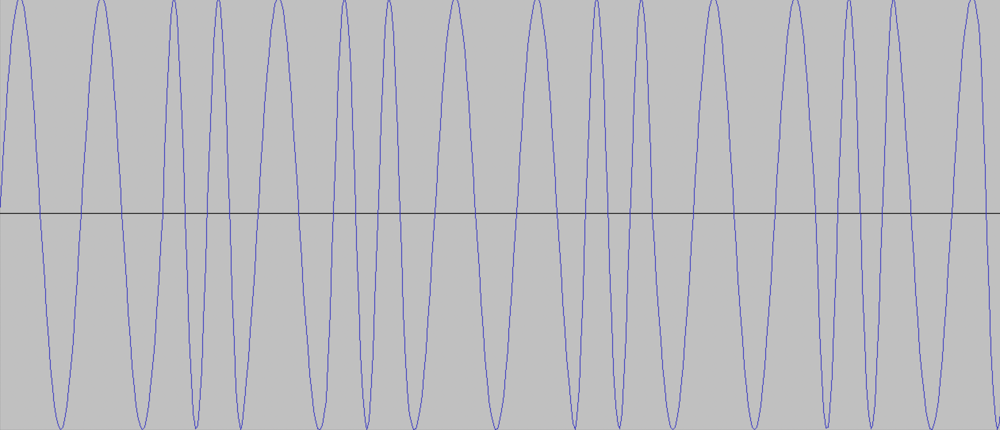

# Bell202

讲个笑话：我最开始想靠自己听出来flag。

不可或缺的脚本小子题。网上冲浪时搜到了类似的[问题](https://blog.csdn.net/Alexhcf/article/details/108333175)，这篇文章里也简单介绍了[modem](https://medium.com/poka-techblog/back-to-basics-decoding-audio-modems-with-audacity-c94faa8362a0)。使用的工具是[minimodem](https://github.com/kamalmostafa/minimodem)。kali可直接apt-get，mac可使用brew install。安装后输入命令。

- minimodem -r -f moe_modem.wav 1200

-r 指定读取模式，-f 选择读取的文件，1200 指定Bell202 1200 bps。1200是最常用的频率，在audacity里将wav文件采样率调成1200也能明显发现二进制数据流。

只有两种波形，那一个可能是1一个可能是0。我也不知道对应情况，总之脚本小子万岁！

- ### Flag
  > moectf{zizi_U_he@rd_the_meanin9_beh1nd_the_s0und}