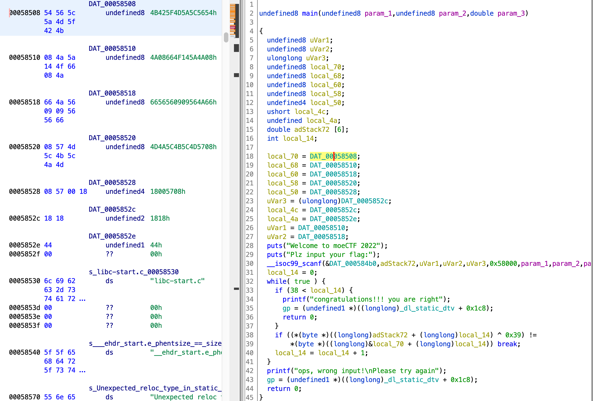

# EzRisc-V

ghidra玩家大获全胜！

[risc-v](https://zh.wikipedia.org/zh-sg/RISC-V)是一种指令集架构，据说原生ida不支持，需要安装插件。但是ghidra竟然原生支持risc，让我们的逆向变得简单了许多。

反编译会出现很多函数（甚至把平时的scanf都给反编译了，3900多行代码震惊我一整年）。不要慌张，直接查找main函数。



别看有这么多变量，其实指代的都是一个东西，看最后while循环里的逻辑就知道了。真正决定flag是什么的语句只有一行，非常简单。

```c
    if ((*(byte *)((longlong)adStack72 + (longlong)local_14) ^ 0x39) !=
        *(byte *)((longlong)&local_70 + (longlong)local_14)) break;
    local_14 = local_14 + 1;
```

local_14可以理解为循环计数，类似(longlong)&local_70 + (longlong)local_14)这种结构的语句就相当于数组取索引，因为&local_70取出数据的首地址，local_14每次往后加1，这些数据都是连着的，每个字符占一个字节，完全等同于数组的结构。

adStack72是我们的输入。虽然反编译出的scanf不知道为啥有很多参数，但既然这里判断的是adStack72，前面也没有别的逻辑，就可以猜测这就是输入了。local_70连着下面的内容就是数据，我多拷贝了一点，反正拷贝多了不会影响输出，拷贝少了会。解密脚本也很简单，这就是个普通得不能再普通的异或加密。

```python
data='54 56 5c 5a 4d 5f 42 4b 08 4a 5a 14 4f 66 08 4a 66 4a 56 09 09 56 56 66 08 57 4d 5c 4b 5c 4a 4d 08 57 00 18 18 18 44 00 6c 69 62 63 2d 73 74 61 72 74 2e 63'
data=data.split(' ')
flag=''
for i in range(39):
    temp=int(data[i],16)^0x39
    flag+=chr(temp)
print(flag)
```

- ### Flag
  > moectf{r1sc-v_1s_so00oo_1nterest1n9!!!}