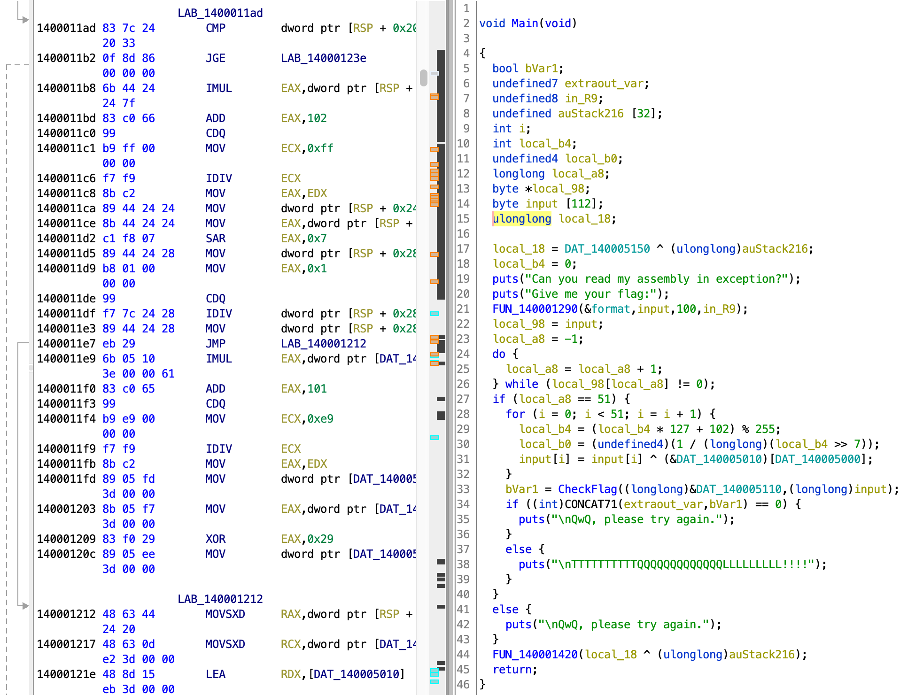
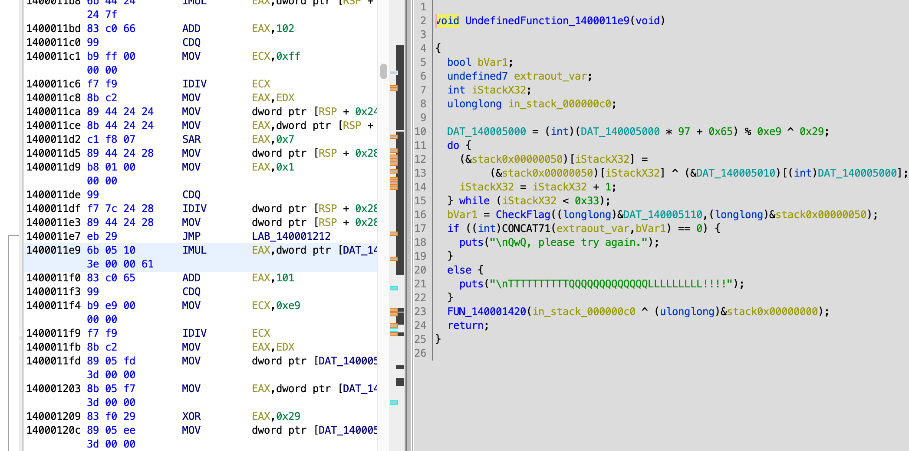

# fake code

ghidra绝对是把技能树点歪了。

云之君真的良心好吧，题目分值高而且不会太难，这道题还贴心地给了pdf说明。草草地看了一眼pdf，说这道题有个try-except来干扰静态分析，还指出了出现干扰的地方，要干的事只有读汇编了。这么好的出题人上哪里找第二个？

不过ghidra里就不一样了。都知道ghidra反编译exe不如ida，比如在ghidra里完全找不到提到的try-except结构。



还好出题人给了ida里的截图，让我可以自己根据地址找到对应的地方。正打算读汇编，没想到ghidra早有准备，已经给我反编译出来了。



1400011e7对应的是jmp指令，结合pdf的提示，如果不触发异常是不会往下走到1400011e9的。我们反其道而行之，就把鼠标点到1400011e9对应的指令。神奇的事情发生了：伪代码窗口中的代码变成了1400011e9对应的指令。背景是灰色的因为正常情况下这个函数是无法访问的。现在要做的就是确定这个函数的范围。

jmp指令跳到LAB_140001212，那么1400011e9-14000120c对应的指令就是except块里的内容。pdf里已经提到了，我以为没截完，没想到辜负了出题人的一片心意。看一下汇编，可以得知这段汇编对应的代码如下。

- DAT_140005000 = (int)(DAT_140005000 * 97 + 0x65) % 0xe9 ^ 0x29;<br>(&stack0x00000050)[iStackX32] =
         (&stack0x00000050)[iStackX32] ^ (&DAT_140005010)[(int)DAT_140005000];

while循环和剩下的内容都不用管，因为这些内容是正常流程中的代码。借此机会学习一下汇编。

- [IMUL](http://c.biancheng.net/view/3603.html)
  > 执行有符号整数乘法。32 位模式下的三操作数格式将乘积保存在第一个操作数中。第二个操作数可以是 16 位寄存器或内存操作数，它与第三个操作数相乘，该操作数是一个8位或16 位立即数

IMUL       EAX,dword ptr [DAT_140005000],0x61表示将DAT_140005000，也就是其内容0x19乘上0x61，存入EAX。

- [ADD](https://www.cnblogs.com/whzym111/p/6363957.html)
  > 操作数1与操作数2相加，结果存入第一个操作数。具体限制请看文章

- [CDQ](https://blog.csdn.net/oBuYiSeng/article/details/50349139)
  > 这个有点难解释，只需要知道一般出现在除法操作之前

- [MOV](http://c.biancheng.net/view/3493.html)
  > 将源操作数复制到目的操作数。

- [XOR](http://c.biancheng.net/view/3558.html)
  > 在两个操作数的对应位之间进行（按位）逻辑异或（XOR）操作，并将结果存放在目标操作数中

开始写脚本。

```python
data='ac 04 58 b0 45 96 9f 2e 41 15 18 29 b1 33 aa 12 0d 89 e6 fa f3 c4 bd e7 70 8a 94 c1 85 9d a3 f2 3f 82 8e d7 03 93 3d 13 05 6b 41 03 96 76 e3 b1 8a 4a 22 55 c4 19 f5 55 a6 1f 0e 61 27 cb 1f 9e 5a 7a e3 15 40 94 47 de 00 01 91 66 b7 cd 22 64 f5 a5 9c 68 a5 52 86 bd b0 dd 76 28 ab 16 95 c5 26 2c f6 39 be 00 a5 ad e3 93 9e e3 05 a0 b0 1d b0 16 0b 5b 33 95 a4 09 16 87 56 1f 83 4e 4a 3c 55 36 6f bb 4c 4b 9d b1 ae e5 8e c8 fb 0e 29 8a bb fc 20 62 04 2d 80 61 d6 c1 cc 3b 89 c5 8b d5 26 58 d6 b6 a0 50 75 ab 17 83 7f 37 2b a0 1d 2c cf c7 e0 e5 49 c9 fa 6b c0 98 66 99 92 00 02 d4 75 46 22 05 35 d1 4b c5 ad e0 8e 45 3b 50 15 b5 2e 85 30 89 54 12 de f1 5a f0 2b a7 1b 4a 26 5d 98 d4 a1 be d1 4d 7e 38 de 0b 0a 54 b8 73 6d ad 8c 1e d9 31 5f 56 7e bd 48 32 98 2e 3e eb a2 1d'
flag='1e 70 7a 6e ea 83 9e ef 96 e2 b2 d5 99 bb bb 78 b9 3d 6e 38 42 c2 86 ff 63 bd fa 79 a3 6d 60 94 b3 42 11 c3 90 89 bd ef d4 97 f8 7b 8b 0b 2d 75 7e dd cb'
flag=flag.split(' ')
data=data.split(' ')
index=0x19
local_b4=0
for i in range(51):
    try:
        local_b4 = (local_b4 * 127 + 102) % 255
        local_b0 = (1 // (local_b4 >> 7))
        flag[i]=chr(int(flag[i],16)^int(data[index],16))
    except:
        index=(index * 97 + 0x65) % 0xe9 ^ 0x29
        flag[i]=chr(int(flag[i],16)^int(data[index],16))
print(''.join(flag))
```

基本都是抄的ghidra反编译代码。发现ghidra抗简单干扰还是可以的，就是exe真的痛苦，稍微大点的exe反编译后就完全不知道在干什么，还好这个不大。注意index也就是DAT_140005000的内容是0x19——再提醒一遍——我最开始写成19了，导致怎么都不对，这个错误犯了好多次了。

- ### Flag
  > moectf{Re4d_4ssemb1y_t0_g3t_the_m4gic_key_0f_Tr4ck}


