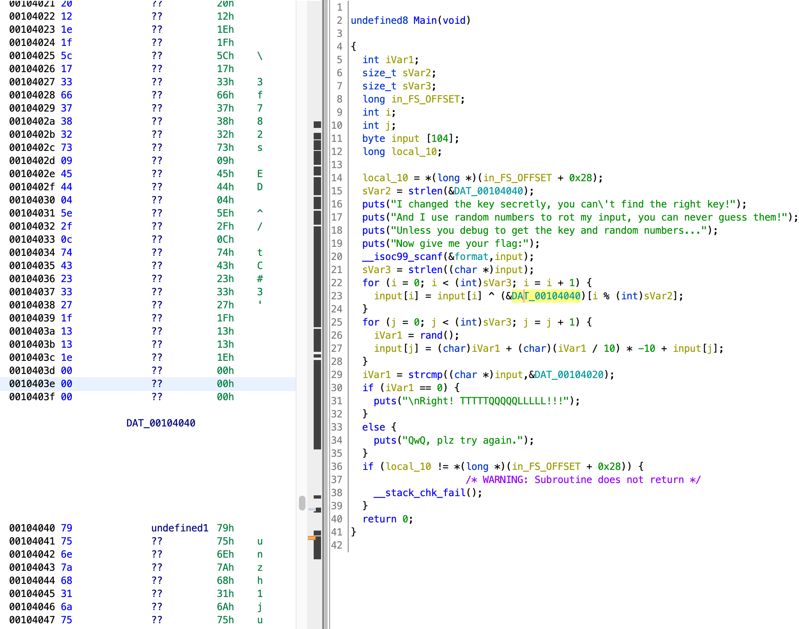

# fake key

这题的关键已经在描述里说了，“调试就完事”。不过我只有原生gdb，没有任何插件，导致我不知道怎么调试开启了pie的文件。直到今天不甘心的我决定再试试，真给我找到了一个调试的笨方法。

程序很简单，main函数就装下了全部的加密逻辑。



看起来DAT_00104040中的内容就是第一次for循环异或用的key。真的吗？让我们调试一下看看。gdb不知道准确加载地址时无法设下断点，ghidra里看到的地址是偏移，不是真正的加载地址。似乎无解了，运行后才知道加载地址从而设断点，但是不设断点运行也看不到加载地址。不过可以在main函数里面发现puts，那我们可以把断点下在puts，这样运行后就能获取main的地址，main运行地址-main偏移=加载时的基地址，从而推出其他的地址。

- gdb ./fake_key
  > (gdb) b puts<br>(gdb) r<br>(gdb) i stack

省略了一些gdb中的输出，只放需要的命令。shell中开启gdb，得到(gdb)提示后b puts将断点下在puts处，r开始运行文件，程序会在puts断点处断开。

- (gdb) i stack
    > #0  __GI__IO_puts (str=0x55976c12c008 "I changed the key secretly, you can't find the right key!") at ./libio/ioputs.c:33
    <br>#1  0x000055976c12b273 in ?? ()
    <br>#2  0x00007f08150cad90 in __libc_start_call_main (main=main@entry=0x55976c12b23d, argc=argc@entry=1, argv=argv@entry=0x7fffaf161278) at ../sysdeps/nptl/libc_start_call_main.h:58
    <br>#3  0x00007f08150cae40 in __libc_start_main_impl (main=0x55976c12b23d, argc=1, argv=0x7fffaf161278, init=<optimized out>, <br>fini=<optimized out>, rtld_fini=<optimized out>, 
        stack_end=0x7fffaf161268) at ../csu/libc-start.c:392
    <br>#4  0x000055976c12b12e in ?? ()

在断点命令处（(gdb)这个前缀就是提示输入命令的，之后不强调了）输入i stack，查看当前栈信息，由此我们得到了这次main函数的加载地址。0x55976c12b23d-0x0010123d（ida或ghidra中看见的main地址）得到这次的基地址。

得到基地址后就可以直接查看key是什么了。ghidra里看到key的地址是0x00104040，那么就把算出来的基地址加上0x00104040得到key的加载地址，一句命令得到真实key值。

- (gdb) x/s 94108841599040
    > 0x55976c12e040: "yunzh1junTCL,trackYYDS"

x/s查看某个内存中字符串的值。得到key了，现在我们再来看看加密逻辑中还有什么不确定的东西。main函数开始时的puts有一句话，“Unless you debug to get the key and random numbers...“提示我们需要调试拿到什么东西。key知道了，是时候去看看random numbers是啥了。第二个for循环中有一句iVar1 = rand(); ，且之前没有srand播种，所以我们确定iVar1每次运行时得到的值都是一样的。我尝试本机rand，但发现跟调试得到的结果不符。那只能一个个调试得到全部的random number值了。

iVar1是rand函数的返回值，那么iVar1在rand执行完成后会被存在rax中。这里我们在rand的下一句下断点，也就是0x0010130e（偏移）处。还是跟上次一样，基地址+0x0010130e得到真实地址。

- (gdb) b *94108841587470
- (gdb) c

*表示在某个地址下断点，否则gdb会把这一串数字看成函数名。c表示继续执行，会让程序断在下一个断点处。c过完全部puts断点后，程序会提示输入flag。注意这个flag不能随便输入，必须和DAT_00104020的长度一样，因为最后会把加密后的input与DAT_00104020进行比较，说明flag和DAT_00104020是一样长的，也就是说会有DAT_00104020这么多的随机数需要记录。

- (gdb) i r
    > rax            0x6b8b4567          1804289383
- (gdb) c

DAT_00104020长29，说明我们会在*94108841587470这个断点处断29次。每次输入i r查看寄存器的值，rax的值就是random number也就是iVar1的值。记录下随机数值后c继续执行，重复29遍。建议写python脚本自动化，不过我很闲，就手动抄了那么多数字（主要还是不会而且学不会啊，之后再做吧，已经埋了无数个坑了）。

得到全部的random number后就可以开始写脚本了。

```python
key='yunzh1junTCL,trackYYDS'
result= "17 20 12 1e 1f 5c 17 33 66 37 38 32 73 09 45 44 04 5e 2f 0c 74 43 23 33 27 1f 13 13 1e"
result=result.split(' ')
flag=[]
numbers=[1804289383, 846930886,1681692777, 1714636915,1957747793, 424238335,719885386,1649760492, 596516649, 1189641421, 1025202362, 1350490027, 783368690, 1102520059, 2044897763, 1967513926,  1365180540, 1540383426, 304089172, 1303455736, 35005211,521595368, 294702567, 1726956429,336465782, 861021530, 278722862, 233665123, 2145174067]
for i in range(len(result)):
    temp=numbers[i]+numbers[i]//10*-10
    flag.append(int(result[i],16)-temp)
for i in range(len(result)):
    flag[i]=flag[i]^ord(key[i%len(key)]) 
print(''.join([chr(i) for i in flag]))
```

逻辑逆向很简单，就不多说了。

- ### Flag
    > moectf{D3bug_t0_g3t_7he_Key!}