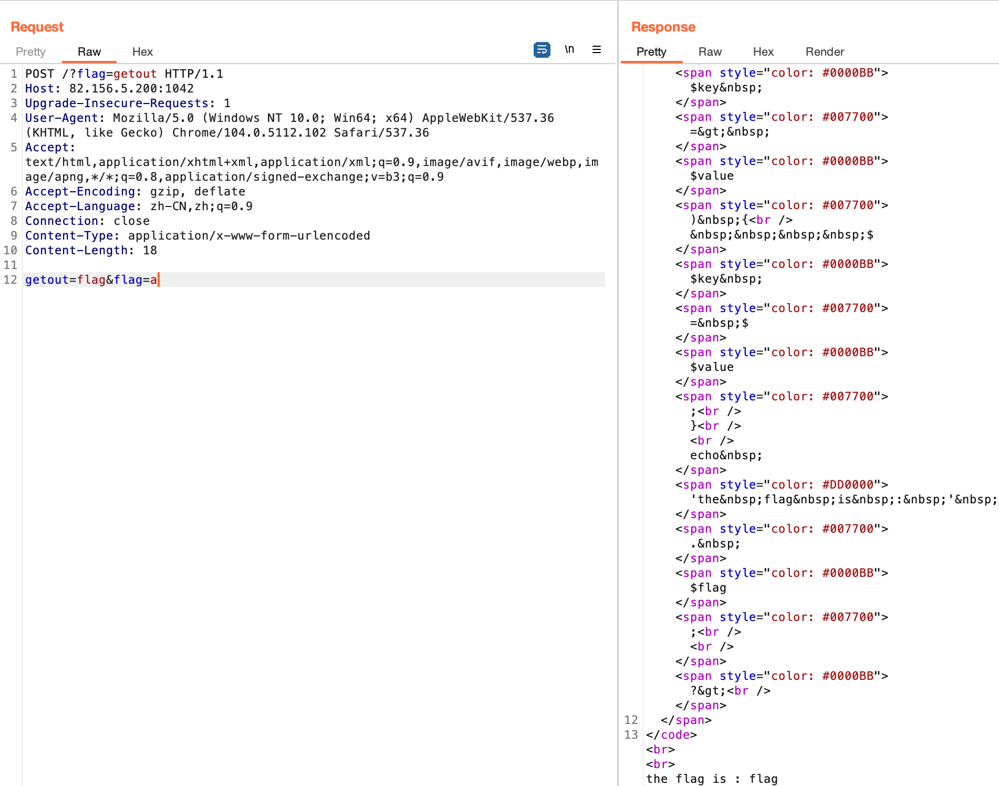
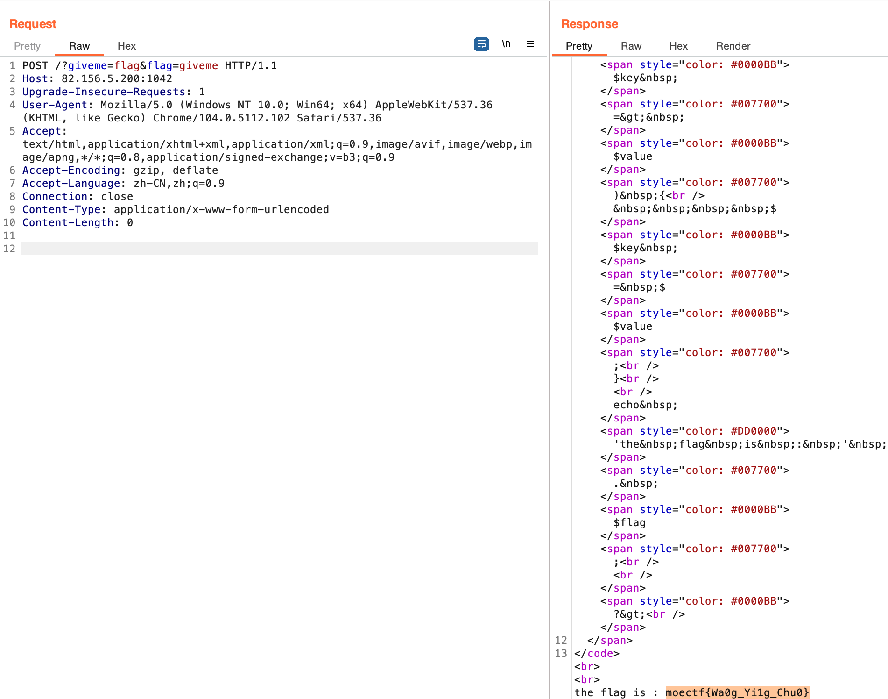

# ezphp

这题我很快就搜到考点了，但是不知道我的目标是啥……

一进来就是源代码，很常见了。

```php
<?php

highlight_file('source.txt');
echo "<br><br>";

$flag = 'xxxxxxxx';
$giveme = 'can can need flag!';
$getout = 'No! flag.Try again. Come on!';
if(!isset($_GET['flag']) && !isset($_POST['flag'])){
    exit($giveme);
}

if($_POST['flag'] === 'flag' || $_GET['flag'] === 'flag'){
    exit($getout);
}

foreach ($_POST as $key => $value) {
    $$key = $value;
}

foreach ($_GET as $key => $value) {
    $$key = $$value;
}

echo 'the flag is : ' . $flag;

?>
```

一条一条看下过滤要求。

```php
if(!isset($_GET['flag']) && !isset($_POST['flag'])){
    exit($giveme);
}
```

要求get传参flag或者post也传参flag，否则直接exit并打印$giveme的内容。

- ### exit
  - 输出一个消息并且退出当前脚本
  - 语法：exit(string $status = ?): void 或 exit(int $status): void
  - 参数
    > 如果 status 是一个字符串，在退出之前该函数会打印 status 。<br>如果 status 是一个 int，该值会作为退出状态码，并且不会被打印输出。 退出状态码应该在范围0至254，不应使用被PHP保留的退出状态码255。 状态码0用于成功中止程序。

不是我们想要的。绕过也很简单，按照它说的做，别都传不就行了。

```php
if($_POST['flag'] === 'flag' || $_GET['flag'] === 'flag'){
    exit($getout);
}
```

传参内容均不能为flag。说明flag可能是我们的目标。

```php
foreach ($_POST as $key => $value) {
    $$key = $value;
}

foreach ($_GET as $key => $value) {
    $$key = $$value;
}
```


\$\$表示一个[可变变量](https://www.feiniaomy.com/post/460.html#:~:text=php%E4%B8%AD%24%24%E7%AC%A6%E5%8F%B7%E7%9A%84%E5%AE%9A%E4%B9%89%E4%B8%8E%E4%BD%9C%E7%94%A8,%E4%BA%8E%E5%AD%98%E5%82%A8%24str%E7%9A%84%E5%80%BC%E3%80%82)。无限套娃的情况会有点绕，这里最多就两层，表示将\$key的内容再次作为一个变量赋$value的值。比如我们传?getout=test，那么上面\$getout的值就变成test了。这种漏洞就叫变量覆盖。由此我想出了一个测试payload。



getout=flag&flag=a 是post传参，结合源代码会把getout变量的值设为flag，flag=a 单纯为了绕过过滤。?flag=getout 将flag变量设为getout变量的内容，也就是flag。注意可以像这样同时传get和post方法。

但现在有个什么问题呢，虽然flag值我们可以随意控制了，可是最后是个字符串拼接，这有啥用啊，根本不会执行。网上搜有个类似的例题在最后还有个die打印出flag的内容。我再搜搜看能不能搜出什么类似的东西。

很多题都是利用exit或者die进行读取flag的，没见过真的用最后那句echo来读取flag的。其他题目也会include flag.php，这里却没有。看来这是个魔改变量覆盖基础题。我现在在想能利用上面两个exit吗，但似乎不行，这两个判断都在foreach上面，变量还没覆盖就输出了肯定不行啊。

我更仔细看了其他的题，猛然发现了我payload得问题。首先post的变量覆盖要优先于get的变量覆盖，其次post的变量覆盖的value无法读取flag，get的变量覆盖才可以。猜测给三个变量是要我们做一点转换。

对不起我读错代码了。我已经把上面的改了所以你们看不出来我读错了:-D。第一个if语句我看成要求get和post都传参flag了。正确的payload其实很简单。



先把flag的值赋给giveme，这样giveme和flag里面都是真正的flag了。由于flag不能赋值flag，所以绕一圈赋值giveme。post传参根本没用上，我还被误导了好久。请相信出题人，他说ez就不可能有多难，真的不要想多了，以及不要看错题了！

- ### Flag
  > moectf{Wa0g_Yi1g_Chu0}
