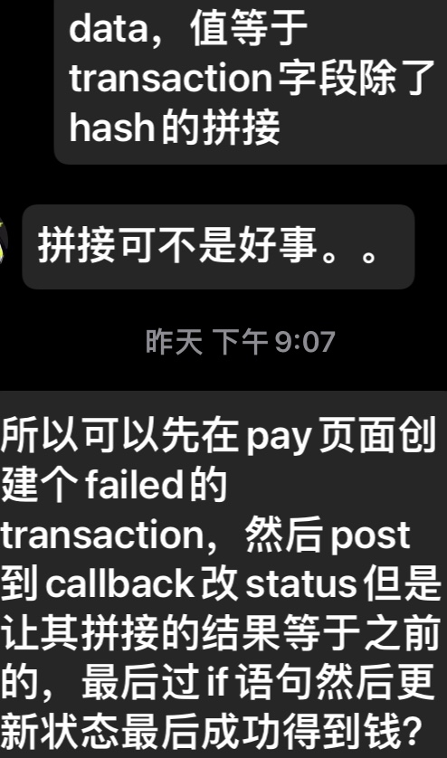
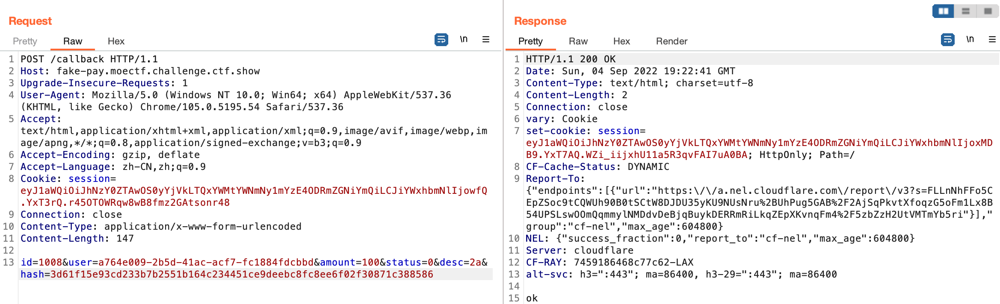

# 支付系统

是谁给我的勇气来做500分的题？答案是别的题都试过了（全不会），只有这题没看了。

上源码。这个模版我根本就没见过。

```python
import os
import uuid
from quart import Quart, render_template, redirect, jsonify, request, session
from hashlib import pbkdf2_hmac
from enum import IntEnum
from tortoise import fields
from tortoise.models import Model
from tortoise.contrib.quart import register_tortoise
from httpx import AsyncClient

app = Quart(__name__)
app.secret_key = os.urandom(16)


class TransactionStatus(IntEnum):
    SUCCESS = 0
    PENDING = 1
    FAILED = 2
    TIMEOUT = 3


class Transaction(Model):
    id = fields.IntField(pk=True)
    user = fields.UUIDField()
    amount = fields.IntField()
    status = fields.IntEnumField(TransactionStatus)
    desc = fields.TextField()
    hash = fields.CharField(64, null=True)

    def __init__(self, **kwargs):
        super().__init__()
        for k, v in kwargs.items():
            self.__setattr__(k, v)


async def do_callback(transaction: Transaction):
    async with AsyncClient() as ses:
        transaction.status = int(TransactionStatus.FAILED)
        data = (
            f'{transaction.id}'
            f'{transaction.user}'
            f'{transaction.amount}'
            f'{transaction.status}'
            f'{transaction.desc}'
        ).encode()
        await ses.post(f'http://localhost:8000/callback', data={
            'id': transaction.id,
            'user': transaction.user,
            'amount': transaction.amount,
            'desc': transaction.desc,
            'status': transaction.status,
            'hash': pbkdf2_hmac('sha256', data, app.secret_key, 2**20).hex()
        })


@app.before_request
async def create_session():
    if 'uid' not in session:
        session['uid'] = str(uuid.uuid4())
    session['balance'] = 0
    for tr in await Transaction.filter(user=session['uid']).all():
        if tr.status == TransactionStatus.SUCCESS:
            session['balance'] += tr.amount


@app.route('/pay')
async def pay():
    transaction = await Transaction.create(
        amount=request.args.get('amount'),
        desc=request.args.get('desc'),
        status=TransactionStatus.PENDING,
        user=uuid.UUID(session.get('uid'))
    )
    app.add_background_task(do_callback, transaction)
    return redirect(f'/transaction?id={transaction.id}')


@app.route('/callback', methods=['POST'])
async def callback():
    form = dict(await request.form)
    data = (
        f'{form.get("id")}'
        f'{form.get("user")}'
        f'{form.get("amount")}'
        f'{form.get("status")}'
        f'{form.get("desc")}'
    ).encode()
    k = pbkdf2_hmac('sha256', data, app.secret_key, 2**20).hex()
    tr = await Transaction.get(id=int(form.pop('id')))
    if k != form.get("hash"):
        return '403'
    form['status'] = TransactionStatus(int(form.pop('status')))
    tr.update_from_dict(form)
    await tr.save()
    return 'ok'


@app.route('/transaction')
async def transaction():
    if 'id' not in request.args:
        return '404'
    transaction = await Transaction.get(id=request.args.get('id'))
    return await render_template('receipt.html', transaction=transaction)


@app.route('/flag')
async def flag():
    return await render_template(
        'flag.html',
        balance=session['balance'],
        flag=os.getenv('FLAG'),
    )


@app.route('/')
@app.route('/index.html')
async def index():
    with open(__file__) as f:
        return await render_template('source-highlight.html', code=f.read())


register_tortoise(
    app,
    db_url="sqlite://./data.db",
    modules={"models": [__name__]},
    generate_schemas=True,
)

if __name__ == '__main__':
    app.run()
```

去[官网](https://tortoise-orm.readthedocs.io/en/latest/)（可能是）搜了下，发现是异步[ORM](https://zhuanlan.zhihu.com/p/27188788)。背景懂了一点，分析代码。

```python
@app.route('/transaction')
async def transaction():
    if 'id' not in request.args:
        return '404'
    transaction = await Transaction.get(id=request.args.get('id'))
    return await render_template('receipt.html', transaction=transaction)


@app.route('/flag')
async def flag():
    return await render_template(
        'flag.html',
        balance=session['balance'],
        flag=os.getenv('FLAG'),
    )


@app.route('/')
@app.route('/index.html')
async def index():
    with open(__file__) as f:
        return await render_template('source-highlight.html', code=f.read())


register_tortoise(
    app,
    db_url="sqlite://./data.db",
    modules={"models": [__name__]},
    generate_schemas=True,
)

if __name__ == '__main__':
    app.run()
```

@app.route('/transaction')表示了页面所在路径，而这个页面会执行下面的函数。 transaction函数要求使用get方法传入id参数，否则404。传入后就会渲染receipt.html模版。flag页面渲染flag.html。根目录高亮了源代码。[register_tortoise](https://www.cnblogs.com/zhongyehai/p/15178002.html)就是配置信息，app.run()老生常谈了，很多web模版都有这行代码，运行app实例。这些部分目前我觉得没什么东西，所以放在一起了。

```python
@app.route('/callback', methods=['POST'])
async def callback():
    form = dict(await request.form)
    data = (
        f'{form.get("id")}'
        f'{form.get("user")}'
        f'{form.get("amount")}'
        f'{form.get("status")}'
        f'{form.get("desc")}'
    ).encode()
    k = pbkdf2_hmac('sha256', data, app.secret_key, 2**20).hex()
    tr = await Transaction.get(id=int(form.pop('id')))
    if k != form.get("hash"):
        return '403'
    form['status'] = TransactionStatus(int(form.pop('status')))
    tr.update_from_dict(form)
    await tr.save()
    return 'ok'
```

一个异步回调函数。我不会异步，先按普通函数分析一下。首先这个页面需要用post方法请求，接着异步请求request.form,结果使用dict函数得到一个字典对象，get取参数键对应的值，pop返回对应键的值且在字典内部删除这个键值对。[pbkdf2_hmac](https://docs.python.org/zh-cn/3/library/hashlib.html)是哈希加密函数，还是加盐的，难搞。Transaction不知道是不是上面要看的类，如果是的话tr就是它的实例，tr.save()将实例里的字段全部存到数据库里。还是没看出来漏洞。

```python
@app.before_request
async def create_session():
    if 'uid' not in session:
        session['uid'] = str(uuid.uuid4())
    session['balance'] = 0
    for tr in await Transaction.filter(user=session['uid']).all():
        if tr.status == TransactionStatus.SUCCESS:
            session['balance'] += tr.amount


@app.route('/pay')
async def pay():
    transaction = await Transaction.create(
        amount=request.args.get('amount'),
        desc=request.args.get('desc'),
        status=TransactionStatus.PENDING,
        user=uuid.UUID(session.get('uid'))
    )
    app.add_background_task(do_callback, transaction)
    return redirect(f'/transaction?id={transaction.id}')
```

[@app.before_request](https://subscription.packtpub.com/book/web-development/9781801076302/2/ch02lvl1sec12/quart-s-built-in-features)修饰的函数会在每一次请求执行前被调用。这个函数在服务器上设置session，如果转账状态为SUCCESS，则会在对应uid下的用户的balance字段加上转账金额。

pay页面需要用get方法传amount和desc参数。Transaction类似乎没有create和上面看到的get函数，猜测和save一样都是Model的方法。另外，刚刚提到的request是[quart](https://pgjones.gitlab.io/quart/)模版的。粗略看了一下和flask很像，就不费力去往深研究了。[add_background_task](https://pgjones.gitlab.io/quart/how_to_guides/background_tasks.html)也是quart提供的方法，和函数名一样，把一些不需要立刻执行的函数放到后台操作。最后重定向到/transaction页面，id为转账消息的id。我注意到直接去/transaction页面传个假id也是可以出内容的，就是显示转账失败。不知道这里有突破点吗？

```python
class TransactionStatus(IntEnum):
    SUCCESS = 0
    PENDING = 1
    FAILED = 2
    TIMEOUT = 3


class Transaction(Model):
    id = fields.IntField(pk=True)
    user = fields.UUIDField()
    amount = fields.IntField()
    status = fields.IntEnumField(TransactionStatus)
    desc = fields.TextField()
    hash = fields.CharField(64, null=True)

    def __init__(self, **kwargs):
        super().__init__()
        for k, v in kwargs.items():
            self.__setattr__(k, v)


async def do_callback(transaction: Transaction):
    async with AsyncClient() as ses:
        transaction.status = int(TransactionStatus.FAILED)
        data = (
            f'{transaction.id}'
            f'{transaction.user}'
            f'{transaction.amount}'
            f'{transaction.status}'
            f'{transaction.desc}'
        ).encode()
        await ses.post(f'http://localhost:8000/callback', data={
            'id': transaction.id,
            'user': transaction.user,
            'amount': transaction.amount,
            'desc': transaction.desc,
            'status': transaction.status,
            'hash': pbkdf2_hmac('sha256', data, app.secret_key, 2**20).hex()
        })
```

Transaction是一个继承与Model的类，上面关于ORM的介绍有提到这相当于一个表，类中的每个字段相当于表中的每个字段。[**kwargs](https://zhuanlan.zhihu.com/p/144773033)是有关键字参数，[__setattr__](https://codeantenna.com/a/ljeCwFqyEE)是python中的一个魔术方法，每次设置属性的时候会被自动调用，像这样手动调用也不是不可以。AsyncClient(https://www.python-httpx.org/async/)是一个异步请求对象，此处ses为AsyncClient的实例。data跟之前看到的一样操作，ses.post应该是利用这个实例向callback发送一个post请求。至此全部代码已粗略分析完毕。

灵魂拷问：漏洞在哪？而且transaction界面随便输id似乎都有状态失败的转账记录。另外还有个彩蛋，快去试一下id填114。

我看了两个小时了都没看见问题，哪怕让我怀疑的地方都没有。index，transaction和flag界面应该是没东西可以搞的，重点应该在pay相关的地方。pay的amount和desc可以随便填，至少我试了很多次都可以出转账失败的收据，连负数金额都行。填上了get参数后pay函数会把转账相关的内容发送到do_callback函数，关键它是在后台发的，do_callback函数本身没有我们可以访问到的路径，因此抓不到包，看不了发送的hash。do_callback做的事情不多，把转账相关的信息包装到data中，status设置为FAILED，然后把data的全部内容encode成byte再做个签名，放在hash里面。带有签名的转账信息接下来会被发到callback页面。

虽然callback页面有路径且我们可以伪造一个post请求，但是hash去哪里找呢？这个签名验证我甚至在有人写的python版本微信支付代码中看见了类似的逻辑。这我能挖得出来？我还发现这个网站使用的应该是JAWT，但初始下发的JAWT本身就是错误的签名……我尝试伪造了一个，但我发现create_session这个方法做了过滤，只有在当前id下的转账状态为Success才能加balance。

pbkdf2_hmac这个hash加密函数同样很安全，轮数可设置，使用os.urandom加盐符合要求。我还搜了一下发现了条件竞争漏洞，但是只发生在多线程共享代码的时候。这里虽然是异步但是还是单线程。

我做出来了。我去问赛事群里的大佬了，直接一语点醒梦中人。



当时我去问大佬这道题的思路，他问我hash是怎么生成的。结果第一次我理解成要我去看hash算法的过程，其实他的意思是有什么内容被传进去进行hash……不过还是有收获的，知道了sha256几乎不可能找到碰撞。传进hash的内容是data，data是transaction各个字段的拼接。于是我立刻知道了做法，大佬tql。

做法就和我发的内容完全一致。首先去pay页面，正常创建一个transaction。钱可以越多越好，但我只传了1000块，因为更大的数我的浏览器就打不开这个界面了，有点奇怪。

- http://fake-pay.moectf.challenge.ctf.show/pay?amount=1000&desc=a

然后会重定向到transaction那个界面，记住收据上的用户名等信息，当前transaction的hash可以通过扫描二维码来得到（我之前还以为这个二维码就是来做做样子的，结果真的有用）。

开始向callback界面传post。因为data是拼接的，我们要保证status被更改后拼接的结果还是等于最开始失败的data。刚刚创建的transaction的status是2，对应枚举的FAILED。那么我们直接传0，把2放到desc里面去。举个例子，没成功前的data是这样的。

- 1008a764e009-2b5d-41ac-acf7-fc1884fdcbbd10002a

1008是id，a764e009-2b5d-41ac-acf7-fc1884fdcbbd是用户id，1000是钱数，2是status，a是可随意控制的desc。那我们改成这样：1008是id，a764e009-2b5d-41ac-acf7-fc1884fdcbbd是用户id，100是钱数，0是status，2a是desc。你会发现拼接起来的结果是一样的，自然hash也一样，这就成功绕过了if语句，更新了这个transaction的状态。bp发送内容如下。



100块钱到手。但是我发现100块钱去flag页面还是没有给flag。可能是我卡了，题目描述说好的flag100块。没关系，我们再搞100块，重复以上步骤就行了。

- ### Flag
  > moectf{b3c0me_s3nsit1v3_t0_bu9s}