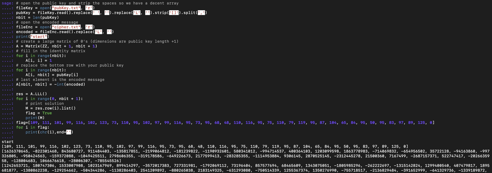

# knapsack

给我找到答案了！

又是背包加密，但这次可就没那么简单了。MiniMiniBackPack里面直接给了私钥，这次才是正儿八经的背包加密。顺便再补充一个文档，[CTF Wiki](https://ctf-wiki.org/crypto/asymmetric/knapsack/knapsack/)永远的神。

```python
from random import randint
from Crypto.Util.number import bytes_to_long,long_to_bytes,GCD,inverse
from secret import flag
def bitlength(n):#判断消息长度
	length=len(bin(bytes_to_long(n))[2:])
	return length
def makeKey(n):#生成超递增序列，得到私钥、公钥
	length=len(n)
	privKey = [randint(1, 65536**length)]
	sum = privKey[0]
	for i in range(1, length):
		privKey.append(randint(sum*255 + 1, 65536**(length + i)))
		sum += privKey[i]
	q = 255*randint(privKey[length-1] + 1, 2*privKey[length-1])
	r = randint(1, q)
	while GCD(r, q) != 1:
		r = randint(1, q)
	pubKey = [ r*w % q for w in privKey ]#将超递增序列变为非超递增序列，作为公钥
	return privKey, q, r, pubKey

def encrypt(msg, pubKey):#用公钥加密消息
	cipher = 0
	i = 0
	for bit in msg:
		cipher += bit*pubKey[i]
		i += 1
	return cipher

def decrypt(cipher, privKey, q, r):#用私钥求得超递增序列并解密
	d = inverse(r, q)
	msg = cipher*d % q
	res = b''
	n = len(privKey)
	for i in range(n - 1, -1, -1):
		temp=0
		if msg >= privKey[i]:
			while msg >= privKey[i]:
				temp=temp+1
				msg -= privKey[i]
			res =  bytes([temp]) + res
		else:
			res =  bytes([0]) + res 
	return res
privKey, q, r, pubKey=makeKey(flag)
cipher=encrypt(flag,pubKey)
f=open("pubKey.txt",'w')
f.write(str(pubKey))
f.close()
f=open("cipher.txt",'w')
f.write(str(cipher))
f.close()
print(decrypt(encrypt(flag,pubKey),privKey,q,r))
assert decrypt(encrypt(flag,pubKey),privKey,q,r)==flag
```

没啥说的，真的就跟ctf wiki里提到的标准背包加密一模一样。甚至于拿去和里面提到的[这道题](https://github.com/ctfs/write-ups-2014/tree/b02bcbb2737907dd0aa39c5d4df1d1e270958f54/asis-ctf-quals-2014/archaic)的make_key方法比较，基本是一样的。解法自然也差不多，那思路也差不了多少。内容涉及线性代数和格(lattice)。线代我看过基础的，勉强知道它在说什么，但是这个格是啥玩意啊，格基规约又是什么东西啊，完全不懂。

看上面那篇github，能知道思路就是构建一个这样的矩阵。

- | I(nxn)  O(nx1) |<br>
| P(1xn) -C(1x1) |

I是n\*n的单位矩阵，0是n\*1的0矩阵（我编的，代表矩阵里面全是0），P是公钥C是密文。-C表示把里面的值反过来，不是C的逆矩阵。目前一切良好，然后突然蹦出来格。如果你对上面那个矩阵进行格基规约，也就是LLL算法，得到的短向量就是解。再把这篇[文章](https://www.ruanx.net/lattice-2/)放一遍，我真的太菜了完全不知道大佬们在说啥。

先放脚本，但这次的脚本需要用[sagemath](https://yiliqsmy.github.io/3summer.github.io/2017/12/06/sage/)运行。

```python
# open the public key and strip the spaces so we have a decent array
fileKey = open("pubKey.txt", 'r')
pubKey = fileKey.read().replace(' ', '').replace('L', '').strip('[]').split(',')
nbit = len(pubKey)
# open the encoded message
fileEnc = open("cipher.txt", 'r')
encoded = fileEnc.read().replace('L', '')
print("start")
# create a large matrix of 0's (dimensions are public key length +1)
A = Matrix(ZZ, nbit + 1, nbit + 1)
# fill in the identity matrix
for i in range(nbit):
    A[i, i] = 1
# replace the bottom row with your public key
for i in range(nbit):
    A[i, nbit] = pubKey[i]
# last element is the encoded message
A[nbit, nbit] = -int(encoded)

res = A.LLL()
for i in range(0, nbit + 1):
    # print solution
    M = res.row(i).list()
    flag = True
    print(M)
flag=[109, 111, 101, 99, 116, 102, 123, 73, 110, 95, 102, 97, 99, 116, 95, 73, 95, 68, 48, 110, 116, 95, 75, 110, 79, 119, 95, 87, 104, 65, 84, 95, 50, 95, 83, 97, 89, 125, 0]
for i in flag:
    print(chr(i),end='')
```

直接抄的上面wp，就是最后得flag时要注意直接把M打印出来就好了，会有很多答案，第一行就是flag。我已经把第一行抄在下面了，所以运行即可得flag。另外我花了好长时间思考sagemath终端怎么运行我的脚本，结果最后发现直接粘贴进去就行了，像下面这样。



- ### Flag
  > moectf{In_fact_I_D0nt_KnOw_WhAT_2_SaY}