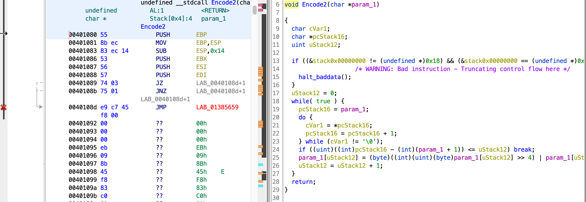
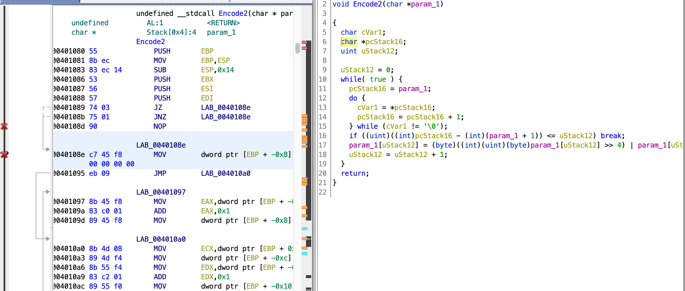

# chicken soup

这题我属实没想到，ghidra在简单花指令上竟然比ida好。

看题目描述得知花指令。笑死根本不知道怎么搞，我的c语言已经很垃圾了，汇编更不用提。动用谷歌，找到了一篇[文章](http://cn-sec.com/archives/196866.html)教怎么去简单花指令，里面正好有我们遇到的。快说：谢谢大佬，谢谢谷歌。

```c
void Main(void)
{
  char cVar1;
  bool bVar2;
  undefined3 extraout_var;
  undefined extraout_DL;
  undefined extraout_DL_00;
  undefined extraout_DL_01;
  undefined uVar3;
  undefined uVar4;
  char input;
  undefined auStack107 [99];
  uint local_8;
  char *copyOfInput;
  local_8 = DAT_0040302c ^ (uint)&stack0xfffffffc;
  puts("I poisoned the program... Can you reverse it?!");
  puts("Come on! Give me your flag:");
  GetInput(&format,(char)&input);
  copyOfInput = &input;
  do {
    cVar1 = *copyOfInput;
    copyOfInput = copyOfInput + 1;
  } while (cVar1 != '\0');
  if ((int)copyOfInput - (int)auStack107 == 38) {
    Encode1(&input);
    uVar4 = SUB41(copyOfInput,0);
    Encode2(&input);
    bVar2 = CheckFlag((int)&input,(int)&DAT_00403000);
    if (CONCAT31(extraout_var,bVar2) == 0) {
      puts("\nQwQ, please try again.");
      uVar3 = extraout_DL_01;
    }
    else {
      puts("\nTTTTTTTTTTQQQQQQQQQQQQQLLLLLLLLL!!!!");
      uVar3 = extraout_DL_00;
    }
  }
  else {
    puts("\nQwQ, please try again.");
    uVar4 = SUB41(copyOfInput,0);
    uVar3 = extraout_DL;
  }
  FUN_004012db(local_8 ^ (uint)&stack0xfffffffc,uVar3,uVar4);
  return;
}
```

Encode1和Encode2中对输入的内容做了改变，那么逆向的重点肯定在这了。两者都使用了相同的花指令混淆，就拿Encode2举例好了。



并没有跟题目描述里说的那样一片飘红，只是jmp跳转的地址红了而已，因为这个地址根本不存在。根据上面那篇文章的介绍，这是因为在正常的byte前面插了一个表示call的byte，于是编译器误把后面的4个字节看成call的地址了，导致反编译错误。这里出现的是e9，表示jmp，我觉得是差不多的。解决方法也很简单，把e9改成nop，后面的内容就正常了。ghidra里patch byte很方便，选中要patch的汇编代码，右键选择Patch instruction，然后输入要改成的指令就可以了。这里改成NOP，0x90。还可以发现jmp后有很多看起来像数据但不合理的byte，ghidra继续右键选择Disassemble就能把这些byte强制编译回指令了。



有没有发现什么？修正花指令后的反编译伪代码和没修正之前逻辑竟然没有改变，唯一改变的是上面的halt_baddata，而ghidra也识别出来了，flag真正需要的加密逻辑没有被混淆到。没想到ghidra还挺强的。

另一个encode1函数patch后如下。

```c
void Encode1(char *param_1)
{
  char cVar1;
  char *pcStack16;
  char *pcStack12;
  pcStack12 = (char *)0x0;
  while( true ) {
    pcStack16 = param_1;
    do {
      cVar1 = *pcStack16;
      pcStack16 = pcStack16 + 1;
    } while (cVar1 != '\0');
    if (pcStack16 + (-1 - (int)(param_1 + 1)) <= pcStack12) break;
    param_1[(int)pcStack12] = param_1[(int)pcStack12] + param_1[(int)(pcStack12 + 1)];
    pcStack12 = pcStack12 + 1;
  }
  return;
}
```

逻辑十分清晰，但不好逆向，直接爆破。

```python
from string import ascii_letters, digits
data='cd 4d 8c 7d ad 1e be 4a 8a 7d bc 7c fc 2e 2a 79 9d 6a 1a cc 3d 4a f8 3c 79 69 39 d9 dd 9d a9 69 4c 8c dd 59 e9 d7'
data=data.split(' ')
flag="moectf{"
letters=ascii_letters+digits+"}{_!"
def encode1(c1,c2):
   return chr(ord(c1)+ord(c2))
def encode2(c1):
   return ord(c1)>>4|ord(c1)<<4
for i in range(7,38):
   current_letter=flag[i-1]
   for letter in letters:
      result=encode2(encode1(current_letter,letter))&0xff
      if result==int(data[i-1],16):
         flag+=letter
         break
print(flag)
```

最开始我在letters里面没有加上感叹号，导致flag提交不对。于是我猜末尾是感叹号再加个}，直接对了。这次是运气好，下次要把全部特殊符号加上才行。&0xff是因为encode2里面把byte转成了int再转uint再转byte，byte到int没什么问题，但int到byte是大转小，加上byte只需要保留最后8位，所以&0xff。其实我不是很懂，但是之前有遇到过类似的，抱着侥幸的心理试了一下，又对了。这题两个关键点都是猜的，做出来完全是瞎猫碰上死耗子。

- ### Flag
  > moectf{p4tch_pr0gr4m_t0_d3c0mpi1e_it!}