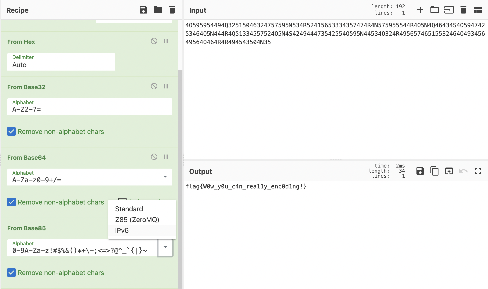

# Encode

[题目地址](https://adworld.xctf.org.cn/challenges/details?hash=bc528606-1312-11ed-9827-fa163e4fa633&task_category_id=1)

原来我的misc差到连编码也搞不明白。

附件打开直接不知道这是什么玩意。我不知道有什么编码由数字和NQR等字母组成。于是看[wp](https://blog.csdn.net/u014029795/article/details/120558887)，大佬告诉了一个小技巧，总之你看字母部分是n到r，找一个编码让它对应到a到f就行了。从n转为a不正好是rot1吗，rot13处理后就是普通的hex了。fromhex转换后像base家族，几个都试一遍，发现是base32。base32后末尾有两个等于号，base64。然后得到的结果好像有些乱码，其实是base85。只不过编码表不是选平时用的standard，而是ipv6。

### Flag
- flag{W0w_y0u_c4n_rea11y_enc0d1ng!}