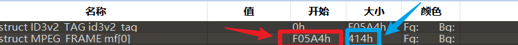

# nice_bgm

[题目地址](https://adworld.xctf.org.cn/challenges/details?hash=ea8d4d36-13c5-11ed-9802-fa163e4fa66d)

misc好久没刷过题了，不能落下啊。

拿到附件，看封面就知道是柯南主题曲。放进audacity看一眼，无果，倒是听了一会歌。现在要干啥呢？当然是看[wp](https://blog.csdn.net/YSF__/article/details/126562971)了。

这题正确的思路是用010 editor打开，要装个MP3模板分析。首先要了解mp3文件的帧结构。

```c
typedef FrameHeader

{          //数字代表大小，单位bit
unsigned int sync:12;                        //同步信息
unsigned int version:2;                      //版本
unsigned int layer: 2;                           //层
unsigned int error protection:1;           // CRC校验
unsigned int bitrate_index:4;              //位率
unsigned int sampling_frequency:2;         //采样频率
unsigned int padding:1;                    //帧长调节
unsigned int private:1;                       //保留字
unsigned int mode:2;                         //声道模式
unsigned int mode extension:2;        //扩充模式
unsigned int copyright:1;                           // 版权
unsigned int original:1;                      //原版标志
unsigned int emphasis:2;                  //强调模式
}
```

那么有些题目就会利用private处隐藏内容，还有用copyright的，不过不是这题。现在的问题就是怎么提取出来文件的所有private bit。先放脚本供积累，类似的题可以直接套。

```python
import re
n = 235986
result = ''
number = 0
file = open('1.mp3', 'rb')
l = []
while n < 1369844:
    file.seek(n, 0)
    head = file.read(1)
    padding = '{:08b}'.format(ord(head))[-2]
    #files.seek(n + 1, 0)
    #file_read_result = files.read(1)
    result += '{:08b}'.format(ord(head))[-1]
    if padding == "0":
        n += 417
    else:
        n += 418
    file.seek(n, 0)
flag = ''
textArr = re.findall('.{' + str(8) + '}', result)
for i in textArr:
    flag = flag + chr(int(i, 2)).strip('\n')
print(flag)
"""
验证padding
l1= []
for i in range(len(l)):
    if l[i] == '0':
        l1.append(i)
print(l1)
"""
```

n是当前mp3文件帧的位置。这个在010 editor里也很好找。图片来自[此处](http://jzcheng.cn/archives/146.html)。



红色的是帧起始位置，蓝色的是一帧的大小。while n < 1369844代表帧到哪里结束。[seek](https://www.runoob.com/python/file-seek.html)函数跟c语言里的文件指针类似，代表把读取指针移动到n处，偏移0。然后读取padding，这道题的padding和private bit重合了，所以读取padding等于读取private bit。其他的题还要再往后读取一个bit，也就是注释部分。padding原本的作用是用于决定当前帧有多大，参考了这篇[文章](https://blog.tms.im/2021/03/30/ctf-mp3-copyright-bit.html)。当padding是0和是1时帧的长度会有变化，一般是1个bit的区别。这道题帧的长度是417或者418，不同题不一样，看上面的图的蓝色框区域。

提取出所有的private bit后用re找到flag，结束。

### Flag
- flag{0k4_YOu_Seem_s0_cl3ver_t0_find_f1ag!}