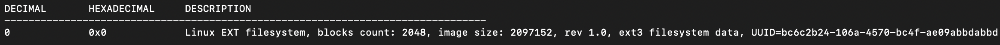
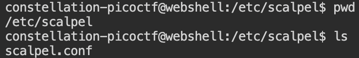
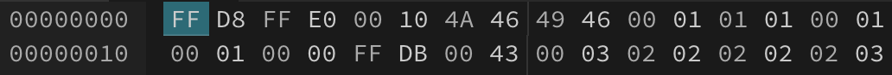
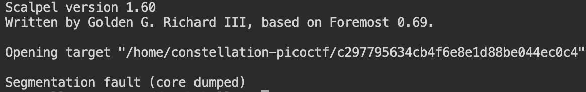

# Recover-Deleted-File

[题目地址](https://adworld.xctf.org.cn/challenges/details?hash=9edc2de9-3b00-44a8-8b74-32bca5a5ad28_2)

这道题其实我没有做出来，而且在我的环境上运行的结果几乎和全网的答案都不一样。下面是整个过程。

附件直接gzip解压，得到一个无后缀的文件。条件反射直接file，文件格式是我没有见过的。

查了一下，其实就是Linux中的文件系统类型。这里出现第一个和其他答案不一样的地方，我使用binwalk无法查找到其他的文件类型。

尝试用mount挂载，但是借用的picoctf [webshell](https://webshell.picoctf.org/)由于不是root权限无法挂载。

自己的shell直接报错无法运行。

这里用SleuthKit的fls命令可以看见里面有一个被删除的flag文件。

但是并没有什么用，只能与这个flag大眼瞪小眼。另外，fls命令可以列出指定镜像内的所有文件夹和文件。更多有关tsk命令的使用请看[官网](http://wiki.sleuthkit.org/index.php?title=The_Sleuth_Kit_commands)

网上的答案都是直接用binwalk就得到里面所有的文件了。可以清楚地看到有一个可执行文件，大概率就是flag了。

[scalpel](https://github.com/sleuthkit/scalpel)可以用于恢复删除的文件。不过scalpel并不专门是用来恢复被删除的文件的。它会扫描镜像内的所有文件，看到有符合配置文件里的文件就恢复。scalpel通过抄写指定文件进行恢复，因此对连续性数据碎片的恢复效果较好。至于更大的文件基本就随缘了。

既然说到配置文件了，你不好奇什么是配置文件吗？scalpel的配置文件用来指定scalpel命令要恢复的文件类型。默认路径在/etc/scalpel.conf或者/etc/scalpel/scalpel.conf。

里面的内容大概是这样。想要什么类型的文件就把什么类型的文件注释取消，就可以生效了。

然后你就会惊喜的发现里面没有可执行文件……没关系，我们可以照着仿写。

在这个文件里面，开头是所要提取文件的后缀名，中间是确定提取（yes），最后一个是header，也就是文件开头的几个字节。相对应的还有一个footer，这个则是文件结尾的几个固定字节。举个例子，随便找几张jpg图片，用编辑器打开它就可以发现每张图片的开头都是一样的。

那么我们就可以用这个配置文件运行scalpel命令了。

这是网上答案的截图。我的实际运行结果就比较奇葩了。

C语言经典噩梦段错误。我也不知道咋办了。其实还有另一种方法，就是用linux自带的命令进行文件恢复。但是不知道为什么我两个shell都没有这个命令，只能作罢。

不过flag可以搜到：de6838252f95d3b9e803b28df33b4baa