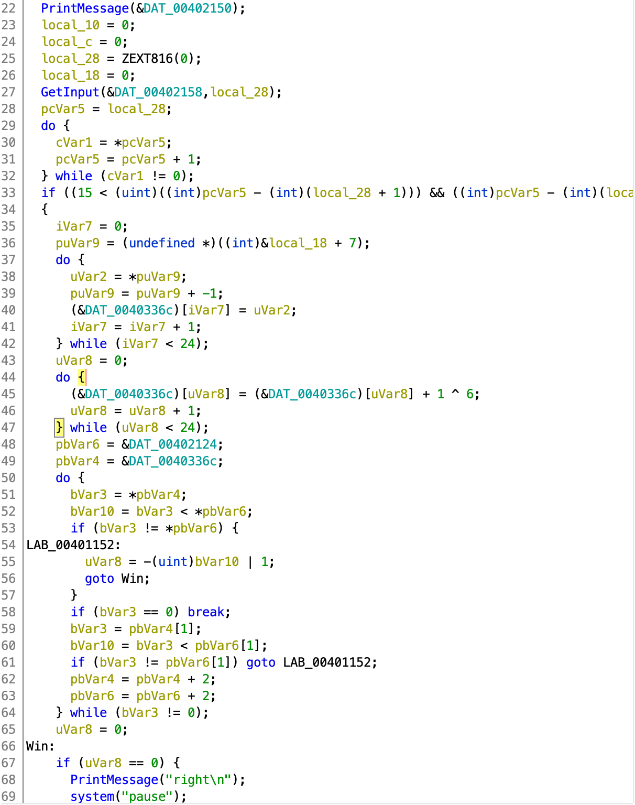
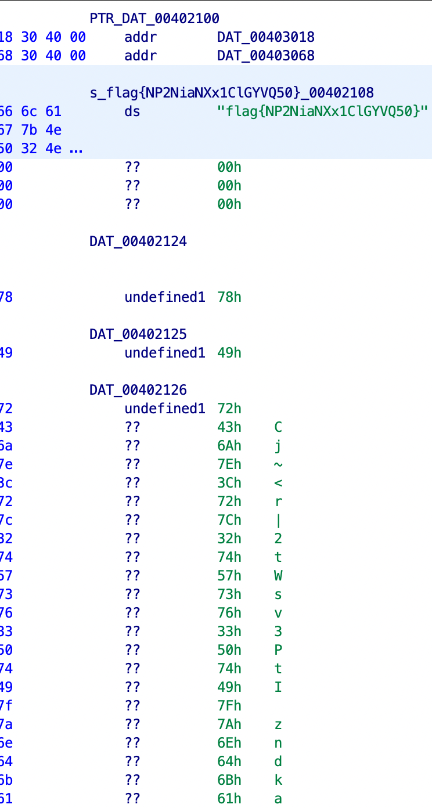

# EasyRE

[题目地址](https://adworld.xctf.org.cn/challenges/details?hash=608d97ab-8be2-41fa-8f6f-0fe0459a95a0_2)

又是令Ghidra用户悲伤的一题。这道题在Ghidra里变得非常有迷惑性。

附件下载下来发现是exe文件。我没法运行，不管了直接扔进Ghidra里。有一个Entry，但是可以判断不是我们想要的入口点。菜单栏->Window->Function Call Graph可以更好地判断出入口点。这里发现了一个函数内部有“right”等字符串，判断是我们的目标。



逆向了几道题后我发现在Ghidra里有的时候就别想完全明白代码在干啥了，只能靠经验去猜代码干了什么。比如这里按正常思路是要让uVar8等于0。但是你可以仔细看一下如何让uVar8等于0，过于复杂，各种代码交织在一起。这里提前告诉你其实整个判断逻辑只有3步。

换个想法，找一下内存中有没有什么可疑的字符串。一般程序中可疑的字符串都是和flag的逆向有关的。（菜单栏->Window->Defined Strings可以查看定义的字符串）



发现了一个flag，但是提交后发现不对。不过下面还有一个可疑的数组，追踪一下这个数组看看在哪里被使用了。（右键目标数组->Reference->Show Reference To Address)

点进去后我们又回到了入口点，看来方向对了。我喜欢从后往前看，所以这里先指出一个很误导人的地方——LAB_00401152。看起来在里面调用了win，是我们的目标，但是你会发现里面将uVar8的值设为-(uint)bVar10 | 1，而按位与只要有1位是1结果都不会是0。所以这里bVar10的值不重要了，因为只要进到这个分支就意味着uVar8值为1，而win需要uVar8值为0。逆向时要避开这个分支。再下面还有进入这个分支的代码，但似乎就是重复了一段逻辑，所以也不用太上心。

虽然这个do-while循环里还有很多细小的东西，但是我们可以先看看前面了，赌这里就是简单的判断相等（因为Ghidra经常把一个简单的逻辑反编译复杂了）。

来到第一个if语句。这个if语句包着下面全部的重要逻辑，如果进不去也肯定无法调用到win了。加上判断的local_28与输入有关，所以直接猜测此处判断的是输入的长度，需要在24位。

第一个do-while循环取指针地址并每次-1，再将结果拷贝到另一个数组里。这个操作就是将输入内容的顺序倒转。下一个do-while循环仅仅是把刚刚得到的结果+1后再与6异或。在后面就是我们猜测的比较了。虽然现在还没有完全了解完整的逻辑，但是完全可以根据现有的信息直接开始写逆向脚本。

```python
s='78 49 72 43 6a 7e 3c 72 7c 32 74 57 73 76 33 50 74 49 7f 7a 6e 64 6b 61'
s=s.split(' ')
for i in range(24):
    s[i]=chr((int(s[i],16)^6)-1)
print(''.join(s[::-1]))
```

事实证明我们是对的。看了别人的使用ida的writeup后才发现逻辑其实非常简单，这个难度完全是被Ghidra自己提升上去了。

## Flag
> flag{xNqU4otPq3ys9wkDsN}