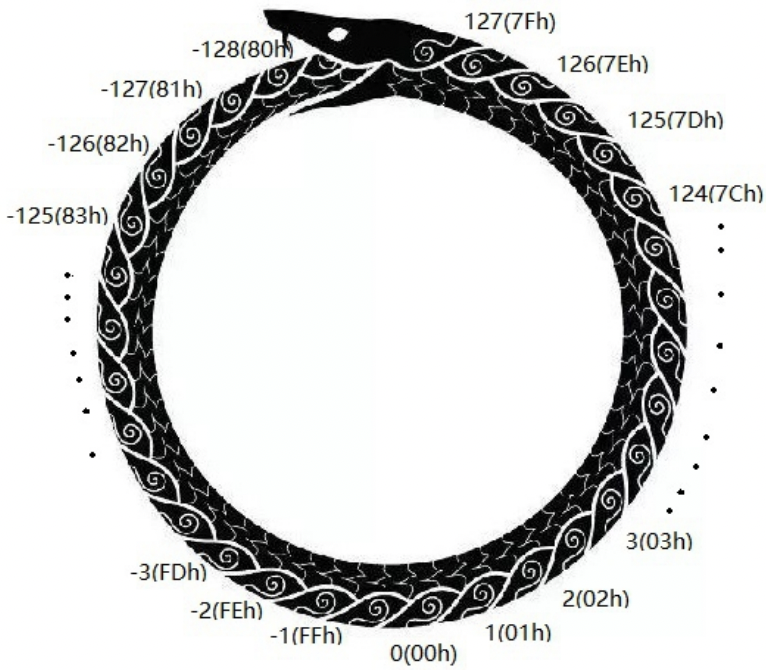

# Newbie_calculations

[题目地址](https://adworld.xctf.org.cn/challenges/details?hash=2ec555af-462e-4a28-bd4f-0f51834958c6_2)

确实牛逼。

不要用ghidra反编译exe啊！！！靠搜索字符串跌跌撞撞找到main函数，我艹这什么东西？

```c
void FUN_004012f0(void)

{
  undefined4 uVar1;
  int i;
  int j;
  undefined4 local_8c;
  undefined local_88 [4];
  undefined local_84 [4];
  undefined local_80 [4];
  undefined local_7c [4];
  undefined local_78 [4];
  undefined local_74 [4];
  undefined local_70 [4];
  undefined local_6c [4];
  undefined local_68 [4];
  undefined local_64 [4];
  undefined local_60 [4];
  undefined4 local_5c;
  undefined local_58 [4];
  undefined local_54 [4];
  undefined local_50 [4];
  undefined local_4c [4];
  undefined local_48 [4];
  undefined local_44 [4];
  undefined local_40 [4];
  undefined local_3c [4];
  undefined local_38 [4];
  undefined local_34 [4];
  undefined4 local_30;
  undefined local_2c [4];
  undefined4 local_28;
  undefined local_24 [4];
  undefined4 local_20;
  undefined local_1c [4];
  undefined local_18 [4];
  undefined4 local_14;
  undefined local_10 [4];
  undefined4 uStack12;
  uint local_8;
  
  local_8 = DAT_0040f000 ^ (uint)&stack0xfffffffc;
  for (i = 0; i < 0x20; i = i + 1) {
    *(undefined4 *)(local_88 + i * 4 + -4) = 1;
  }
  uStack12 = 0;
  FUN_00401d2b("Your flag is:",1);
  uVar1 = FUN_00401100(&local_8c,1000000000,0x3b9ac9ce,2);
  uVar1 = FUN_00401220(uVar1);
  FUN_00401100(uVar1);
  uVar1 = FUN_00401000(local_88,5000000,0x65b9aa,0x196e6a,0x2d,2,5);
  uVar1 = FUN_00401220(uVar1);
  uVar1 = FUN_00401000(uVar1);
  uVar1 = FUN_00401000(uVar1);
  uVar1 = FUN_00401100(uVar1);
  FUN_00401000(uVar1);
  uVar1 = FUN_00401100(local_84,1000000000,0x3b9ac9ce,2,2);
  uVar1 = FUN_00401220(uVar1);
  uVar1 = FUN_00401100(uVar1);
  FUN_00401000(uVar1);
  uVar1 = FUN_00401000(local_80,0x37,3,4,1);
  uVar1 = FUN_00401220(uVar1);
  uVar1 = FUN_00401000(uVar1);
  FUN_00401220(uVar1);
  uVar1 = FUN_00401100(local_7c,100000000,0x5f5e0ce,2,2);
  uVar1 = FUN_00401220(uVar1);
  uVar1 = FUN_00401100(uVar1);
  FUN_00401000(uVar1);
  uVar1 = FUN_00401220(local_78,1,1000000000,0x37,3);
  uVar1 = FUN_00401100(uVar1);
  uVar1 = FUN_00401000(uVar1);
  FUN_00401220(uVar1);
  uVar1 = FUN_00401100(local_74,1000000,0xf4227,4);
  uVar1 = FUN_00401220(uVar1);
  FUN_00401100(uVar1);
  uVar1 = FUN_00401000(local_70,0x37,0x21,0x2c,0xb);
  uVar1 = FUN_00401220(uVar1);
  uVar1 = FUN_00401000(uVar1);
  FUN_00401220(uVar1);
  uVar1 = FUN_00401100(local_6c,10,5,8,9);
  uVar1 = FUN_00401220(uVar1);
  uVar1 = FUN_00401100(uVar1);
  FUN_00401000(uVar1);
  uVar1 = FUN_00401000(local_68,0,0,0xb,0xb,0x35);
  uVar1 = FUN_00401220(uVar1);
  uVar1 = FUN_00401000(uVar1);
  uVar1 = FUN_00401220(uVar1);
  FUN_00401000(uVar1);
  uVar1 = FUN_00401000(local_64,0x31,2,4,2);
  uVar1 = FUN_00401220(uVar1);
  uVar1 = FUN_00401000(uVar1);
  FUN_00401220(uVar1);
  uVar1 = FUN_00401100(local_60,1000000,999999,4,0x32);
  uVar1 = FUN_00401220(uVar1);
  uVar1 = FUN_00401100(uVar1);
  FUN_00401000(uVar1);
  uVar1 = FUN_00401000(&local_5c,1,1,1,1,1,1,10,0x20);
  uVar1 = FUN_00401000(uVar1);
  uVar1 = FUN_00401000(uVar1);
  uVar1 = FUN_00401000(uVar1);
  uVar1 = FUN_00401000(uVar1);
  uVar1 = FUN_00401000(uVar1);
  uVar1 = FUN_00401000(uVar1);
  FUN_00401000(uVar1);
  uVar1 = FUN_00401100(local_58,10,5,8,9,0x30);
  uVar1 = FUN_00401220(uVar1);
  uVar1 = FUN_00401100(uVar1);
  uVar1 = FUN_00401000(uVar1);
  FUN_00401000(uVar1);
  uVar1 = FUN_00401220(local_54,1,4000000000,0x37,3);
  uVar1 = FUN_00401100(uVar1);
  uVar1 = FUN_00401000(uVar1);
  FUN_00401220(uVar1);
  uVar1 = FUN_00401000(local_50,1,2,3,4,5,6,7,0x14);
  uVar1 = FUN_00401000(uVar1);
  uVar1 = FUN_00401000(uVar1);
  uVar1 = FUN_00401000(uVar1);
  uVar1 = FUN_00401000(uVar1);
  uVar1 = FUN_00401000(uVar1);
  uVar1 = FUN_00401000(uVar1);
  FUN_00401000(uVar1);
  uVar1 = FUN_00401100(local_4c,10,5,8,9,0x30);
  uVar1 = FUN_00401220(uVar1);
  uVar1 = FUN_00401100(uVar1);
  uVar1 = FUN_00401000(uVar1);
  FUN_00401000(uVar1);
  uVar1 = FUN_00401000(local_48,7,6,5,4,3,2,1,0x14);
  uVar1 = FUN_00401000(uVar1);
  uVar1 = FUN_00401000(uVar1);
  uVar1 = FUN_00401000(uVar1);
  uVar1 = FUN_00401000(uVar1);
  uVar1 = FUN_00401000(uVar1);
  uVar1 = FUN_00401000(uVar1);
  FUN_00401000(uVar1);
  uVar1 = FUN_00401000(local_44,7,2,4,3,6,5,1,0x14);
  uVar1 = FUN_00401000(uVar1);
  uVar1 = FUN_00401000(uVar1);
  uVar1 = FUN_00401000(uVar1);
  uVar1 = FUN_00401000(uVar1);
  uVar1 = FUN_00401000(uVar1);
  uVar1 = FUN_00401000(uVar1);
  FUN_00401000(uVar1);
  uVar1 = FUN_00401100(local_40,1000000,999999,4,0x32,1);
  uVar1 = FUN_00401220(uVar1);
  uVar1 = FUN_00401100(uVar1);
  uVar1 = FUN_00401000(uVar1);
  FUN_00401220(uVar1);
  uVar1 = FUN_00401220(local_3c,1,4000000000,0x31,1);
  uVar1 = FUN_00401100(uVar1);
  uVar1 = FUN_00401000(uVar1);
  FUN_00401220(uVar1);
  uVar1 = FUN_00401220(local_38,1,1000000000,0x36,1,1000000000,1000000000);
  uVar1 = FUN_00401100(uVar1);
  uVar1 = FUN_00401000(uVar1);
  uVar1 = FUN_00401220(uVar1);
  uVar1 = FUN_00401000(uVar1);
  FUN_00401220(uVar1);
  uVar1 = FUN_00401000(local_34,0x31,1,2,1);
  uVar1 = FUN_00401220(uVar1);
  uVar1 = FUN_00401000(uVar1);
  FUN_00401220(uVar1);
  uVar1 = FUN_00401100(&local_30,10,5,8,9,0x30);
  uVar1 = FUN_00401220(uVar1);
  uVar1 = FUN_00401100(uVar1);
  uVar1 = FUN_00401000(uVar1);
  FUN_00401000(uVar1);
  uVar1 = FUN_00401000(local_2c,1,3,3,3,6,6,6,0x14);
  uVar1 = FUN_00401000(uVar1);
  uVar1 = FUN_00401000(uVar1);
  uVar1 = FUN_00401000(uVar1);
  uVar1 = FUN_00401000(uVar1);
  uVar1 = FUN_00401000(uVar1);
  uVar1 = FUN_00401000(uVar1);
  FUN_00401000(uVar1);
  uVar1 = FUN_00401000(&local_28,0x37,0x21,0x2c,0xb,0x2a);
  uVar1 = FUN_00401220(uVar1);
  uVar1 = FUN_00401000(uVar1);
  uVar1 = FUN_00401220(uVar1);
  FUN_00401000(uVar1);
  FUN_00401000(local_24,local_28);
  FUN_00401000(&local_20,local_5c);
  uVar1 = FUN_00401220(local_1c,1,local_20,1);
  uVar1 = FUN_00401000(uVar1);
  FUN_00401220(uVar1);
  uVar1 = FUN_00401220(local_18,1,1000000,local_30);
  uVar1 = FUN_00401100(uVar1);
  FUN_00401000(uVar1);
  uVar1 = FUN_00401000(&local_14,1,local_20);
  FUN_00401100(uVar1);
  FUN_00401000(local_10,local_14);
  FID_conflict:_wprintf("CTF{");
  for (j = 0; j < 0x20; j = j + 1) {
    FID_conflict:_wprintf("%c",(int)(char)local_88[j * 4 + -4]);
  }
  FID_conflict:_wprintf("}\n");
  FUN_00401e80();
  return;
}
```

后面有flag，发现和local_88有关系。local_88长度肯定不够这个for循环用的，估计是反编译时拆成分裂的变量了。ida里也出现了这种情况，只不过可以重新convert to array让它变得好看一点。暂时没有在ghidra里发现这个功能，大家来[这里](https://blog.csdn.net/xiao__1bai/article/details/119972692)看吧。出现很多次的几个函数FUN_00401000，FUN_00401220，FUN_00401100都看看。

```c
int * FUN_00401000(int *param_1,int param_2)

{
  int i;
  int j;
  
  j = -1;
  for (i = -param_2; i != 0; i = i + -1) {
    *param_1 = *param_1 + -1;
  }
  for (; j != 0; j = j + -1) {
    *param_1 = *param_1 + 1;
  }
  *param_1 = *param_1 + 1;
  return param_1;
}
```

这个函数只有两个参数，怎么main函数调用时传了5个？这里的关键点在于负数循环。问当i初始值为-1是，while(i){i--;}会循环多少次？按照之前的理解，非0值就会进入循环，那你这一直减一直非0，无限循环啊？C语言里不是这样。记得整数溢出吗？当int大到一定程度时会变为很小的负数，反过来当int小到一定程度时会变为很大的正数。摘抄wp区写的很好的一段话。

这里需要了解计算机中的有符号数的表示，以 8 位 CPU 为例子，逻辑上 8 位 CPU 和实际的64 位CPU在这里是一样的，为了简化故用八位 CPU 分析。（64 位的计算机中启动程序员计算器计算FFFFFFFFFFFFFFFF 的十进制会得到-1 的结果）

8 位空间共有 2 的八次方个符号，共可以表示 256 个值，除去 0，则正负的值共有255 个，为奇数，无法均分。

常用最高位作为符号位，最高位为 0 时为整数，最高位为 1 时为负数，其余位为数据位，正数的值大小等于数据位的值，负数的数据位值大小等于数据位的反码加一，即补码。这样设计的一个目的是为了避免 0 的值出现两次（正零和负零），若零值出现两次会造成负值顺延到正值时出错，（比如-1+2 应该为 1，有负零时得到结果为正零）。

但负数的值取补码的一个更重要的目的在于使得取值空间连续，发生符号位溢出时可以正确处理，以 8 位数值空间为例，在有符号的情况下，整个空间取值实际上是一个循环，如图，很像一条衔尾蛇，蛇头为最大正数（计算机中的“正无穷”），蛇尾为最小负数（计算机中的“负无穷”）。



在这个衔尾蛇环中，从任意点开始，加一即为逆时针转动，减一即为顺时针转动，比如0加 1 即为 1，即逆时针走了一步（位）。在32位中，-1就是FFFFFFFF，也是100000000-1。在while(-i){i--;}中，如果i是1，while(-1)共会执行100000000-1；while(-i)共会执行100000000-i次。那么第一个for循环会执行100000000-param_2次。每次param_1=param_1-1，最后param_1=param_1-（100000000-param_2）*1=param_1-100000000+param_2。

第二个for循环的计数j初始为-1，会执行100000000-1次。这里每次param_1++，最后param_1=param_1+100000000-1。后面还有1句param_1+=1。所有的放在一起，param_1=param_1-100000000+param_2+100000000-1+1=param_1+param_2，搞这么多只是个加法。另一个函数也是差不多的套路。

```c
int * FUN_00401220(int *param_1,int param_2)

{
  int i;
  int j;
  
  j = -1;
  for (i = -param_2; i != 0; i = i + -1) {
    *param_1 = *param_1 + 1;
  }
  for (; j != 0; j = j + -1) {
    *param_1 = *param_1 + 1;
  }
  *param_1 = *param_1 + 1;
  return param_1;
}
```

第一个for循环param_1=param_1+(100000000-param_2)\*1，一样的；第二个for循环param_1=param_1+(100000000-1)\*1；最后+1。放在一起，param_1=param_1+(100000000-param_2)\*1+(100000000-1)\*1+1=param_1+100000000+100000000-param_2。这是个什么运算？注意32位系统中100000000就是0，直接变成普通的param_1=param_1-param_2。

最后一个函数了。

```c
void FUN_00401100(int *param_1,int param_2)

{
  int iVar1;
  int iVar2;
  int local_10;
  int local_c;
  uint local_8;
  
  local_8 = DAT_0040f000 ^ (uint)&stack0xfffffffc;
  iVar2 = *param_1;
  iVar1 = -1;
  local_c = 0;
  local_10 = iVar2 * param_2;
  for (; param_2 != 0; param_2 = param_2 + -1) {
    FUN_00401000(&local_c,*param_1,0x151,0x84,0x29a,iVar1,0x85,iVar2,iVar2 * local_10);
    local_10 = local_10 + 1;
  }
  for (; iVar1 != 0; iVar1 = iVar1 + -1) {
    *param_1 = *param_1 + 1;
  }
  *param_1 = *param_1 + 1;
  *param_1 = local_c;
  FUN_00401e80();
  return;
}
```

ghidra很坑的一点是它没写返回值啊，导致没法跟ida里一样通过返回值判断哪些是无用干扰项。FUN_00401000我们看过是加法，不知道这么多参数干啥的。各位去看ida吧，比这里清晰一点。能看出来循环100000000-param_2次，每次local_c和param_1相加。local_c初始值为0，那这里只是param_1在自己相加，加param_2次，param_1=param_1\*param_2。从调用函数处发现param_2为100000000。（谁来告诉我怎么这里没有变成0）。第二个for循环不用看，因为最后有一句\*param_1 = local_c;，无论之前干了什么param_1永远等于local_c。local_c=param_1\*param_2，那这里就是个乘法。把这几个函数简化后代入原脚本，运行得flag。

```c
#include <cstdio>

int sub_401000(int a1, int a2)
{
    return a1 + a2;
}

int sub_401100(int a1, int a2)
{
   return a1  *a2;
}

int sub_401220(int a1, int a2)
{
    return a1 - a2;
}

int main()
{
    int v3; // eax
    int v4; // eax
    int v5; // eax
    int v6; // eax
    int v7; // eax
    int v8; // eax
    int v9; // eax
    int v10; // eax
    int v11; // eax
    int v12; // eax
    int v13; // eax
    int v14; // eax
    int v15; // eax
    int v16; // eax
    int v17; // eax
    int v18; // eax
    int v19; // eax
    int v20; // eax
    int v21; // eax
    int v22; // eax
    int v23; // eax
    int v24; // eax
    int v25; // eax
    int v26; // eax
    int v27; // eax
    int v28; // eax
    int v29; // eax
    int v30; // eax
    int v31; // eax
    int v32; // eax
    int v33; // eax
    int v34; // eax
    int v35; // eax
    int v36; // eax
    int v37; // eax
    int v38; // eax
    int v39; // eax
    int v40; // eax
    int v41; // eax
    int v42; // eax
    int v43; // eax
    int v44; // eax
    int v45; // eax
    int v46; // eax
    int v47; // eax
    int v48; // eax
    int v49; // eax
    int v50; // eax
    int v51; // eax
    int v52; // eax
    int v53; // eax
    int v54; // eax
    int v55; // eax
    int v56; // eax
    int v57; // eax
    int v58; // eax
    int v59; // eax
    int v60; // eax
    int v61; // eax
    int v62; // eax
    int v63; // eax
    int v64; // eax
    int v65; // eax
    int v66; // eax
    int v67; // eax
    int v68; // eax
    int v69; // eax
    int v70; // eax
    int v71; // eax
    int v72; // eax
    int v73; // eax
    int v74; // eax
    int v75; // eax
    int v76; // eax
    int v77; // eax
    int v78; // eax
    int v79; // eax
    int v80; // eax
    int v81; // eax
    int v82; // eax
    int v83; // eax
    int v84; // eax
    int v85; // eax
    int v86; // eax
    int v87; // eax
    int v88; // eax
    int v89; // eax
    int v90; // eax
    int v91; // eax
    int v92; // eax
    int v93; // eax
    int v94; // eax
    int v95; // eax
    int v96; // eax
    int v97; // eax
    int v98; // eax
    int v99; // eax
    int v100; // eax
    int v101; // eax
    int v102; // eax
    int v103; // eax
    int v104; // eax
    int v105; // eax
    int v106; // eax
    int v107; // eax
    int v108; // eax
    int v109; // ST1C_4
    int v110; // eax
    int v111; // eax
    int v112; // ST20_4
    int v113; // eax
    int v114; // eax
    int v115; // ST20_4
    int v116; // eax
    signed int i; // [esp+4h] [ebp-90h]
    signed int j; // [esp+8h] [ebp-8Ch]
    int v120[32]; // [esp+Ch] [ebp-88h]
    int v121; // [esp+8Ch] [ebp-8h]

    for (i = 0; i < 32; ++i)
        v120[i] = 1;
    v121 = 0;
    puts("Your flag is:");
    v3 = sub_401100(v120[0], 1000000000);
    v4 = sub_401220(v3, 999999950);
    v120[0] = sub_401100(v4, 2);
    v5 = sub_401000(v120[1], 5000000);
    v6 = sub_401220(v5, 6666666);
    v7 = sub_401000(v6, 1666666);
    v8 = sub_401000(v7, 45);
    v9 = sub_401100(v8, 2);
    v120[1] = sub_401000(v9, 5);
    v10 = sub_401100(v120[2], 1000000000);
    v11 = sub_401220(v10, 999999950);
    v12 = sub_401100(v11, 2);
    v120[2] = sub_401000(v12, 2);
    v13 = sub_401000(v120[3], 55);
    v14 = sub_401220(v13, 3);
    v15 = sub_401000(v14, 4);
    v120[3] = sub_401220(v15, 1);
    v16 = sub_401100(v120[4], 100000000);
    v17 = sub_401220(v16, 99999950);
    v18 = sub_401100(v17, 2);
    v120[4] = sub_401000(v18, 2);
    v19 = sub_401220(v120[5], 1);
    v20 = sub_401100(v19, 1000000000);
    v21 = sub_401000(v20, 55);
    v120[5] = sub_401220(v21, 3);
    v22 = sub_401100(v120[6], 1000000);
    v23 = sub_401220(v22, 999975);
    v120[6] = sub_401100(v23, 4);
    v24 = sub_401000(v120[7], 55);
    v25 = sub_401220(v24, 33);
    v26 = sub_401000(v25, 44);
    v120[7] = sub_401220(v26, 11);
    v27 = sub_401100(v120[8], 10);
    v28 = sub_401220(v27, 5);
    v29 = sub_401100(v28, 8);
    v120[8] = sub_401000(v29, 9);
    v30 = sub_401000(v120[9], 0);
    v31 = sub_401220(v30, 0);
    v32 = sub_401000(v31, 11);
    v33 = sub_401220(v32, 11);
    v120[9] = sub_401000(v33, 53);
    v34 = sub_401000(v120[10], 49);
    v35 = sub_401220(v34, 2);
    v36 = sub_401000(v35, 4);
    v120[10] = sub_401220(v36, 2);
    v37 = sub_401100(v120[11], 1000000);
    v38 = sub_401220(v37, 999999);
    v39 = sub_401100(v38, 4);
    v120[11] = sub_401000(v39, 50);
    v40 = sub_401000(v120[12], 1);
    v41 = sub_401000(v40, 1);
    v42 = sub_401000(v41, 1);
    v43 = sub_401000(v42, 1);
    v44 = sub_401000(v43, 1);
    v45 = sub_401000(v44, 1);
    v46 = sub_401000(v45, 10);
    v120[12] = sub_401000(v46, 32);
    v47 = sub_401100(v120[13], 10);
    v48 = sub_401220(v47, 5);
    v49 = sub_401100(v48, 8);
    v50 = sub_401000(v49, 9);
    v120[13] = sub_401000(v50, 48);
    v51 = sub_401220(v120[14], 1);
    v52 = sub_401100(v51, -294967296);
    v53 = sub_401000(v52, 55);
    v120[14] = sub_401220(v53, 3);
    v54 = sub_401000(v120[15], 1);
    v55 = sub_401000(v54, 2);
    v56 = sub_401000(v55, 3);
    v57 = sub_401000(v56, 4);
    v58 = sub_401000(v57, 5);
    v59 = sub_401000(v58, 6);
    v60 = sub_401000(v59, 7);
    v120[15] = sub_401000(v60, 20);
    v61 = sub_401100(v120[16], 10);
    v62 = sub_401220(v61, 5);
    v63 = sub_401100(v62, 8);
    v64 = sub_401000(v63, 9);
    v120[16] = sub_401000(v64, 48);
    v65 = sub_401000(v120[17], 7);
    v66 = sub_401000(v65, 6);
    v67 = sub_401000(v66, 5);
    v68 = sub_401000(v67, 4);
    v69 = sub_401000(v68, 3);
    v70 = sub_401000(v69, 2);
    v71 = sub_401000(v70, 1);
    v120[17] = sub_401000(v71, 20);
    v72 = sub_401000(v120[18], 7);
    v73 = sub_401000(v72, 2);
    v74 = sub_401000(v73, 4);
    v75 = sub_401000(v74, 3);
    v76 = sub_401000(v75, 6);
    v77 = sub_401000(v76, 5);
    v78 = sub_401000(v77, 1);
    v120[18] = sub_401000(v78, 20);
    v79 = sub_401100(v120[19], 1000000);
    v80 = sub_401220(v79, 999999);
    v81 = sub_401100(v80, 4);
    v82 = sub_401000(v81, 50);
    v120[19] = sub_401220(v82, 1);
    v83 = sub_401220(v120[20], 1);
    v84 = sub_401100(v83, -294967296);
    v85 = sub_401000(v84, 49);
    v120[20] = sub_401220(v85, 1);
    v86 = sub_401220(v120[21], 1);
    v87 = sub_401100(v86, 1000000000);
    v88 = sub_401000(v87, 54);
    v89 = sub_401220(v88, 1);
    v90 = sub_401000(v89, 1000000000);
    v120[21] = sub_401220(v90, 1000000000);
    v91 = sub_401000(v120[22], 49);
    v92 = sub_401220(v91, 1);
    v93 = sub_401000(v92, 2);
    v120[22] = sub_401220(v93, 1);
    v94 = sub_401100(v120[23], 10);
    v95 = sub_401220(v94, 5);
    v96 = sub_401100(v95, 8);
    v97 = sub_401000(v96, 9);
    v120[23] = sub_401000(v97, 48);
    v98 = sub_401000(v120[24], 1);
    v99 = sub_401000(v98, 3);
    v100 = sub_401000(v99, 3);
    v101 = sub_401000(v100, 3);
    v102 = sub_401000(v101, 6);
    v103 = sub_401000(v102, 6);
    v104 = sub_401000(v103, 6);
    v120[24] = sub_401000(v104, 20);
    v105 = sub_401000(v120[25], 55);
    v106 = sub_401220(v105, 33);
    v107 = sub_401000(v106, 44);
    v108 = sub_401220(v107, 11);
    v120[25] = sub_401000(v108, 42);
    v120[26] = sub_401000(v120[26], v120[25]);
    v120[27] = sub_401000(v120[27], v120[12]);
    v109 = v120[27];
    v110 = sub_401220(v120[28], 1);
    v111 = sub_401000(v110, v109);
    v120[28] = sub_401220(v111, 1);
    v112 = v120[23];
    v113 = sub_401220(v120[29], 1);
    v114 = sub_401100(v113, 1000000);
    v120[29] = sub_401000(v114, v112);
    v115 = v120[27];
    v116 = sub_401000(v120[30], 1);
    v120[30] = sub_401100(v116, v115);
    v120[31] = sub_401000(v120[31], v120[30]);
    printf("CTF{");
    for (j = 0; j < 32; ++j)
        printf("%c", v120[j]);
    printf("}\n");
    return 0;
}
```

- ### Flag
  > CTF{daf8f4d816261a41a115052a1bc21ade}