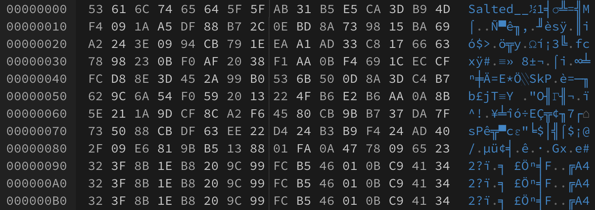

# ecb,_it’s_easy_as_123

[题目地址](https://adworld.xctf.org.cn/challenges/details?hash=9f42d2be-ccc6-4819-9b19-bf510a096435_2&task_category_id=5)

附件解压出来还是个zip，需要二次解压。解压出了一张bmp，但是无法打开。hex打开，发现开头有salt字样，是openssl加密。



openssl加密的特征是文件头有8个字节大小的签名，签名的字符形式是“Salted__”

在解题之前先简单了解一下ecb。ecb是AES加密的一种形式，通过把明文分成一块一块分别加密，然后把密文块拼在一起进行加密。这样有什么缺点呢？因为加密用的密钥在加密过程中是一样的，导致相同的明文块一定会有相同的密文块。此加密方式的缺陷在图片上尤为明显。[维基百科](https://en.wikipedia.org/wiki/Block_cipher_mode_of_operation)上的一张对比图广为流传。


从左到右第一张图是原图，第二张图是ecb加密后的图，第三张是除ecb模式意外的伪随机加密方式。ecb在加密后还能看到企鹅的轮廓。这是因为既然ecb相同明文块会出现相同的密文，那么其呈现形式也是一样的。比如图片中的白色会被替换成一种密文，黑色是另一种……但颜色种类还是那么多，加上有能区分出密文的样子，那这不等于加密了个寂寞吗？仔细看，原图上每一种颜色都对应了相同的噪点，所以才能呈现出轮廓。

回到刚刚的bmp。这张bmp没有被识别出来的原因是文件头不对，并不是因为里面的内容被加密了。那我们把文件头改成正确的试试？参考[官方writeup](https://github.com/ctfs/write-ups-2014/tree/master/tinyctf-2014/ecb-its-easy-as-123)

```shell
$ xxd sample.bmp | head -n 8
0000000: 424d 7648 3f00 0000 0000 7600 0000 2800  BMvH?.....v...(.
0000010: 0000 000f 0000 7008 0000 0100 0400 0000  ......p.........
0000020: 0000 0048 3f00 0000 0000 0000 0000 0000  ...H?...........
0000030: 0000 0000 0000 0000 0000 0000 8000 0080  ................
0000040: 0000 0080 8000 8000 0000 8000 8000 8080  ................
0000050: 0000 8080 8000 c0c0 c000 0000 ff00 00ff  ................
0000060: 0000 00ff ff00 ff00 0000 ff00 ff00 ffff  ................
0000070: 0000 ffff ff00 ffff ffff ffff ffff ffff  ................
```

前面有个txt提示bmp是4k的，意味着分辨率是3840×2160或4096×2160。用下面这个脚本创建一个有正确文件头的bmp。

```python
from Crypto.Util.number import long_to_bytes
with open('你的bmp图片地址','rb') as f:
    data=f.read()
pre=0x424d76483f00000000007600000028000000000f000070080000010004000000000000483f00000000000000000000000000000000000000000000008000008000000080800080000000800080008080000080808000c0c0c0000000ff0000ff000000ffff00ff000000ff00ff00ffff0000ffffff00ffffffffffffffffffff
out=long_to_bytes(pre)+data[128:]   #文件头长128，所以只要原图片的128位以后
with open('你要存储的地址','wb') as g:
    g.write(out)
```

注意这个bmp的色深是16为而不是24位。因为上面提到的ecb特性，所以即使图片被加密了我们仍然能看出flag的轮廓。bmp文件头可以[看这](https://www.cnblogs.com/Matrix_Yao/archive/2009/12/02/1615295.html)

- ### Flag
- > flag{no_penguin_here}