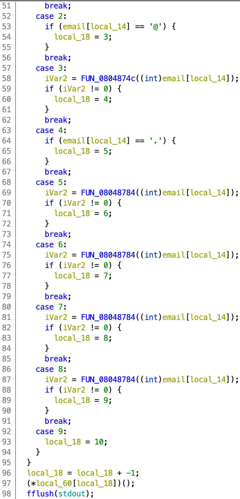

# forgot

[题目地址](https://adworld.xctf.org.cn/challenges/details?hash=acb5e17b-369a-4679-90bb-64cb9e15cd47_2)

这题的来源应该是国外的一个比赛，所以描述是生草机翻。没事，pwn看程序就行了。




根据反编译和运行结果可知这是一个判断邮箱是否有效的程序。没有在程序内部发现打开flag文件这个操作，暂时无法判断目标是什么。可以发现main内部的定义很奇怪，声明了一堆函数指针。这里我重命名了几个，发现都是一些运行程序时可以触法的打印操作。因此下一步就是看看这些函数指针在哪里被调用了。

for循环中一位一位判断用户输入的时候email是否有效。这里判断的方式也很奇特，利用switch判断local_18的值来决定目前判断到哪一步了。点进几个函数看看也发现就是普通的判断逻辑，并且没有执行之前看到的打印操作。

继续往下看发现了一个更奇怪的函数调用方式。

```c  
local_18 = local_18 + -1;
(*local_60[local_18])();
```

我们可以从最上面的变量声明得知local_60是一个指针数组，那么这里的作用就是把local_18用作索引并在local_60里取值。要注意这里虽然local_60只有4个元素，但是c语言中并不会有数组越界的问题——应该说不会报错，但是会引发不可预料的问题。这是因为访问数组的本质是访问一段连续内存中的某个单元，只要这个单元的内存是可用的，那么程序就不会崩溃。正常情况下访问local_60\[0]是访问这个数组的首元素，自然没错；但是访问local_60\[6]的时候也可以取出值，因为local_60数组后面紧跟着别的函数指针，那么这个索引6就取到别的函数了。在这里不会报错但是其他情况下很有可能会导致程序崩溃。

这个地方的调用这么蹊跷那么必有漏洞可利用。回头看之前接受输入的地方，第一个name没有问题因为fgets限定了接收的长度，但是email的接收就有问题了，email声明是只有32个char但是却接收了无限制的char。查看栈上变量的分布还发现email和local_60是挨着的，就让溢出并覆盖local_60的原始值的操作变得十分简单。

现在清点一下我们有的条件：可随意覆盖地址，可控制local_18的值，而local_18和local_60一起决定了最后调用的函数。这就显而易见了，溢出并覆盖local_60的首元素，也就是第一个函数指针，再吧local_18控制在1，这样后面local_18-1的操作就让local-18变为0，成功调用第一个函数。问题是我们调用啥呢？

在程序里搜索flag可以发现有一个这样的函数：

```c
void FUN_080486cc(void)

{
  char local_3e [58];
  
  snprintf(local_3e,0x32,"cat %s","./flag");
  system(local_3e);
  return;
}
```

调用system函数打印flag。那这就是我们想要的了。拷贝函数地址后我们就能开始写exp了。

```python
from pwn import *
flag_addr=0x080486cc
payload=b'A'*0x20+p32(flag_addr)
proc=remote("61.147.171.105",49996)
proc.sendlineafter("> ",b't')
proc.sendlineafter("> ",payload)
print(proc.recvall())
```

注意proc.sendlineafter("> ",b't')必需发送byte类型，否则会失败。

- ### Flag
- > cyberpeace{7816e237f0b31b7ae1a570e152a17c32}