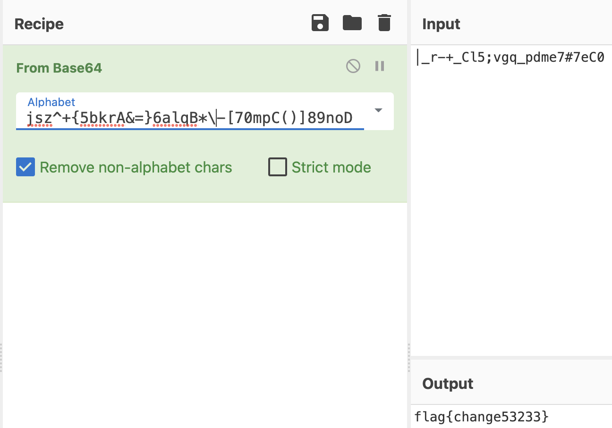

# 2ex1

[题目地址](https://adworld.xctf.org.cn/challenges/details?hash=480b14de-470a-4282-bcae-b57d19340f5a_2)

根本不懂base64的我。

拿到附件，不知道为啥电脑把两个文件都识别成elf了，其实只有mx是elf，out就是个txt而已。反编译mx，entry函数调用的main是以指针形式存储的，照样点进去看。

```c
undefined4 Main(void)

{
  undefined4 in_a3;
  undefined *puVar1;
  undefined auStack56 [20];
  undefined auStack36 [28];
  
  puVar1 = &_mips_gp0_value;
  FUN_00400840(auStack56);
  FUN_004010f0(auStack36,0x19);
  AnotherBase64(auStack56,0x11,auStack36,in_a3,puVar1);
  FUN_004009c0(auStack36);
  return 0;
}
```

这题是static的，意味着很多平时一眼过的系统函数现在全部有着乱七八糟的名字和看不懂的作用，导致程序很难完整分析完。之前一直有的习惯现在看来是错的：先把程序里调用的所有函数都过一遍，再分析flag。这题不能这么做，因为每个函数里都有套娃，很有可能到最后看晕了。注意以后static程序的函数不要看太多层，先看主函数里面的，不要套娃，一层没有再往下一层看。

会发现第三个函数AnotherBase64有点问题。问题不在函数的逻辑中（反正ghidra里也看不出来(･_･;），而是调用的数据。

```c
undefined4 AnotherBase64(int param_1,uint param_2,int param_3)

{
  uint uVar1;
  uint local_18;
  int local_14;
  
  local_14 = 0;
  for (local_18 = 0; local_18 < param_2; local_18 = local_18 + 1) {
    uVar1 = local_18 % 3;
    if (uVar1 == 1) {
      *(undefined *)(param_3 + local_14) =
           (&DAT_00410200)
           [(*(byte *)(param_1 + (local_18 - 1)) & 3) * 0x10 +
            (uint)(*(byte *)(param_1 + local_18) >> 4)];
      local_14 = local_14 + 1;
    }
    else if (uVar1 == 2) {
      *(undefined *)(param_3 + local_14) =
           (&DAT_00410200)
           [(*(byte *)(param_1 + (local_18 - 1)) & 0xf) * 4 +
            (uint)(*(byte *)(param_1 + local_18) >> 6)];
      *(undefined *)(param_3 + local_14 + 1) = (&DAT_00410200)[*(byte *)(param_1 + local_18) & 0x3f]
      ;
      local_14 = local_14 + 2;
    }
    else if (uVar1 == 0) {
      *(undefined *)(param_3 + local_14) = (&DAT_00410200)[*(byte *)(param_1 + local_18) >> 2];
      local_14 = local_14 + 1;
    }
  }
  local_18 = local_18 - 1;
  if (local_18 % 3 == 0) {
    *(undefined *)(param_3 + local_14) = (&DAT_00410200)[(*(byte *)(param_1 + local_18) & 3) * 0x10]
    ;
    *(undefined *)(param_3 + local_14 + 1) = 0x3d;
    *(undefined *)(param_3 + local_14 + 2) = 0x3d;
  }
  else if (local_18 % 3 == 1) {
    *(undefined *)(param_3 + local_14) = (&DAT_00410200)[(*(byte *)(param_1 + local_18) & 0xf) * 4];
    *(undefined *)(param_3 + local_14 + 1) = 0x3d;
  }
  return 0;
}
```

DAT_00410200提取出来转成字符。

```python
data='40 2c 2e 31 66 67 76 77 23 60 2f 32 65 68 75 78 24 7e 22 33 64 69 74 79 25 5f 3b 34 63 6a 73 7a 5e 2b 7b 35 62 6b 72 41 26 3d 7d 36 61 6c 71 42 2a 2d 5b 37 30 6d 70 43 28 29 5d 38 39 6e 6f 44'.split(' ')
print(len(data))
for i in data:
    print(chr(int(i,16)),end='')
```

虽然data不是常见的base64编码表，但是它确确实实长度为64啊，没人规定base64编码表就非得是那些字符。拿出cyberchef，自定义编码表，然后把密文粘贴进去就是了。



我在编码表*和-符号之间加了个转义符，因为直接粘贴进去cyberchef会把这两个字符展开，导致编码表错误。去掉了密文最后的=号，当然不去掉也能解密成功，就是末尾多了个)号。

### Flag
- flag{change53233}