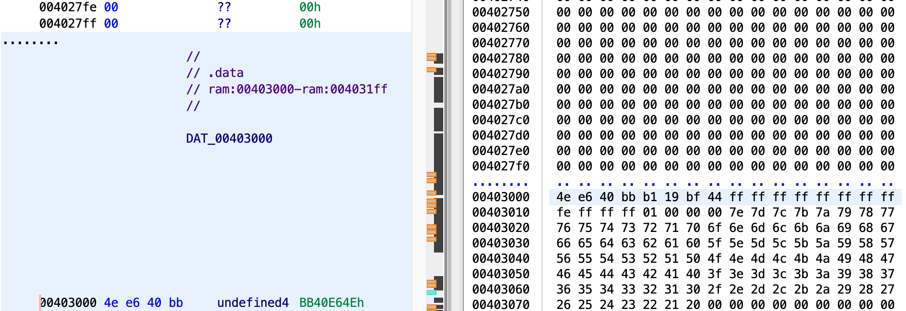

# Windows_Reverse1

[题目地址](https://adworld.xctf.org.cn/challenges/details?hash=536d1bda-e1a6-44b9-b9b9-9641c9efb823_2)

正如醉翁之意不在酒，windows_reverse考点不在windows。

windows题目就是体验一下了，ghidra反编译出来的windows简直是顶级抽象艺术。最开始直接反编译发现只有一个函数，字符串信息也很少，意识到有壳。upx脱壳后看main函数。

```c
void main(void)

{
  byte *_some_ptr;
  int iVar1;
  char *flag;
  undefined4 extraout_EDX;
  undefined4 extraout_EDX_00;
  bool bVar2;
  byte local_803 [1023];
  char input;
  undefined local_403 [1023];
  uint local_4;
  byte some_ptr;
  byte value_of_some_ptr;
  
  local_4 = DAT_00403000 ^ (uint)&stack0xfffff7fc;
  input = '\0';
  memset(local_403,0,0x3ff);
  some_ptr = 0;
  memset(local_803,0,0x3ff);
  printf("please input code:");
  scanf("%s",&input);
  PtrFunction(&stack0xfffff7fc,&input);
  flag = "DDCTF{reverseME}";
  _some_ptr = &stack0xfffff7fc;
  do {
    value_of_some_ptr = *_some_ptr;
    bVar2 = value_of_some_ptr < (byte)*flag;
    if (value_of_some_ptr != *flag) {
LAB_004010f4:
      iVar1 = (1 - (uint)bVar2) - (uint)(bVar2 != 0);
      goto LAB_004010f9;
    }
    if (value_of_some_ptr == 0) break;
    value_of_some_ptr = _some_ptr[1];
    bVar2 = value_of_some_ptr < ((byte *)flag)[1];
    if (value_of_some_ptr != ((byte *)flag)[1]) goto LAB_004010f4;
    _some_ptr = _some_ptr + 2;
    flag = (char *)((byte *)flag + 2);
  } while (value_of_some_ptr != 0);
  iVar1 = 0;
LAB_004010f9:
  if (iVar1 == 0) {
    printf("You\'ve got it!!%s\n",&stack0xfffff7fc);
    FUN_00401146(local_4 ^ (uint)&stack0xfffff7fc,extraout_EDX,some_ptr);
    return;
  }
  printf("Try again later.\n");
  FUN_00401146(local_4 ^ (uint)&stack0xfffff7fc,extraout_EDX_00,some_ptr);
  return;
}
```

没有重命名变量名之前仔细看了看LAB_004010f4的内容，不明所以。靠之前的内容猜测了一下内容，改个名后发现这不就是普通的比较吗？这么多行内容只有一个目标：value_of_some_ptr要和flag相等。那就要看看_some_ptr，也就是stack0xfffff7fc，是什么了。

```c
void __thiscall PtrFunction(void *this,char *param_1)

{
  char cVar1;
  char *pcVar2;
  int iVar3;
  uint uVar4;
  
  uVar4 = 0;
  pcVar2 = param_1;
  do {
    cVar1 = *pcVar2;
    pcVar2 = pcVar2 + 1;
  } while (cVar1 != '\0');
  if (pcVar2 != param_1 + 1) {
    iVar3 = (int)param_1 - (int)this;
    do {
      *(undefined *)this = *(undefined *)(*(char *)((int)this + iVar3) + 0x402ff8);
      uVar4 = uVar4 + 1;
      this = (void *)((int)this + 1);
      pcVar2 = param_1;
      do {
        cVar1 = *pcVar2;
        pcVar2 = pcVar2 + 1;
      } while (cVar1 != '\0');
    } while (uVar4 < (uint)((int)pcVar2 - (int)(param_1 + 1)));
  }
  return;
}
```

这个函数里涉及到了stack0xfffff7fc。函数中的this对应stack0xfffff7fc，param_1是输入内容。iVar3 = (int)param_1 - (int)this;说明iVar3是两个地址的差值，毕竟是以指针形式传进来的。下一句无能为力了，\*(undefined \*)this = \*(undefined \*)(\*(char \*)((int)this + iVar3) + 0x402ff8); ，这是个什么东西？翻[wp](https://blog.csdn.net/xiao__1bai/article/details/119938464)。

原来是出题人在做混淆，这里的作用是遍历input的内容。仔细想想发现挺简单的，当时没绕过来。iVar3是param_1减this的结果，后面又用this加上iVar3，那这不就又得到param_1的地址了吗？接下来把this的地址值加上1，但是iVar3没有变，第二次加回来不就得到param_1地址偏移1的位置了吗？数组取值本身就是地址偏移，知道这点后绕过来就不难了。

0x402ff8在这里应该是个数组，不知道为什么ghidra里直接粗暴相加。好像也不能说它错，每次*(char *)((int)this + iVar3)遍历input数组并取字符ascii值，加上0x402ff8，完成了用input内容ascii值作为索引取0x402ff8处数组值的操作，本质还是数组遍历。这题的考点应该是数组遍历啊。

ghidra里还没法直接搜索这个地址（可能是我没找到教程），只能手动往下翻。



怎么跟wp比对还少了一段？

```python
table = [00,0x00,0x00,0x00,0x00,0x00,0x00,0x00,0xFF,0x3A,0xFC,0x30,0x00,0xC5,0x03,0xCF,0xFF,0xFF,0xFF,0xFF,0xFF,0xFF,0xFF,0xFF,0xFE,0xFF,0xFF,0xFF,0x01,0x00,0x00,0x00,0x7E,0x7D,0x7C,0x7B,0x7A,0x79,0x78,0x77,0x76,0x75,0x74,0x73,0x72,0x71,0x70,0x6F,0x6E,0x6D,0x6C,0x6B,0x6A,0x69,0x68,0x67,0x66,0x65,0x64,0x63,0x62,0x61,0x60,0x5F,0x5E,0x5D,0x5C,0x5B,0x5A,0x59,0x58,0x57,0x56,0x55,0x54,0x53,0x52,0x51,0x50,0x4F,0x4E,0x4D,0x4C,0x4B,0x4A,0x49,0x48,0x47,0x46,0x45,0x44,0x43,0x42,0x41,0x40,0x3F,0x3E,0x3D,0x3C,0x3B,0x3A,0x39,0x38,0x37,0x36,0x35,0x34,0x33,0x32,0x31,0x30,0x2F,0x2E,0x2D,0x2C,0x2B,0x2A,0x29,0x28,0x27,0x26,0x25,0x24,0x23,0x22,0x21,0x20,0x00,0x01,0x00,0x00,0x00,0x70,0x19,0x38,0x00,0x80,0x12,0x38,0x00,0x00,0x00,0x00,0x00]
flag = ''
str1 = "DDCTF{reverseME}"
for i in range(len(str1)):
    flag += chr(table.index(ord(str1[i])))
print(flag)
```

- ### Flag
  > flag{ZZ[JX#,9(9,+9QY!}