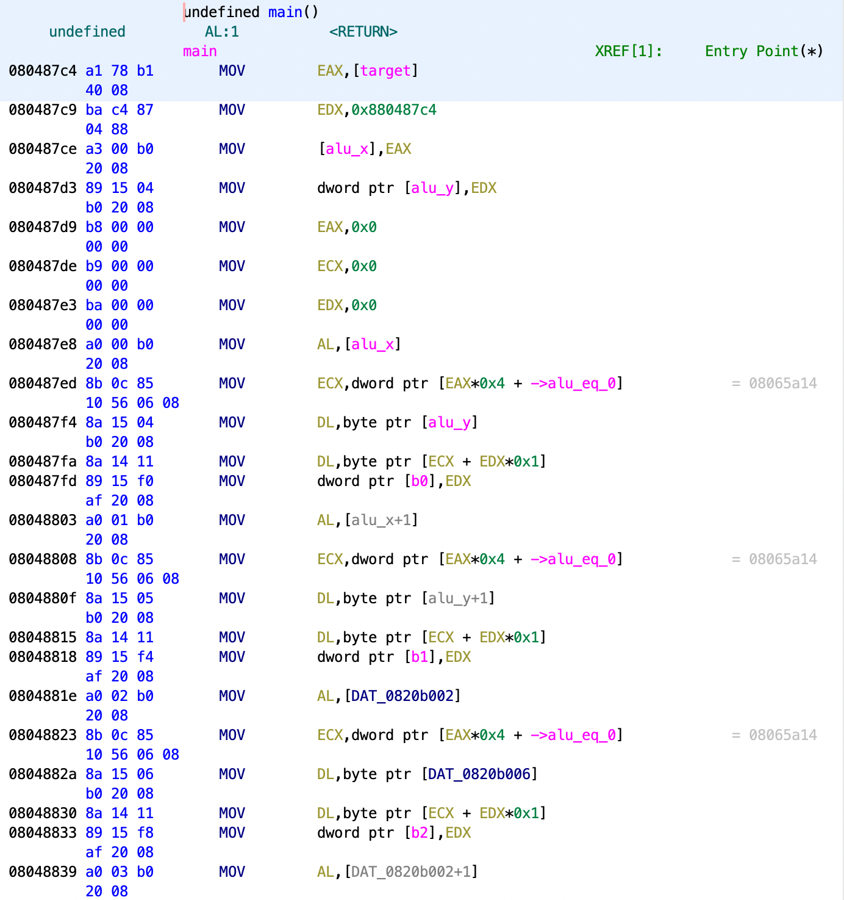
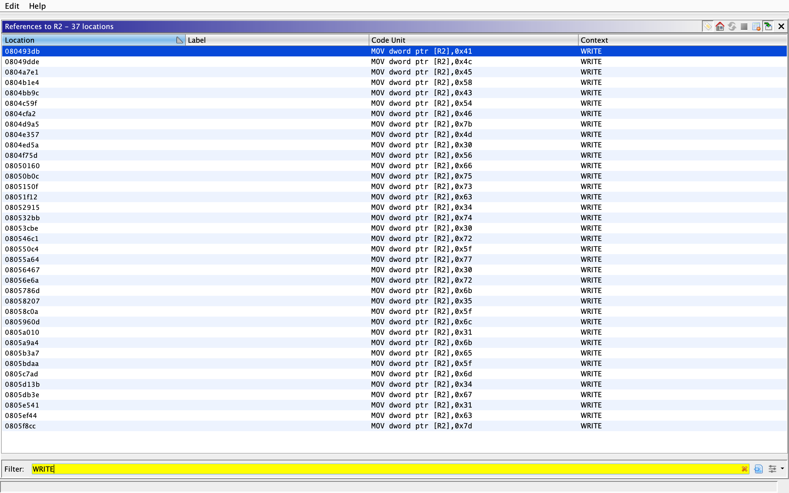

# re5-packed-movement

[题目地址](https://adworld.xctf.org.cn/challenges/details?hash=bfc981d6-4d6c-47a2-adee-26e37dff38a3_2)

这是什么神奇混淆？

程序到手，一看反编译出来的内容就知道有壳。这次的壳是up，正好我可以直接脱。然而脱出来我更懵逼了。main函数根本反编译不出来伪代码，一看汇编……



连续出现几个mov我会觉得是巧合，这全是mov怎么解释？看[wp](https://blog.csdn.net/xiao__1bai/article/details/121322499)说是用了[movfuscator](https://github.com/xoreaxeaxeax/movfuscator)来混淆。M/o/Vfuscator（简称“o”，听起来像“mobfuscator”）将程序编译成“mov”指令，并且只编译“mov”指令。算术、比较、跳转、函数调用，以及程序需要的一切，都是通过mov操作完成的；没有自修改代码，没有传输触发的计算，也没有其他形式的非 mov 作弊。万恶之源是剑桥大学的Stephen Dolan证明了x86的mov指令是图灵完全的（论文《mov is Turing-complete》）。这意味着从理论上来讲，x86只要有mov这一条指令就可以完成几乎所有功能了（可能还需要jmp），其他指令都是“多余的”。受此启发，有个大牛做了一个虚拟机加密编译器。它是一个修改版的LCC编译器，输入是C语言代码，输出的obj里面直接包含了虚拟机加密后的代码。如它的名字，函数的所有代码只有mov指令，没有其他任何指令。对，完全没有，连call，jz，ret之类的都没有。

所以我怎么看？我知道有混淆，但是除了啃汇编似乎没有别的办法了。马后炮看wp区发现大佬总结逆向的4种类型：

1. 数据段中有直接的flag
2. 数据段中没有flag，但是有索引值，可以进行变换（或加密算法）
3. flag直接写在立即数中，写死了
4. flag完全由代码实现，需要动调

如果是第二种，这题不用玩了，看全mov构成的简单算法都能看一年。第4种也没有必要，如果动调就出来了跟混淆这个考点没啥关系。还剩1和3。没法通过搜索字符串直接找到flag，那只能是第3种了，即 mov xxx,'a'这类指令，xxx可能是寄存器，a是flag数据。ghidra不知道怎么搜索这些数据，无脑乱翻翻到了一条内容。

```
        080493db c7 05 68        MOV        dword ptr [R2],0x41
                 20 06 08 
                 41 00 00 00
```

0x41是A啊，使用的寄存器是r2。ghidra里双击r2寄存器，然后右键Reference->Show Reference to R2，就能查到所有r2的引用。将结果按照地址从小到大排列并且按照WRITE过滤（因为发现只有WRITE有数据）。



这些数据就是flag。

### Flag
- ALEXCTF{M0Vfusc4t0r_w0rk5_l1ke_m4g1c}