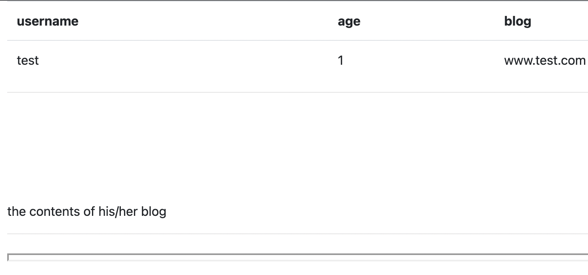
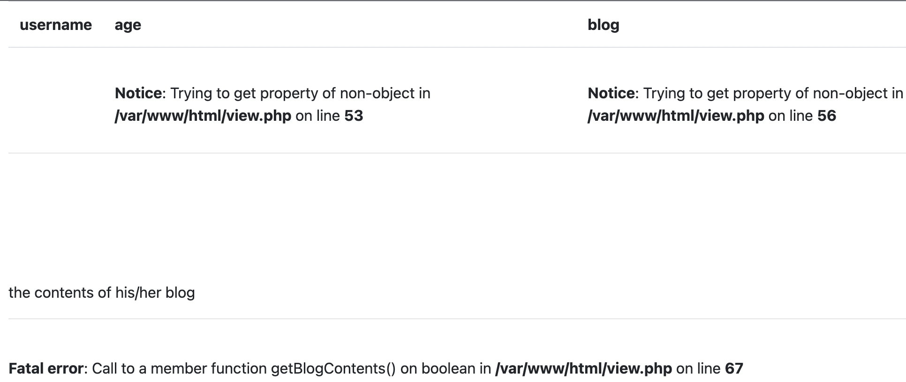

# fakebook

[题目地址](https://adworld.xctf.org.cn/challenges/details?hash=c500b9d0-d809-4879-a7a8-5b12da735c57_2)

我卡在了这道题的第一步……场景打开是普通的注册和登录界面。

很离谱的是我不知道怎么注册……注册界面要求填写blog，当我随便填个名字时却显示无效。后来我才知道要遵循“www.xxx.com”的形式。

点进注册的blog发现显示不知道为啥不完全。URL也很可疑，使用get传参的形式。

- http://61.147.171.105:54899/view.php?no=1

更改参数no的值发现有回显，得到了当前网站运行路径。

输入引号有报查询错误，考虑URL SQL注入。放到burpsuite的repeater来找有效payload。先试一下union select，正确的列数到时候一起找，就懒得order by了。

- /view.php?no=2+union+select+1--+

可惜没有成功，有过滤。只传union报查询错误，只传select也报查询错误，但是在同时传union select时会提示no hack，于是判断过滤内容是union select。这里只需要找个能在不输入空格的情况下又能让系统识别出union select的方法，比如用多行注释/**/。

- /view.php?no=2+union/**/select+1,2,3,4--+

最后在四列时没有报错。按照一般流程就该爆库爆表爆字段了，但是有没有啥捷径呢？通过搜索可得MySQL有个叫load_file的方法，可以读取一个文件的内容并将其作为字符串返回。这个方法当然比常规的方法简单很多，就是有条件限制：

- ### 条件
- > 必须有权限读取并且文件必须完全可读。
- > 读取文件必须在服务器上
- > 必须指定文件完整的路径
- > 读取文件必须小于max_allowed_packet

后三条应该满足，flag没多大且肯定在服务器上，我们也有了当前网站绝对路径所以可以猜一下flag的路径。第一条可以用一条语句确定当前用户用没有读取权限。

- /view.php?no=1+and+(select+count(*)+from+mysql.user)>0--+

如果页面回显正常就证明有权限，报错就说明没有，应该是管理员对数据库账户降权了。

或者也可以用这个办法：

- /view.php?no=2+union/**/select+1,user(),3,4--+

返回结果是root@localhost，那就是有权限了。条件基本都满足，可以猜flag路径了。猜flag就在当前目录下，最后发现/var/www/html/flag.php是正确路径。

- /view.php?no=2+union/**/select+1,load_file("/var/www/html/flag.php"),3,4--+

最后看官方writeup还发现有反序列化和SSRF的解法。我太菜了就先用这种解法吧。ʕ •ᴥ•ʔ

- ### Flag
- > flag{c1e552fdf77049fabf65168f22f7aeab}