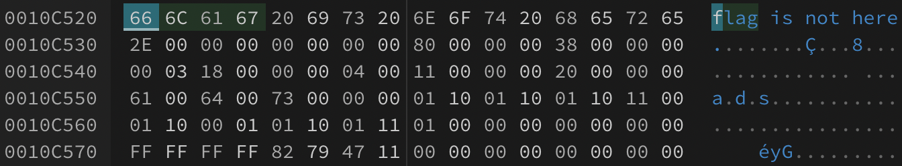

# Disk

[题目地址](https://adworld.xctf.org.cn/challenges/details?hash=c8944ac2-2162-4422-8f90-f0aff10ea4e1_2)

什么还可以这样的吗？

附件后缀名为vmdk。dk看起来像个磁盘文件，尝试tsk。

-  mmls ctf-flat.vmdk
  > DOS Partition Table
 Offset Sector: 0
 Units are in 512-byte sectors
       Slot      Start        End          Length       Description
 000:  Meta      0000000000   0000000000   0000000001   Primary Table (#0)
 001:  -------   0000000000   0000002047   0000002048   Unallocated
 002:  000:000   0000002048   0000020479   0000018432   Linux (0x83)

2048偏移处有个linux磁盘。fls跟上。

- fls -o 2048 ctf-flat.vmdk
  > r/r 4-128-1:	\$AttrDef
 r/r 8-128-2:	\$BadClus
 r/r 8-128-1:	\$BadClus:\$Bad
 r/r 6-128-1:	\$Bitmap
 r/r 7-128-1:	\$Boot
 d/d 11-144-2:	\$Extend
 r/r 2-128-1:	\$LogFile
 r/r 0-128-1:	\$MFT
 r/r 1-128-1:	\$MFTMirr
 r/r 9-128-2:	\$Secure:\$SDS
 r/r 9-144-7:	\$Secure:\$SDH
 r/r 9-144-4:	\$Secure:\$SII
 r/r 10-128-1:	\$UpCase
 r/r 10-128-2:	\$UpCase:\$Info
 r/r 3-128-3:	\$Volume
 r/r 33-128-3:	flag0.txt
 r/r 33-128-4:	flag0.txt:ads
 r/r 34-128-3:	flag1.txt
 r/r 34-128-4:	flag1.txt:ads
 r/r 35-128-3:	flag2.txt
 r/r 35-128-4:	flag2.txt:ads
 r/r 36-128-3:	flag3.txt
 r/r 36-128-4:	flag3.txt:ads
 V/V 256:	\$OrphanFiles

欢喜着去icat flag，全部只有一句话：“flag is not here.”。行吧，16进制搜索下flag字样。

每个flag后面都有奇怪的01。所以flag并不是真正意义上的flag，而是提示呢哪里会藏特殊信息。把所有flag.txt周围的01提取出来。

- 0110011001101100011000010110011101111011001101000100010001010011010111110011000101101110010111110100010000110001011100110110101101111101

放到cyberchef里就能看到flag了。

- ### Flag
  > flag{4DS_1n_D1sk}