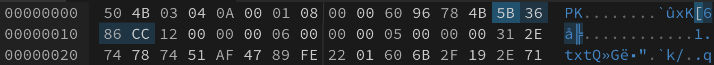
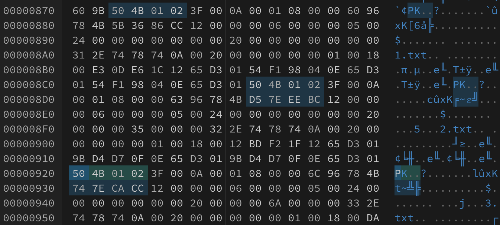

# crc

[题目地址](https://adworld.xctf.org.cn/challenges/details?hash=613638cf-80e6-4608-9d67-ae63d22635f3_2)

脚本小子看世界。

一个被加密的zip。不是伪加密，简单破解也失败。题目提到了crc，应该是和crc有关系。但是直接搜crc破解搜不到直观的解释和工具（当然主要是工具），掏出wp，找到了这个[工具](https://github.com/theonlypwner/crc32)

太好了是python3的，能直接运行。用法很简单，找到zip中的crc值然后用一行命令就能出现所有可能的值，找到合理的那个就行。

问题来了，我怎么知道哪个是crc值？找了个[教程](https://shuishangyun.github.io/2019/04/06/%E5%AF%B9zip%E5%8E%8B%E7%BC%A9%E5%8C%85%E9%80%9A%E7%94%A8%E6%A0%BC%E5%BC%8F%E7%9A%84%E8%AE%A4%E8%AF%86/)，里面详细介绍了zip文件的格式。针对这道题做个省流管家：用16进制打开，第一个crc值为文件开头偏移14位的位置，也就是从开头数14个字节，第15个字节开始的四个字节就是crc值。

这里是小端存储，所以要倒过来看，也就是0xCC86365B。剩下的几个crc要通过查找0x504B0102这个值来找到。找到后从包括0x504B0102起，数16个字节，第17个字节开始4个字节就是各个文件的crc值。

注意这里有三个0x504B0102，但只有两个有效crc值。可能是后面有对应文件名的才算，比如第二个和第三个后面能看见2.txt和3.txt的字样。

然后用刚刚那个脚本破解。

- python3 crc32.py reverse crc值

能发现有意义的破解结果连在一起为forum_91ctf_com_66。这就是zip的密码。解压zip后有一个文件里有一堆二进制。cyberchef直接转字符。转了发现是base64形式的图片，找个在线base64转图片网站就行了。转出来是个二维码，扫描即可。

- ### Flag
  > flag{owid0-o91hf-9iahg}