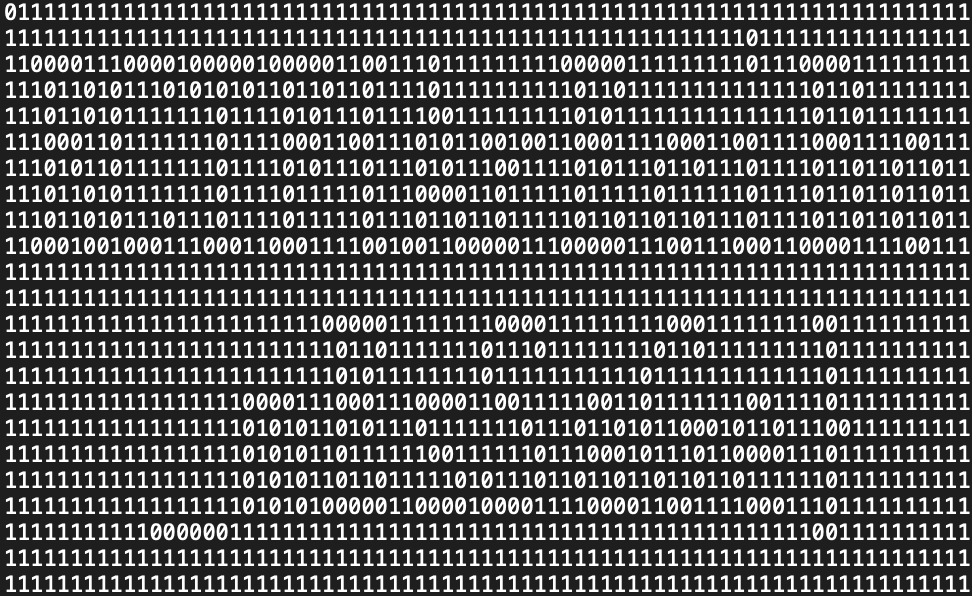

# message

[题目地址](https://adworld.xctf.org.cn/challenges/details?hash=7536a0e7-bd00-4943-8ac1-e907b325372f_2)

为什么我这么菜。

附件看起来像16进制，可是解码后是乱码。得了到这我就没思路了。完全没想到还可以转成二进制。之前没遇到过这种题，完全没想到二进制可以画画。不过misc脑洞也是实力的一部分，很明显我没有。

转二进制我用cyberchef了。要先from hex再to binary。


其实已经能看出来有点猫腻了。复制下来去掉空格拼接在一起发现长度是1680。1680没法完整分解，但是1679可以（我应该是多拼接了什么东西，网上wp直接就是1679）。找个分解网站分解得到1679=23*73，可能是flag排版的提示。完整脚本如下。

```python
with open("/Users/constellation/Desktop/msg.txt") as f:
	data=''.join(f.read().split(' '))
with open("/Users/constellation/Desktop/flag.txt",'w') as f:
	for i in range(0,len(data),73):
		line=data[i:i+73]
		f.write(line+'\n')
```

然后就可以看flag了。



有点模糊，调高亮度然后站远一点看就很清楚了。

- ### Flag
  > RCTF{ArEciBo_mEsSaGe}