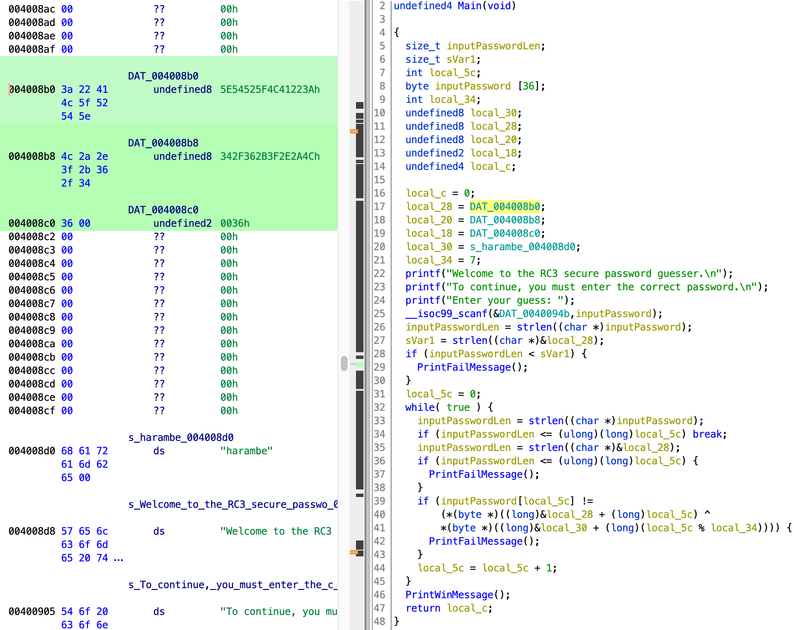

# logmein

[题目地址](https://adworld.xctf.org.cn/challenges/details?hash=029ca36e-966c-4328-9e88-baf47e35ae03_2)

这道题用ghidra和ida结果不一样，又是渴望ida的一天。

附件扔进ghidra，查找字符串并顺藤摸瓜找到main。



前面都没啥重要的，while循环里前两个if语句判断输入的长度是否正确，不是逆向的关键。最后一个if里很明显是密码比较的逻辑。但仔细看整个逻辑似乎只用到了local_28,local_5c,local_30和local_34。local_34上面可以看见是7，local_5c就是普通的索引，local_30是一个叫harambe的字符串（这里和ida不一样，在这里无需将字符串反序，ghidra的首次胜利），local_28是一些看起来像16进制的字母。

这就是本次挑战使用ghidra最大的坑。很明显if逻辑了只取出local_28的每一位然后进行一些异或操作，但你可以在上面的main截图中发现栈上还有跟local_28差不多结构的字符串，上面也进行了赋值。加上if语句中奇怪的取值方法，我们可以推断出应该按顺序取出了local_28,local_20和local_18。

```c
        *(byte *)((long)&local_28 + (long)local_5c) ^
        *(byte *)((long)&local_30 + (long)(local_5c % local_34))
```

一起来读一下这句代码，ida里很明显的逻辑在ghidra里就有点绕了。先看异或前面那部分。取local_28的的地址，转为long后再加上local_5c，整体结果再转为指向byte的指针。后面部分逻辑也差不多。最后的结果是一个指向byte的指针，于是用*取值。

我感觉我说得更绕了。就把前半部分理解为把local_28的地址作为基地址，每次往后偏移local_5c；后半部分把local_30的地址作为基地址，每次往后偏移local_5c % local_34。最后的结果是个地址再取值就是结果了。

因为local_28,local_20和local_18在栈上是挨着的，所以按照local_28进行偏移肯定能按顺序取到local_20和local_18的值。好了不解释了，又有谁会用ghidra呢？这里在ida里巨简单。ᶘ ᵒᴥᵒᶅ

所以现在把local_28,local_20和local_18的值取出来。注意要从byte界面选出它们的原始值，然后再转成字符串。而且这样还不行，会少一个\符号，我不知道为什么，难道被ghidra当成了转义符号？

```python
data=':\"AL_RT^L*.?+6/46'
s='harambe'
flag=''
for i in range(len(data)):
    flag+=chr(ord(s[i%7])^ord(data[i]))
print(flag)
```

- ### Flag
- > RC3-2016-XORISGUD


