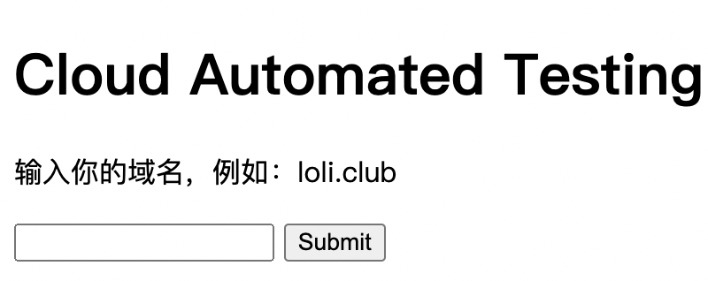
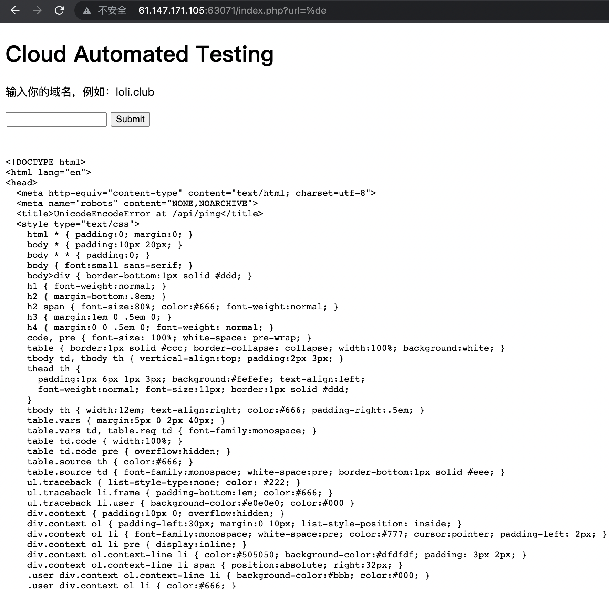

# Cat

[题目地址](http://61.147.171.105:63071/index.php)



题目说输入一个域名我还真就傻乎乎地只输域名……什么也没有发生，乱输域名也没有别的什么提示，只会增加一个get参数。往参数里传了引号之类的想测试sql注入，很显然没有，连回显都没有其实也没办法注入。

- http://61.147.171.105:63071/index.php?url=%27"

没想到输入引号后出现了一行“Invalid URL”，同时单引号被编码。换一下编码看看发生什么。

- http://61.147.171.105:63071/index.php?url=%34
> http://61.147.171.105:63071/index.php?url=4

发现执行后%34变成4了，看来是有url解码。服务器想解码我们就不让它解，传一个解不出来的码试试看。

- http://61.147.171.105:63071/index.php?url=%de

%de由于超过了ascii码范围，服务器无法解析并报错了，没想到的是报错信息回显上来了。



你可以复制报错的内容放到另一个浏览器打开，也可以就像我一样随便翻翻，两个办法都能发现使用了django。知道django只是其中一个要点，目前我们还不知道能怎么利用。对了，前面出现过Invalid URL，应该是双引号被过滤了，那现在可以找一下有什么符号没有被过滤。测试什么符号没有被过滤可以用bp的intruder，在url参数后放一个变量并构建一个全是符号的字典。一切完成后查看返回长度不一样的回包就知道哪个符号没有被过滤了。

/号没有被过滤，应该是留着给我们构造路径的；.号也没有可能是有后缀名？但@号也没有却暂时想不出来作用了。只能看writeup了。最后发现了php的又一个坑点。在php的[手册](https://www.php.net/manual/zh/function.curl-setopt.php)中可以看到一个叫CURLOPT_POSTFIELDS的东西。

- ### CURLOPT_POSTFIELDS
- > 全部数据使用HTTP协议中的 "POST" 操作来发送。 要发送文件，在文件名前面加上@前缀并使用完整路径。 文件类型可在文件名后以 ';type=mimetype' 的格式指定。 这个参数可以是 urlencoded 后的字符串，类似'para1=val1&para2=val2&...'，也可以使用一个以字段名为键值，字段数据为值的数组。 如果value是一个数组，Content-Type头将会被设置成multipart/form-data。 从 PHP 5.2.0 开始，使用 @ 前缀传递文件时，value 必须是个数组。 从 PHP 5.5.0 开始, @ 前缀已被废弃，文件可通过 CURLFile 发送。 设置 CURLOPT_SAFE_UPLOAD 为 true 可禁用 @ 前缀发送文件，以增加安全性。

- ### CURLOPT_SAFE_UPLOAD
- > 默认true。禁用 @ 前缀在 CURLOPT_POSTFIELDS 中发送文件。 意味着 @ 可以在字段中安全地使用了。 可使用 CURLFile 作为上传的代替。
- > PHP 5.5.0 中添加，默认值 false。 PHP 5.6.0 改默认值为 true。PHP 7 删除了此选项， 必须使用 CURLFile interface 来上传文件

@符号出现了。这里的意思就是如果CURLOPT_SAFE_UPLOAD为False，那么在CURLOPT_POSTFIELDS要发送的文件名前面加上@就可以使用完整路径读取文件了。此时问题又来到了经典的文件任意读取。问题是，读取啥文件呢？我们现在完全不知道flag文件在哪。

先从最开始报错的回显信息中尝试搜一下path。搜索后可以发现当前路径是opt/api.

```html
<th>Python Path:</th>
      <td><pre>[&#39;/opt/api&#39;,
```

知道这个还不够，还要了解一下django的开发知识。django项目下一般有个settings.py文件用于设置网站数据库路径（默认使用sqlites数据库）。如果使用的是其它数据库的话settings.py则设置用户名和密码。除此之外settings.py还会对项目整体的设置进行定义。settings.py默认存放在以项目目录下再以项目名称命名的文件夹下面。（也就是/opt/api/api）

- http://61.147.171.105:64778/?url=@/opt/api/api/settings.py

flag会在哪？网站一般都有个数据库的，那这里我们就看看数据库里有没有flag。搜database发现了下面的内容。

```html
<tr>
          <td>DATABASES</td>
          <td class="code"><pre>{&#39;default&#39;: {&#39;ATOMIC_REQUESTS&#39;: False,
             &#39;AUTOCOMMIT&#39;: True,
             &#39;CONN_MAX_AGE&#39;: 0,
             &#39;ENGINE&#39;: &#39;django.db.backends.sqlite3&#39;,
             &#39;HOST&#39;: &#39;&#39;,
             &#39;NAME&#39;: &#39;/opt/api/database.sqlite3&#39;,
             &#39;OPTIONS&#39;: {},
             &#39;PASSWORD&#39;: u&#39;********************&#39;,
             &#39;PORT&#39;: &#39;&#39;,
             &#39;TEST&#39;: {&#39;CHARSET&#39;: None,
                      &#39;COLLATION&#39;: None,
                      &#39;MIRROR&#39;: None,
                      &#39;NAME&#39;: None},
             &#39;TIME_ZONE&#39;: None,
             &#39;USER&#39;: &#39;&#39;}}</pre></td>
        </tr>
```

/opt/api/database.sqlite3是数据库的路径。按照我们的猜测，假如这里面有flag的话那读取后就可以直接搜索了。不过这里搜flag不行，要搜ctf，因为flag里没有出现flag这四个字母。

- http://61.147.171.105:64778/?url=@/opt/api/database.sqlite3

- ### Flag
- > WHCTF{yoooo_Such_A_G00D_@}


