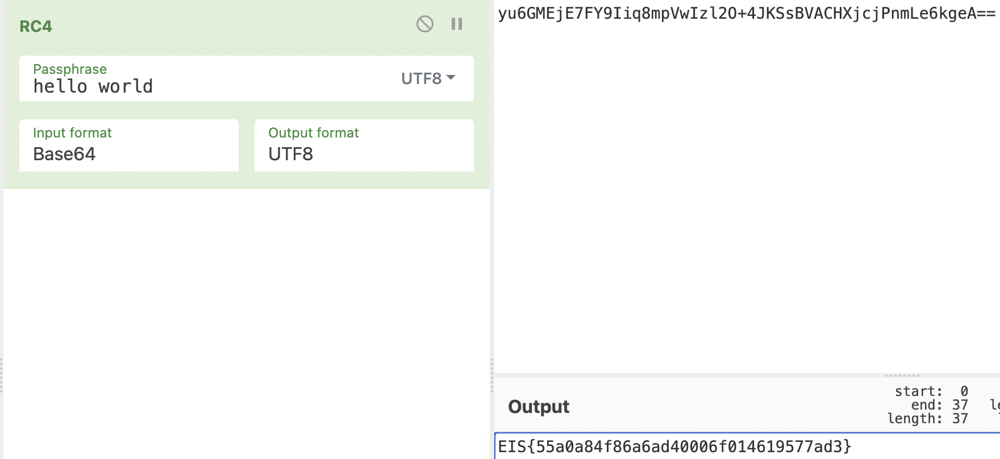

# Easy_Crypto

[题目地址](https://adworld.xctf.org.cn/challenges/details?hash=d948a8db-007b-40b7-af7f-507686e91426_2)

考验知识面的时刻到了。经马后炮查看wp后，发现这个密码就是RC4，附件中还给了加密的密钥，这意味着直接在网上找个解密网站或者脚本就可以知道flag了。密文内容无法复制粘贴，先转成base64。

```python
from base64 import b64encode
"""get buf unsign s[256]

get buf t[256]

we have key:hello world

we have flag:????????????????????????????????


for i:0 to 256
    
set s[i]:i

for i:0 to 256
    set t[i]:key[(i)mod(key.lenth)]

for i:0 to 256
    set j:(j+s[i]+t[i])mod(256)
        swap:s[i],s[j]

for m:0 to 37
    set i:(i + 1)mod(256)
    set j:(j + S[i])mod(256)
    swap:s[i],s[j]
    set x:(s[i] + (s[j]mod(256))mod(256))
    set flag[m]:flag[m]^s[x]

fprint flagx to file"""
from base64 import b64encode
with open("enc.txt",'rb') as f:
    print(b64encode(f.read()))
```

把附件的内容写在上面了，方便下次识别RC4。掏出cyberchef解密。



至于这道题学到的东西，以后记得交换异或这种结构的密文可能是RC4。

- ### Flag
  > EIS{55a0a84f86a6ad40006f014619577ad3}