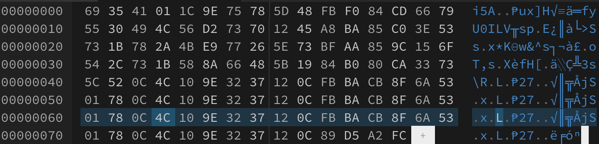

# x_xor_md5

[题目地址](https://adworld.xctf.org.cn/challenges/details?hash=67427056-6429-4994-89d9-c3257e2608ef_2)

属于我看了wp都觉得离谱的题。

得到一个文件，内容是乱码。那就放到hex编辑器里看看。



能发现文件末尾有一串明显重复的内容，可能是key的提示。拿出来这串内容（我把这串内容保存到新的文件里面了），作为key与附件异或。看见可读的字符了，但是还不够。

- hMMM<br>
    GOODJOB<Br>
           *THEFLAGISNOTrctf[wELDN<UTWHTI
KEY ]*rois

发现关键字rctf，但是flag不应该是{}包着的吗，[]是什么鬼？ord('{')^ord('[')得到0x20，那么再把内容整体异或0x20。

- Hmmm, good job,<br>
the flag is not RCTF{We1l_d0n3_ut_wh4t_i5_*key}<br>
                                                        ROIS

ut前面应该还有一个字符，看其16进制能发现，但是显示出来就被吃掉了。同时key右边应该还有个*，而16进制显示是0x0。0x0^0x2a可以得到*，正好也把ut前面的字符异或0x2a，看看是什么。

- Hmmm, good job,<br>
the flag is not RCTF{We1l_d0n3_6ut_wh4t_i5_\*key\*}<br>
                                                        ROIS

问题：经过刚刚那段操作，现在的key是什么？我们首先整体异或了0x20，然后在两个特别的地方异或了0x2a。所以真正的key为21582c6c30be1217322cdb9aebaf4a59。题目还提到了md5，所以把key拿去md5解密得到that。至此我们做完了这道有点脑洞的题。

```python
with open("key",'rb') as f:
    key=f.read()
with open("data",'rb') as f:
    data=f.read()
temp=[]
for i in range(len(data)):
    temp.append(hex(data[i]^key[i%len(key)]))
print(temp)
print(''.join([chr(int(i,16)) for i in temp]))
data=[]
for i in range(len(temp)):
    data.append(hex(int(temp[i],16)^0x20))
index1=data.index('0x0')
data[index1]=str(hex(0x0^0x2a))
index2=data.index('0x1c')
data[index2]=str(hex(0x1c^0x2a))
print(data)
print(''.join([chr(int(i,16)) for i in data]))
```

以上是不完整脚本。这题真的恶心，能想出来的都是身经百战的大佬。

- ### Flag
  > RCTF{We1l_d0n3_6ut_wh4t_i5_that}