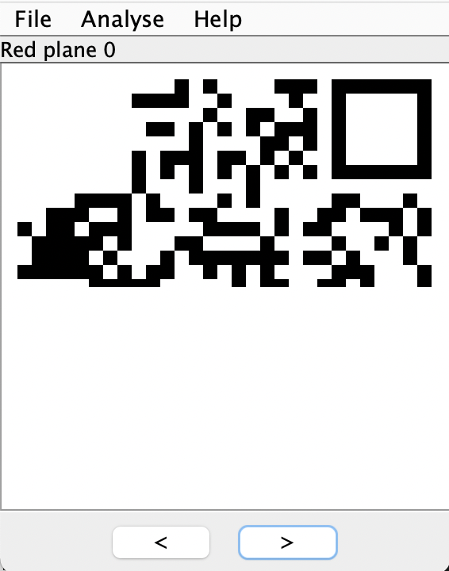
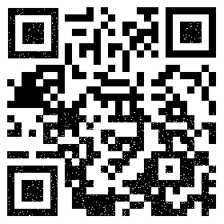

# SimpleRAR

[题目地址](https://adworld.xctf.org.cn/challenges/details?hash=c6787270-1af2-47cf-b10b-21c9e531efbe_2)

众所周知misc什么都要会，包括ps。

附件是一个rar文件，解压后只有一个假的flag.txt。binwalk和foremost无果，16进制编辑器看看。

发现有个secret.png，不知道为什么没解压出来。上网搜了一下，借用[这里](https://blog.csdn.net/destiny1507/article/details/89928234)拿到的图就明白了。

注意看hex中第6行第3列的字节0x7a。0x7a表示子块，而这里应该是一个文件，所以应该改为0x74。更改后解压出了一张空白图片。file一下发现应该是gif图片，更改后缀名后再扔进stegsolve。

出来了一个二维码，但是只有一半。这时想起题目描述“ps：双图层”，看来要用ps查看一下图层。不过我没有ps，所以找到了在线替代品[photopea](https://www.photopea.com/)

菜单->文件->导出图层（注意不要勾选第一个选项，否则还要添加文件夹，比较麻烦）就可以将全部的图层导出为图片。stegsolve检查第二个图层就发现了上半部分。

继续用photopea合成二维码。首先打开上半部分，菜单->图像->裁切先把底下空白的部分切掉后保存。然后再打开下半部分，文件->导入选择刚刚切好的上半部分，现在两者应该可以很简单地拼在一起。

但是怎么还是少了几个小黑块？不慌，左下角有个很完整的小黑块，直接抠图贴到没有的地方就行了。左侧选择矩形选框工具，套住左下角小黑块，右键“通过拷贝的图层”（这里应该是翻译错误）把选择的区域拷贝到另一个图层，然后点到另一个图层把缺失的东西移过去就行了。注意图层顺序。

扫码可得到flag。

- ### Flag
- > flag{yanji4n_bu_we1shi} 