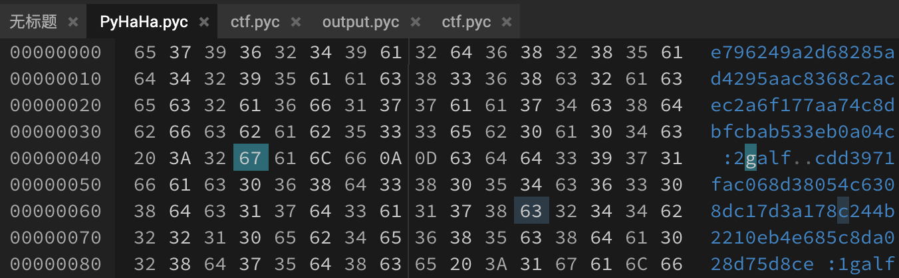

# pyHAHA

[题目地址](https://adworld.xctf.org.cn/challenges/details?hash=aa5ccc43-9028-462e-93a1-cbc83c38e41c_2)

现在的隐写越玩越花了啊。

给了个pyc文件，但是反编译出不来。隐写肯定要看看16进制编辑器，发现疑似flag的东西。



可能需要把整个文件倒过来。

```python
def reverseHex():
    with open("PyHaHa.pyc",'rb') as f:
        data=f.read()[::-1]
    with open("output.pyc",'wb') as f:
        f.write(data)
reverseHex()
```

倒过来再反编译一下，还是没出来。什么东西，找了下各种文件的[文件头](https://www.cnblogs.com/lwy-kitty/p/3928317.html)，你这pyc有问题啊，少了文件头？给他补上03F30D0A，再反编译就出来了。

```python
#!/usr/bin/env python
# visit https://tool.lu/pyc/ for more information
# Version: Python 2.7

from os import urandom

def generate(m, k):
    result = 0
    for i in bin(m ^ k)[2:]:
        result = result << 1
        if int(i):
            result = result ^ m ^ k
        if result >> 256:
            result = result ^ P
            continue
    return result


def encrypt(seed):
    key = int(urandom(32).encode('hex'), 16)
    while True:
        yield key
        key = generate(key, seed) + 0x3653C01D55L


def convert(string):
    return int(string.encode('hex'), 16)

P = 0x10000000000000000000000000000000000000000000000000000000000000425L
flag1 = 'ThIs_Fl4g_Is_Ri9ht'
flag2 = 'Hey_Fl4g_Is_Not_HeRe'
key = int(urandom(32).encode('hex'), 16)
data = open('data.txt', 'r').read()
result = encrypt(key)
encrypt1 = bin(int(data, 2) ^ eval('0x' + hex(result.next())[2:-1] * 22))[2:]
encrypt2 = hex(convert(flag1) ^ result.next())[2:-1]
encrypt3 = hex(convert(flag2) ^ result.next())[2:-1]
print 'flag1:', encrypt2
print 'flag2:', encrypt3
f = open('encrypt.txt', 'w')
f.write(encrypt1)
f.close()
```

但是我们不知道encrypt1，encrypt2和encrypt3。binwalk刚才的pyc文件，暗藏玄机。直接-e选项提取。

```
binwalk ctf.pyc -e

DECIMAL       HEXADECIMAL     DESCRIPTION
--------------------------------------------------------------------------------
1487          0x5CF           Zip archive data, at least v2.0 to extract, compressed size: 8221556, uncompressed size: 8938447, name: Dream It Possible.mp3
```

进入提取出来的文件夹，zip包需要密码，但是binwalk已经把mp3搞出来了，估计是伪加密。右键显示简介，有个奇怪的东西。

```
163 key(Don't modify):L64FU3W4YxX3ZFTmbZ+8/dx5jBNDPdsKv9gAgXYyj0/Z0Vl4ORaCLH5D0oN9v9nBBv6zxpBucgNeE2qqke4ugZs7dxriT5lfUpulX5PYMzSg2pqL6APTHQjtIHw16ZCRTMBBkInrUGSTklA2MwPLGkuDTmWfzjHqDWEK5LLRP6oiOXe0JeI9mLHzL2nm6T3/ianaPEzeH7lpE/ciWDyqFUXoTZWeyK0xTjYxBSj9RJFoaoIxmXk6P8MJq+EvcS7ratByRUvWLaUFhcXhJ1iRK58BKcVPS0hxkzA77WB1UnrUfpkS1U/F5uYmYWGZ3Cz2fTvJHcsE228LUnnybaoIoDyY6BvZVUitmA+VhhTHoIKsREyCzC3VXq/HuwwuHdCdftzXJpXPoJSNzWAZH0oGnF+WE7m5Fqd36dqp2srL5bgFjFnyZzIkxdaU+ZW+Rm7aIbrb7nK2Pp9iequOBV6rnKeHZyc3hzG4lVVapoXl/U2cvfVgIqVtnuJE4XM4NuUd
```

这个mp3的隐写方法没有这么简单，需要[DeEgger Embedder](http://deegger-embedder.findmysoft.com/download/)。工具小子题！可以得到一堆base32。一堆base一般就不是简单的解码了，绝对有base系列隐写。脚本解密。

```python
import base64

def get_base32_diff_value(stego_line, normal_line):
    base32chars = 'ABCDEFGHIJKLMNOPQRSTUVWXYZ0123456789'
    for i in range(len(normal_line)):
        if stego_line[i] != normal_line[i]:
            return abs(base32chars.index(chr(stego_line[i]))-base32chars.index(chr(normal_line[i])))
    return 0

# base32 隐写解密
def base32stego_decode(lines):
    res = ''
    for i in lines:
        stego_line = i.strip()
        normal_line = base64.b32encode(base64.b32decode(i.strip()))
        diff = get_base32_diff_value(stego_line, normal_line)
        if '=' not in str(stego_line):
            continue
        if diff:
            res += bin(diff)[2:]
        else:
            res += '0'
    return res

with open("Dream It Possible - extracted.txt", 'rb') as f:
    file_lines = f.readlines()
en=open("encrypt.txt","w")
en.write(base32stego_decode(file_lines))
en.close()
```

得到的内容是二进制。真的套了一层又一层，没完没了。不过我们好歹是拿到了encrypt1的内容，现在就是逆向算法了。大佬分析了一波，我不是很懂。

encrypt实现的是一个256bit随机数生成器的功能

generate实现的是在有限域GF($2^{256}$)下的平方运算：new_key=$(old\_key+seed)^2$

flag1和flag2的密文在前面的zip注释信息已给出

脚本对三段明文使用了同个Seed做了加密，其中后两段明文和密文还有第一段的密文（在那大段的base32里）已知

考虑OTP加密

先由后两段明文和密文算出 key2 和 key3，再在 $GF(2^{256})$下进行开方即可得到 seed，key3 = $(key2+seed)^2$

再由第一段密文(即 base32 隐藏的数据)key1 和 seed 解得 key1，Key2= $(key1+seed)^2$

最后对第一段密文(即 base32 隐藏的数据)和 22 次叠加的 key1 做异或得到原始二进制数据

没学过域。唉。得到的数据还没完，还要写为图片。我去这也太绕了。

```python
import base64

def get_base32_diff_value(stego_line, normal_line):
    base32chars = 'ABCDEFGHIJKLMNOPQRSTUVWXYZ0123456789'
    for i in range(len(normal_line)):
        if stego_line[i] != normal_line[i]:
            return abs(base32chars.index(chr(stego_line[i]))-base32chars.index(chr(normal_line[i])))
    return 0

# base32 隐写解密
def base32stego_decode(lines):
    res = ''
    for i in lines:
        stego_line = i.strip()
        normal_line = base64.b32encode(base64.b32decode(i.strip()))
        diff = get_base32_diff_value(stego_line, normal_line)
        if '=' not in str(stego_line):
            continue
        if diff:
            res += bin(diff)[2:]
        else:
            res += '0'
    return res

with open("Dream It Possible - extracted.txt", 'rb') as f:
    file_lines = f.readlines()
en=open("encrypt.txt","w")
en.write(base32stego_decode(file_lines))
en.close()
```

## Flag
> flag{H4pPy_pY_C0dlng}