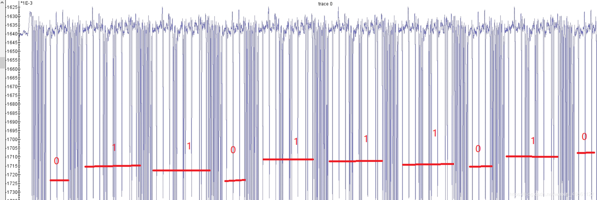

# 侧信道初探

[题目地址](https://adworld.xctf.org.cn/challenges/details?hash=5d8699ea-6ecf-4452-b5b4-6f1f1f09f18b_2&task_category_id=1)

这年头要会的东西可太多了。

给了两张图，一张伪代码，一张奇怪的波纹。不会，看都看不懂，建议看这这篇[文章](https://blog.csdn.net/weixin_46661122/article/details/109740368)。意识到目标是还原伪代码中的数组k的每一项。

算法重点的部分在于遍历k数组，如果k[i]==1就会进入if语句执行额外的一行代码。由此我们知道k[i]等于1和等于0时执行的代码数量不一样，自然需要的时间也不一样。图中相邻密集的线之间有间隔，如果间隔短就是0，反之就是1。

## Flag
> SCTF{0110111010}