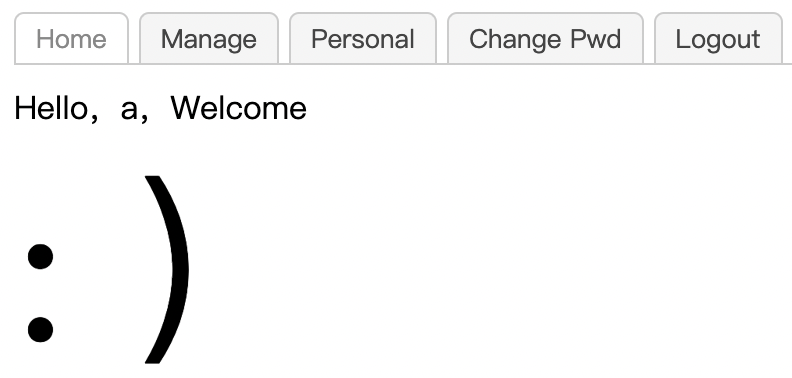

# bug

[题目链接](https://adworld.xctf.org.cn/challenges/details?hash=e6382584-087d-4ca9-ba58-3887fdbecd00_2)

一个简单的登录界面。试了一下没有sql注入，那就正常注册一个用户试试。

manage不能点，显示不是管理员。personal就是一些静态的信息，change pwd改密码，logout登出。我在url试了一些漏洞，比如php伪协议，模版注入等，均无反应。看来要想办法拿管理员身份了。管理员的密码和信息我们肯定无法知道，那有没有办法直接把管理员的密码改了呢？

登出后会发现有个find pwd选项。用bp抓一下此处的包。发现包内容似乎没有做任何过滤和分辨用户的操作，那直接把username参数的值改成admin。

放走包后显示改密码成功。此时就可以登录进admin的账号了。但是manage还是不能点，显示ip not allowed。ip相关的头部信息能想到xff，改的地址第一选项127.0.0.1，因为很多挑战设置都是只能本机ip访问。

源代码中发现了一句话：index.php?module=filemanage&do=??? 。结合前面页面的url，此处的do应该是和模块相关的操作。文件管理的操作无非就是增删改查，查和改不太可能会给flag，没那么简单，删更没必要了。那就只有增了，文件上传也是常考点之一。

点击request右上角的三个横线可以快速拷贝url到浏览器中。打开后就是常规的文件上传题了。提示Just image?可能是要我们传个木马什么的。直接php肯定被发现了，传个jpg后缀的php文件后面抓包再改也不行，看来不止有后缀检测，还有内容过滤。php有很多后缀，php,php1,php2,php3,php4,php5,php7,pht,phtml等都可以试试。内容也有多种写法，\<?php phpinfo(); ?>，\<?=system(“ls”);?>，\都行（此处参考了cpy的writeup）

最后用\和php4后缀绕过了过滤，得到flag。

- ### Flag
- > cyberpeace{0abc0e83a1d8c2930cb7fb42cd6f7f3d}